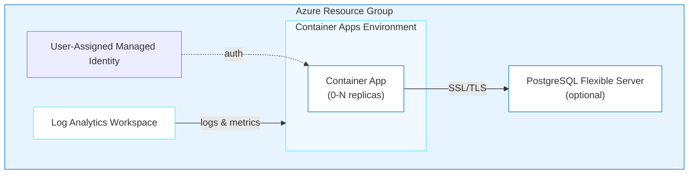

# Azure Container Apps Deployment Skill

Deploy production-ready applications on Azure Container Apps with integrated Azure services.

## When to Use Container Apps vs AKS

| Use Container Apps When | Use AKS When |
|------------------------|--------------|
| Simple HTTP/background apps | Need Kubernetes APIs/CRDs |
| Quick deployment, less config | Complex networking (CNI, network policies) |
| Built-in ingress is sufficient | Custom ingress controllers (NGINX, Traefik) |
| Serverless / scale-to-zero | Helm charts or GitOps workflows |
| azd-native deployment | Multi-container pods with shared volumes |
| Cost-sensitive dev/test workloads | Node-level control required |

## Architecture Pattern



## Azure MCP Tools

Leverage these Azure MCP Server tools when working with Container Apps:

| Tool | When to Use |
|------|-------------|
| `azure_bicep_schema` | Get latest API versions and property definitions for `Microsoft.App/containerApps` and `Microsoft.App/managedEnvironments` |
| `azure_deploy_iac_guidance` | Best practices for Bicep/Terraform with azd — use params: `deployment_tool=AZD`, `iac_type=bicep`, `resource_type=containerapp` |
| `azure_deploy_plan` | Generate deployment plans — use params: `target=ContainerApp`, `provisioning_tool=AZD` |
| `azure_deploy_architecture` | Generate Mermaid architecture diagrams for Container Apps deployments |
| `azure_deploy_app_logs` | Fetch Log Analytics logs post-deployment for troubleshooting |

## Key Patterns

### 1. Container Apps Environment (Bicep)

```bicep
resource logAnalytics 'Microsoft.OperationalInsights/workspaces@2023-09-01' = {
  name: logAnalyticsName
  location: location
  properties: {
    sku: { name: 'PerGB2018' }
    retentionInDays: 30
  }
}

resource containerAppsEnvironment 'Microsoft.App/managedEnvironments@2023-11-02-preview' = {
  name: environmentName
  location: location
  properties: {
    appLogsConfiguration: {
      destination: 'log-analytics'
      logAnalyticsConfiguration: {
        customerId: logAnalytics.properties.customerId
        sharedKey: logAnalytics.listKeys().primarySharedKey
      }
    }
  }
}
```

### 2. Container App Configuration

```bicep
resource containerApp 'Microsoft.App/containerApps@2023-11-02-preview' = {
  name: appName
  location: location
  identity: {
    type: 'UserAssigned'
    userAssignedIdentities: { '${managedIdentity.id}': {} }
  }
  properties: {
    managedEnvironmentId: containerAppsEnvironment.id
    configuration: {
      ingress: {
        external: true
        targetPort: 8080
        transport: 'auto'
        allowInsecure: false
      }
      secrets: [
        { name: 'db-password', value: dbPassword }
        { name: 'app-secret-key', value: appSecretKey }
      ]
    }
    template: {
      containers: [
        {
          name: appName
          image: containerImage
          resources: {
            cpu: json('1.0')
            memory: '2Gi'
          }
          env: [
            { name: 'DB_HOST', value: postgresServer.properties.fullyQualifiedDomainName }
            { name: 'DB_PASSWORD', secretRef: 'db-password' }
            { name: 'APP_SECRET', secretRef: 'app-secret-key' }
            { name: 'PORT', value: '8080' }
          ]
          probes: [
            {
              type: 'Startup'
              httpGet: { path: '/health', port: 8080 }
              periodSeconds: 10
              failureThreshold: 30
            }
            {
              type: 'Liveness'
              httpGet: { path: '/health', port: 8080 }
              initialDelaySeconds: 60
              periodSeconds: 30
              failureThreshold: 3
            }
            {
              type: 'Readiness'
              httpGet: { path: '/health', port: 8080 }
              periodSeconds: 10
              failureThreshold: 3
            }
          ]
        }
      ]
      scale: {
        minReplicas: 0
        maxReplicas: 3
        rules: [
          {
            name: 'http-scale'
            http: { metadata: { concurrentRequests: '10' } }
          }
        ]
      }
    }
  }
}
```

### 3. Secrets Management

**Always use `secretRef` — never put sensitive values in plain `value` fields:**

```bicep
// Define secrets at the configuration level
secrets: [
  { name: 'db-password', value: postgresPassword }
  { name: 'encryption-key', value: encryptionKey }
]

// Reference via secretRef in environment variables
env: [
  { name: 'DB_PASSWORD', secretRef: 'db-password' }       // ✅ Secure
  { name: 'DB_PASSWORD', value: postgresPassword }         // ❌ Exposed in logs
]
```

### 4. Scaling Rules

#### HTTP Scaling (Default)
```bicep
scale: {
  minReplicas: 0    // Scale to zero when idle
  maxReplicas: 10
  rules: [
    {
      name: 'http-scaling'
      http: { metadata: { concurrentRequests: '10' } }
    }
  ]
}
```

#### Custom Scaling (KEDA)
```bicep
scale: {
  minReplicas: 1
  maxReplicas: 5
  rules: [
    {
      name: 'queue-scaling'
      custom: {
        type: 'azure-queue'
        metadata: {
          queueName: 'myqueue'
          queueLength: '5'
          connectionFromEnv: 'QUEUE_CONNECTION'
        }
      }
    }
  ]
}
```

### 5. Health Probes (Critical for Slow-Starting Apps)

Many OSS apps (n8n, Superset, etc.) take 60+ seconds to start. Without proper probes, Azure kills the container before initialization completes, causing **CrashLoopBackOff**.

**Recommended pattern for slow starters:**

| Probe | Purpose | Key Settings |
|-------|---------|--------------|
| **Startup** | Wait for app to initialize | `periodSeconds: 10`, `failureThreshold: 30` (5 min max) |
| **Liveness** | Restart unhealthy containers | `initialDelaySeconds: 60`, `periodSeconds: 30` |
| **Readiness** | Gate traffic to ready containers | `periodSeconds: 10`, `failureThreshold: 3` |

**The startup probe runs first.** Liveness and readiness don't start until the startup probe succeeds.

### 6. Ingress Configuration

```bicep
ingress: {
  external: true          // true = public, false = internal (within environment)
  targetPort: 8080        // Container's listening port
  transport: 'auto'       // auto | http | http2 | tcp
  allowInsecure: false    // Redirect HTTP → HTTPS
  ipSecurityRestrictions: [
    {
      name: 'allow-office'
      ipAddressRange: '203.0.113.0/24'
      action: 'Allow'
    }
  ]
}
```

### 7. Volume Mounts (Azure Files for Persistent Storage)

```bicep
// In managedEnvironments
resource env 'Microsoft.App/managedEnvironments@2023-11-02-preview' = {
  // ...
  properties: {
    // ...
    storages: {
      myfiles: {
        azureFile: {
          accountName: storageAccount.name
          accountKey: storageAccount.listKeys().keys[0].value
          shareName: 'appdata'
          accessMode: 'ReadWrite'
        }
      }
    }
  }
}

// In containerApp template
template: {
  volumes: [
    { name: 'data-volume', storageName: 'myfiles', storageType: 'AzureFile' }
  ]
  containers: [
    {
      // ...
      volumeMounts: [
        { volumeName: 'data-volume', mountPath: '/data' }
      ]
    }
  ]
}
```

### 8. Post-Provision Hooks (Circular Dependency Pattern)

Some apps need their own FQDN as a config value (e.g., `WEBHOOK_URL`), but the FQDN isn't known until deployment. Use azd post-provision hooks:

```bash
#!/bin/bash
# hooks/postprovision.sh
APP_NAME=$(azd env get-value CONTAINER_APP_NAME)
RG=$(azd env get-value RESOURCE_GROUP_NAME)

# Get the FQDN assigned by Azure
FQDN=$(az containerapp show --name $APP_NAME --resource-group $RG \
  --query "properties.configuration.ingress.fqdn" -o tsv)

# Update the container app with its own URL
az containerapp update --name $APP_NAME --resource-group $RG \
  --set-env-vars "WEBHOOK_URL=https://$FQDN"
```

## Outputs Pattern

```bicep
output RESOURCE_GROUP_NAME string = resourceGroup().name
output CONTAINER_APP_NAME string = containerApp.name
output APP_URL string = 'https://${containerApp.properties.configuration.ingress.fqdn}'
output APP_FQDN string = containerApp.properties.configuration.ingress.fqdn
```

## Common Troubleshooting

### CrashLoopBackOff
**Symptom:** Container restarts repeatedly.
**Cause:** Health probes too aggressive for slow-starting app.
**Fix:** Add startup probe with `failureThreshold: 30` (5 min window). Set liveness `initialDelaySeconds: 60`.

### Cold Start / 502 During Scale-from-Zero
**Symptom:** First request after idle returns 502 Bad Gateway.
**Cause:** Container scaling from 0→1 takes 30-60 seconds.
**Fix:** Set `minReplicas: 1` for production. For dev, accept cold starts or use a health-check ping.

### Database Connection Refused
**Symptom:** App can't connect to PostgreSQL.
**Fix:**
1. Use FQDN from `postgresServer.properties.fullyQualifiedDomainName`
2. Enable SSL: add `sslmode=require` or app-specific SSL env vars
3. Verify firewall allows Azure services (`0.0.0.0` rule)

### Secret Not Found
**Symptom:** Container fails with "secret not found" error.
**Fix:** Secret names in `secretRef` must exactly match names defined in `configuration.secrets`. Names are lowercase, alphanumeric, and hyphens only.

### Container Logs
```bash
# Stream logs
az containerapp logs show --name $APP_NAME --resource-group $RG --follow

# System logs (scaling, probe failures)
az containerapp logs show --name $APP_NAME --resource-group $RG --type system

# Query Log Analytics directly
az monitor log-analytics query --workspace $WORKSPACE_ID \
  --analytics-query "ContainerAppConsoleLogs_CL | where ContainerAppName_s == '$APP_NAME' | top 50 by TimeGenerated"
```

## Best Practices

1. **Use managed identity** for service-to-service auth (not connection strings)
2. **Always include health probes** — startup + liveness + readiness
3. **Use `secretRef`** for all sensitive environment variables
4. **Scale-to-zero** for dev/test to minimize cost
5. **Set resource limits** — `cpu` and `memory` for each container
6. **Use Log Analytics** for monitoring — don't skip it
7. **Post-provision hooks** for circular dependencies (FQDN-based config)
8. **SCREAMING_SNAKE_CASE** for Bicep outputs (azd convention)
