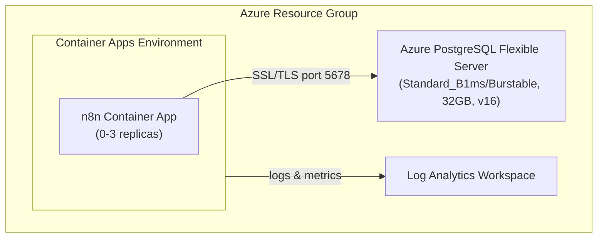

# n8n Azure Configuration Skill

Application-specific configuration for deploying n8n to Azure Container Apps with PostgreSQL.

## When to Use

- Deploying n8n to Azure
- Troubleshooting n8n on Azure
- Configuring n8n environment variables

**Note:** This skill is n8n-specific. Use the official `azure-prepare` skill to generate infrastructure from scratch.

## Critical: Infrastructure Generation

This skill provides n8n-specific configuration only. Infrastructure (Bicep, azure.yaml) should be generated fresh each time by the official `azure-prepare` → `azure-validate` → `azure-deploy` pipeline. Do NOT rely on pre-existing infra code.

## Critical: Subscription Context

**ALWAYS set AZURE_SUBSCRIPTION_ID explicitly before running `azd up`:**
```bash
azd env set AZURE_SUBSCRIPTION_ID "$(az account show --query id -o tsv)"
```
Without this, azd and Azure MCP tools will fail silently or produce incomplete deployments.

## Critical: PostgreSQL Network Access

The AVM PostgreSQL Flexible Server module **defaults `publicNetworkAccess` to disabled**. When public access is off, firewall rules are silently ignored and Container Apps cannot connect.

**Always set this explicitly in Bicep:**
```bicep
// For AVM module br/public:avm/res/db-for-postgre-sql/flexible-server
params: {
  // ... other params
  publicNetworkAccess: 'Enabled'
  authConfig: {
    passwordAuth: 'Enabled'        // AVM defaults to Disabled (Entra-only)!
    activeDirectoryAuth: 'Disabled'
  }
  firewallRules: [
    {
      name: 'AllowAllAzureServices'
      startIpAddress: '0.0.0.0'
      endIpAddress: '0.0.0.0'
    }
  ]
}
```

Without `publicNetworkAccess: 'Enabled'`, firewall rules are silently ignored.
Without `passwordAuth: 'Enabled'`, n8n will fail with "authentication failed" because only Entra ID auth is allowed.

## Critical: Secrets and Redeploy Safety

**Do NOT rely on `newGuid()` for PostgreSQL passwords.** `newGuid()` regenerates a new value on every deployment, but PostgreSQL keeps the original password — causing authentication failures on redeploy.

**Solution:** Pin passwords to azd environment variables so they persist across deployments:

```bash
# Generate once and store in azd env
azd env set POSTGRES_PASSWORD "$(openssl rand -hex 16)"
azd env set N8N_ENCRYPTION_KEY "$(openssl rand -hex 16)"
azd env set N8N_AUTH_PASSWORD "$(openssl rand -hex 16)"
```

Then reference them in `main.parameters.json`:
```json
{
  "postgresPassword": { "value": "${POSTGRES_PASSWORD}" },
  "n8nEncryptionKey": { "value": "${N8N_ENCRYPTION_KEY}" },
  "n8nAuthPassword": { "value": "${N8N_AUTH_PASSWORD}" }
}
```

This ensures the same password is used across deploys. Keep `newGuid()` only as a fallback default:
```bicep
@secure()
param postgresPassword string = newGuid()  // Overridden by main.parameters.json
```

## Critical: PostgreSQL SKU Format

Azure PostgreSQL Flexible Server requires BOTH `sku.name` and `sku.tier`:
```bicep
sku: {
  name: 'Standard_B1ms'    // NOT 'B_Standard_B1ms'
  tier: 'Burstable'        // REQUIRED - omitting causes deployment failure
}
```
Valid tier values: `Burstable`, `GeneralPurpose`, `MemoryOptimized`.

## Official Documentation

- n8n Docker Installation: https://docs.n8n.io/hosting/installation/docker/
- n8n Environment Variables: https://docs.n8n.io/hosting/configuration/environment-variables/

## Quick Start (Verified)

```bash
# 1. Register providers (one-time per subscription)
az provider register --namespace Microsoft.App
az provider register --namespace Microsoft.DBforPostgreSQL
az provider register --namespace Microsoft.OperationalInsights

# 2. Create environment
azd env new my-n8n-env

# 3. Set required variables (passwords pinned — safe for redeploy)
azd env set AZURE_SUBSCRIPTION_ID "$(az account show --query id -o tsv)"
azd env set AZURE_LOCATION "westus"
azd env set POSTGRES_PASSWORD "$(openssl rand -hex 16)"
azd env set N8N_ENCRYPTION_KEY "$(openssl rand -hex 16)"
azd env set N8N_AUTH_PASSWORD "$(openssl rand -hex 16)"

# 4. Deploy (~7-10 minutes)
azd up

# 5. Access n8n
azd env get-value N8N_URL
# Login: admin / $(azd env get-value N8N_AUTH_PASSWORD)
```

**Deployment time breakdown:**
- Resource Group: ~4s
- Log Analytics: ~25s
- Container Apps Environment: ~38s
- PostgreSQL Flexible Server: ~4-5 min
- n8n Container App: ~20s
- **Total: ~7 minutes**

## Key Configuration Files

| File | Purpose |
|------|---------|
| `config/environment-variables.md` | All n8n environment variables for Azure |
| `config/health-probes.md` | Health probe timing for n8n startup |
| `troubleshooting.md` | Common issues and solutions |

## Architecture



## n8n-Specific Requirements

### Container Configuration

| Setting | Value | Reason |
|---------|-------|--------|
| Image | `docker.io/n8nio/n8n:latest` | Official Docker Hub image |
| Port | 5678 | n8n default port |
| CPU | 1.0 cores | Minimum for responsive UI |
| Memory | 2Gi | n8n recommended minimum |
| Min Replicas | 0 | Scale-to-zero for cost |
| Max Replicas | 3 | Handle traffic spikes |

### Health Probes (CRITICAL)

n8n requires **60+ seconds** to start. See `config/health-probes.md`.

**Without proper health probes, containers will crash before n8n initializes!**

### Database Requirements

- PostgreSQL 15 or 16 (Flexible Server)
- SSL enabled (required by Azure)
- FQDN connection (not internal hostname)

## Cost Estimate (Dev Environment)

| Resource | Monthly Cost |
|----------|--------------|
| Container Apps (scale-to-zero) | ~$5-15 |
| PostgreSQL Flexible Server | ~$15 |
| Log Analytics | ~$2-5 |
| **Total** | **~$25-35/month** |

## Verification

After `azd up`, run the verification commands in [troubleshooting.md](troubleshooting.md). Key checks: HTTP 200 from the n8n URL, `WEBHOOK_URL` is set on the container, and container logs show no errors.

## Tear Down

```bash
azd down --force --purge
```

**Note:** Teardown takes 5-10 minutes (PostgreSQL deletion is slow).

## n8n-Specific Quirks

1. **Slow startup** — needs 60s+ `initialDelaySeconds` on liveness probe
2. **SSL** — requires `SSL_REJECT_UNAUTHORIZED=false` for Azure PostgreSQL
3. **WEBHOOK_URL** — set post-deployment via hook (circular dependency with FQDN)
4. **Port 5678** — non-standard port for health checks and ingress
5. **PostgreSQL publicNetworkAccess** — AVM module defaults to disabled; must explicitly enable or Container Apps can't connect
6. **Password pinning** — use azd env variables for passwords, not `newGuid()` alone; `newGuid()` regenerates on redeploy causing auth failures
7. **HA not supported on Burstable** — must set `highAvailability: 'Disabled'` when using `Burstable` tier
8. **AVM probe failureThreshold cap** — AVM container-app module caps `failureThreshold` at 10; use `periodSeconds: 30` with `failureThreshold: 10` for 5 min startup window

## Azure MCP Tools

Use these Azure MCP Server tools for n8n deployments:

| Tool | When to Use |
|------|-------------|
| `azure_bicep_schema` | Get latest schemas for `Microsoft.App/containerApps` and `Microsoft.DBforPostgreSQL/flexibleServers` |
| `azure_deploy_architecture` | Generate Mermaid architecture diagrams for the n8n deployment |
| `azure_deploy_plan` | Validate the deployment plan before `azd up` — use `target=ContainerApp` |
| `azure_deploy_app_logs` | Fetch container logs from Log Analytics when troubleshooting startup or connectivity issues |

## Reproducibility Notes

This deployment has been tested multiple times and is verified working:
- ✅ Clean environment deployment
- ✅ Teardown and redeploy
- ✅ Parameter interpolation via `${VAR}` syntax in main.parameters.json
- ✅ Post-provision hook correctly sets WEBHOOK_URL
