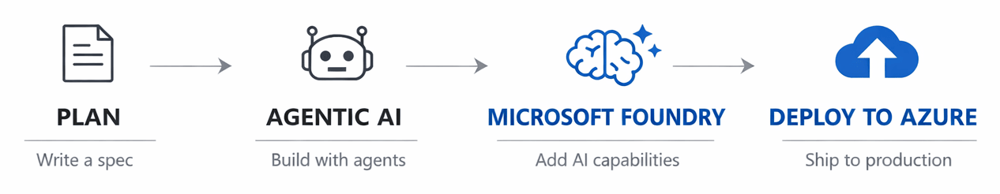

[](./LICENSE)&ensp;
[](https://github.com/DanWahlin/github-azure-agentic-journeys/pulls)&ensp;
[](https://azure.microsoft.com)&ensp;
[](https://github.com/features/copilot)

🎯 [What You'll Learn](#what-youll-learn) &ensp; ✅ [Prerequisites](#prerequisites) &ensp; 📚 [Agentic Journeys](#agentic-journeys) &ensp; 🚀 [Quick Start](#quick-start)

# GitHub and Azure Agentic Journeys

> **Build and deploy applications to Azure using agents and skills.**



What if you could go from idea to running in Azure and stay focused on your actual product the entire time? With agents handling the infrastructure — Bicep templates, health probes, database wiring, deployment pipelines — you can spend your time on what makes your app interesting instead of what makes it run. GitHub and Azure Agentic Journeys shows what that looks like in practice. 

You write a spec and hand it to GitHub Copilot, which scaffolds your API and database while you decide on a stack. From there you build out a web or mobile frontend, add AI capabilities like search and recommendations through Microsoft Foundry, and let an agent generate the Azure infrastructure and deploy it when you're ready to ship. Some agentic journeys are quick deploys of open-source apps. Others take you from an empty folder to a full-stack app with AI features running in production.

This is designed for:

- **Developers** who want to build and ship to Azure using agentic AI techniques
- **Teams** evaluating how agents and skills fit into their development workflow

Although the agentic journeys use GitHub Copilot CLI by default, you can use another tool such as GitHub Copilot in VS Code and other editors, or Claude Code if you prefer. The agents and skills are designed to be tool-agnostic.

## What You'll Learn

Each agentic journey pairs GitHub Copilot with Azure services to handle a different part of the development lifecycle:

- Deploying open-source apps (n8n, Grafana, Superset) to Azure with a single agent conversation
- Building APIs, databases, and frontends from a spec document
- Adding AI features (search, recommendations, chat agents) with Microsoft Foundry
- Deploying to Azure Container Apps and AKS without writing infrastructure by hand
- Creating your own agents, skills, and MCP integrations
- Choosing your own stack and platform (web or iOS, .NET or Python or Node)

## Prerequisites

Before starting, ensure you have:

- **GitHub account** with GitHub Copilot access ([Free](https://github.com/features/copilot/plans), [Pro](https://github.com/features/copilot/plans), or [Enterprise](https://github.com/features/copilot/plans))
- **GitHub Copilot**:
  - [GitHub Copilot CLI](https://docs.github.com/en/copilot/how-tos/copilot-cli/cli-getting-started) for terminal workflows
  - [VS Code + GitHub Copilot](https://marketplace.visualstudio.com/items?itemName=GitHub.copilot) for editor workflows
- **Azure subscription** - [Create account](https://azure.microsoft.com/pricing/purchase-options/azure-account)
- **Azure CLI** (`az`) - [Install](https://docs.microsoft.com/cli/azure/install-azure-cli)
- **Azure Developer CLI** (`azd`) - [Install](https://learn.microsoft.com/azure/developer/azure-developer-cli/install-azd)

```bash
# Verify installations
az version
azd version

# Login to Azure and select your subscription
az login
azd auth login
```

## GitHub Copilot tools

Use whichever tool fits your workflow:

| Tool | Where it runs | What it does |
|---------|---------------|----------|
| [**GitHub Copilot CLI**](https://docs.github.com/copilot/how-tos/copilot-cli/cli-getting-started) | Your terminal | Terminal-native AI coding assistant |
| [**GitHub Copilot**](https://docs.github.com/copilot) | VS Code, Visual Studio, JetBrains | Agent mode, chat, inline suggestions |
| [**GitHub Copilot cloud agent**](https://docs.github.com/copilot/using-github-copilot/using-copilot-coding-agent-to-work-on-tasks) | GitHub | Assign issues to agents, get PRs back |

The journeys in this repo use GitHub Copilot CLI by default. However, you can use any AI coding assistant you prefer as long as it supports AI agents and skills including Claude Code, Codex, and others. The agentic journeys include prompts and plans that can be used to build and deploy apps with any of the tools.

## Agentic journeys

| # | Agentic journey | Highlights |
|:-:|----------|-------------------|
| 01 | [AIMarket](./journeys/aimarket/README.md) | Full-stack app from spec + AI search + shopping assistant |
| 02 | [n8n - Workflow Automation](./journeys/n8n/README.md) | Container Apps + PostgreSQL |
| 03 | [Grafana - Metrics and Visualization](./journeys/grafana/README.md) | Container Apps |
| 04 | [Apache Superset - BI Platform](./journeys/superset/README.md) | AKS + PostgreSQL |

## How the agentic journeys work

Each agentic journey follows the same structure:

1. **Architecture diagram** showing what gets created in Azure
2. **Agentic AI** - Generate code and deployment infrastructure 
3. **Troubleshooting** for common issues

## How the OSS agent works

The OSS deployment journeys (01-03) use an agent that orchestrates a 6-step pipeline:

```
1. Load app skill     →  Read n8n-azure, grafana-azure, or superset-azure
2. azure-prepare      →  Generate Bicep infrastructure from scratch
3. Set environment     →  Configure azd with subscription, location, secrets
4. azure-validate      →  Validate Bicep templates and azd configuration
5. azure-deploy        →  Run azd up to provision and deploy
6. Verify              →  Output the deployed URL and run health checks
```

The agent reads app-specific skills (port numbers, database requirements, health probe timing) and uses the [Azure plugin](https://github.com/microsoft/azure-skills) MCP tools to look up real Bicep schemas and best practices. Infrastructure is generated fresh each deployment. 

## Getting help

- App-specific issues: check the troubleshooting section in each agentic journey
- Ask GitHub Copilot
- Found a bug? [Open an issue](https://github.com/DanWahlin/github-azure-agentic-journeys/issues)
- Want to contribute? PRs welcome.

## License

This project is licensed under the [MIT License](LICENSE).
