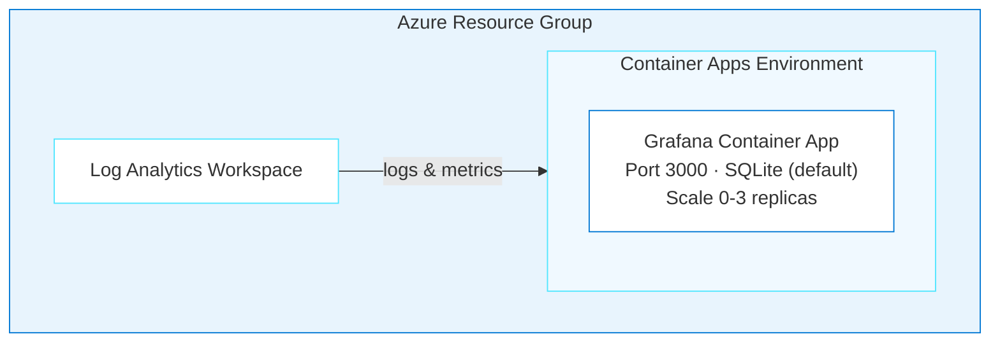

# Chapter 02: Grafana — Metrics & Visualization on Azure Container Apps

> **The simplest deployment in the project — no external database required, two minutes to production.**

In this chapter, you'll deploy [Grafana OSS](https://grafana.com/oss/grafana/) — the industry-standard observability platform — to Azure Container Apps. With no external database required and a ~2 minute deploy time, Grafana is the perfect second chapter: same agent, same skills system, dramatically simpler architecture. You'll also explore the SQLite vs PostgreSQL decision point for production readiness.

## Learning Objectives

- Deploy Grafana to Azure Container Apps using the agent or pre-built Bicep
- Understand why Grafana is simpler than n8n (no database dependency, fast startup)
- Evaluate SQLite vs PostgreSQL for different environments
- Use `/api/health` for reliable health probes
- Handle scale-to-zero cold starts gracefully

> ⏱️ **Estimated Time**: ~15 minutes (Path 1) or ~5 minutes (Path 2)
>
> 💰 **Estimated Cost**: ~$10-20/month (see [Cost Breakdown](#cost-breakdown)) — remember to clean up with `azd down` when done!
>
> 📋 **Prerequisites**: Azure CLI, Azure Developer CLI, and optionally GitHub Copilot CLI. See [root README prerequisites](../README.md#prerequisites) for installation links.

---

## Real-World Analogy: The Food Truck vs The Restaurant

In Chapter 01, deploying n8n was like opening a restaurant — you needed a kitchen (Container Apps), a walk-in fridge (PostgreSQL), and a seating plan (health probes for slow startup). Grafana is more like a food truck: self-contained, fast to set up, and ready to serve in minutes.

| Food Truck | Grafana on Azure |
|------------|-----------------|
| Self-contained kitchen | SQLite embedded database — no external dependency |
| Parks and serves in minutes | Deploys in ~2 minutes |
| Limited storage (small fridge) | Ephemeral storage — data lost on restart |
| Can upgrade to a commissary kitchen | Switch to PostgreSQL for production persistence |
| Quick to relocate | Scale-to-zero, spin up anywhere |

The food truck works great for testing and demos. When you need persistence, you upgrade to a commissary kitchen (PostgreSQL).

---

## Architecture



**Azure resources created:**

- **Azure Container Apps** — Serverless hosting with scale-to-zero
- **Azure Log Analytics** — Monitoring and diagnostics
- **SQLite** (default) — Embedded database, no external dependency
- Optional: **Azure Database for PostgreSQL** for production persistence

**Infrastructure directory:** [`../infra-grafana/`](../infra-grafana/)

---

## Path 1: Generate Infrastructure with the Agent

### Step 1: Start Copilot and Install the Azure MCP Plugin

Make sure you're in the repo root first:

```bash
cd oss-to-azure
```

Then start Copilot CLI:

```bash
copilot
```

Once inside the interactive session, install the Azure MCP plugin:

```
> /plugin install microsoft/github-copilot-for-azure:plugin
```

> **Already installed?** If you completed a previous chapter, the plugin persists across sessions — skip this step.

### Step 2: Select the Agent

```
> /agent
```

Select **`oss-to-azure-deployer`** from the list.

### Step 3: Ask the Agent to Deploy Grafana

```
> Deploy Grafana to Azure using Bicep and azd
```

The agent will:

1. **Load the right skills** — `grafana-azure`, `azure-container-apps`, `azure-bicep-generation`, and `azd-deployment`
2. **Use Azure MCP tools** — `azure_bicep_schema` for API versions, `azure_deploy_iac_guidance` for Bicep best practices
3. **Generate a leaner structure** than n8n — no PostgreSQL module needed (SQLite is default)

### Step 4: Review the Generated Infrastructure

Once the agent finishes, check what it created:

```bash
ls -R infra-grafana/
```

You should see:

```
infra-grafana/
├── main.bicep
├── main.parameters.json
├── abbreviations.json
├── modules/
│   ├── log-analytics.bicep
│   ├── container-apps-environment.bicep
│   └── grafana-container-app.bicep
└── hooks/
    ├── postprovision.sh
    └── postprovision.ps1
```

You can ask follow-up questions in the same session:

```
> Should I use PostgreSQL instead of SQLite for Grafana?
```

The agent explains: SQLite is fine for dev/testing but dashboards are lost on container restart. For production, either mount Azure Files to `/var/lib/grafana` or switch to PostgreSQL.

### Step 5: Deploy to Azure

Stay in the same Copilot session and ask the agent to deploy:

```
> Run azd up for the Grafana infrastructure you just generated. Set the location to westus and generate a secure admin password. If there are any issues, resolve them.
```

The agent will handle everything: update `azure.yaml`, register providers, create the azd environment, set variables, and run `azd up` (~2 minutes). If anything fails, it diagnoses and fixes automatically.

### Step 6: Verify

Once the agent reports success, ask it to verify:

```
> Verify the Grafana deployment is working. Check the health endpoint.
```

You can also verify manually:

```bash
GRAFANA_URL=$(azd env get-value GRAFANA_URL)
curl -s "$GRAFANA_URL/api/health"
# Expected: {"commit":"...","database":"ok","version":"10.x.x"}
```

If something goes wrong, just ask — you're still in the same session:

```
> Grafana is returning 502 errors
```

The agent will use `azure_deploy_app_logs` to check if it's a cold start issue (scale-from-zero takes 30-60s) or a real problem.

---

## Path 2: Deploy Pre-Built Infrastructure

> **No GitHub Copilot CLI required.** This path uses only Azure CLI and Azure Developer CLI.

### 1. Register Azure Resource Providers

```bash
az provider register --namespace Microsoft.App
az provider register --namespace Microsoft.OperationalInsights
```

### 2. Set Required Variables

```bash
azd env new my-grafana-env
azd env set AZURE_SUBSCRIPTION_ID "$(az account show --query id -o tsv)"
azd env set AZURE_LOCATION "westus"
azd env set GRAFANA_ADMIN_PASSWORD "$(openssl rand -hex 16)"
```

### 3. Update azure.yaml

Edit the existing `azure.yaml` in the repo root to point to the Grafana infra directory:

```yaml
name: grafana-azure

infra:
  provider: bicep
  path: infra-grafana

hooks:
  postprovision:
    posix:
      shell: sh
      run: ./infra-grafana/hooks/postprovision.sh
    windows:
      shell: pwsh
      run: ./infra-grafana/hooks/postprovision.ps1
```

### 4. Deploy

```bash
azd up
```

**Deployment time breakdown:**
| Stage | Time |
|-------|------|
| Resource Group | ~4s |
| Log Analytics | ~25s |
| Container Apps Environment | ~38s |
| Grafana Container App | ~10s |
| **Total** | **~2 minutes** |

### 5. Access Grafana

```bash
azd env get-value GRAFANA_URL
# Login: admin / <your GRAFANA_ADMIN_PASSWORD>
```

---

## Configuration Reference

### Environment Variables

| Variable | Value | Description |
|----------|-------|-------------|
| `GF_SECURITY_ADMIN_USER` | `admin` | Admin username |
| `GF_SECURITY_ADMIN_PASSWORD` | (secret) | Admin password |
| `GF_SERVER_HTTP_PORT` | `3000` | HTTP port |
| `GF_SERVER_ROOT_URL` | Auto-configured | Public URL |
| `GF_AUTH_ANONYMOUS_ENABLED` | `false` | Disable anonymous access |
| `GF_DATABASE_TYPE` | `sqlite3` | Default database |
| `GF_LOG_MODE` | `console` | Log output mode |
| `GF_LOG_LEVEL` | `info` | Log verbosity |

### Container Resources

| Setting | Value |
|---------|-------|
| Image | `docker.io/grafana/grafana:latest` |
| CPU | 0.5 cores |
| Memory | 1 GiB |
| Min Replicas | 0 (scale-to-zero) |
| Max Replicas | 3 |
| Scale Rule | HTTP requests (10 concurrent per replica) |

### Health Probes

Grafana starts fast (~15-30 seconds) and provides a dedicated health endpoint at `/api/health`.

| Probe | Initial Delay | Period | Failure Threshold |
|-------|---------------|--------|-------------------|
| Startup | — | 10s | 30 (5 min max) |
| Liveness | 15s | 30s | 3 |
| Readiness | — | 10s | 3 |

Health endpoint response:
```json
{"commit": "abc123", "database": "ok", "version": "10.x.x"}
```

### Storage: SQLite vs PostgreSQL

**SQLite (default):**
- Zero setup — embedded in the container
- ⚠️ Dashboards lost on container restart (ephemeral storage)
- Good for dev/testing

**PostgreSQL (production):**
Add these environment variables for persistent storage:

```yaml
GF_DATABASE_TYPE: postgres
GF_DATABASE_HOST: your-server.postgres.database.azure.com
GF_DATABASE_NAME: grafana
GF_DATABASE_USER: grafana
GF_DATABASE_PASSWORD: <secret>
GF_DATABASE_SSL_MODE: require
```

**Alternative:** Mount Azure Files to `/var/lib/grafana` for persistent SQLite.

---

## Cost Breakdown

| Resource | SKU | Monthly Cost |
|----------|-----|--------------|
| Container Apps (scale-to-zero) | Consumption (0.5 vCPU, 1GB) | ~$5-10 |
| Log Analytics | PerGB2018 | ~$2-5 |
| **Total (SQLite)** | | **~$10-20/month** |
| + PostgreSQL (optional) | B_Standard_B1ms | +~$15/month |

Grafana is the cheapest deployment in this project — no external database required for dev use.

---

## Troubleshooting

### Container Won't Start

**Check logs:**
```bash
az containerapp logs show --name <app-name> --resource-group <rg> --follow
```

Verify health probes aren't too aggressive. The Bicep templates in `../infra-grafana/` include proper timing.

> **Agent tip:** Ask `@oss-to-azure-deployer` — *"My Grafana container won't start"* — and it will use `azure_deploy_app_logs` to diagnose.

### 502 Bad Gateway

**Cause:** This typically happens on the first request after the container scales from zero. Cold start takes 30-60s — this is a one-time delay, not a persistent issue.

**Fix:** Wait 30-60 seconds and retry. For production, set `minReplicas: 1` to keep one instance warm.

### Login Fails

**Cause:** Password not set correctly, or special characters causing shell escaping issues.

**Fix:**
1. Verify the password env var is set: `az containerapp show --name <app> -g <rg> --query "properties.template.containers[0].env"`
2. Use alphanumeric passwords to avoid shell escaping issues
3. Redeploy with a new password if needed

### Dashboards Lost After Restart

**Cause:** SQLite stores data in ephemeral container storage.

**Fix:**
1. Add Azure Files volume mount for `/var/lib/grafana`
2. Switch to PostgreSQL backend (recommended for production)
3. Export dashboards as JSON and use Grafana provisioning

### Post-Deployment Issues

These issues relate to using Grafana after deployment, not the deployment itself.

### Can't Connect to Data Sources

**Fix:**
1. Ensure data sources are in the same VNet or publicly accessible
2. For Azure services, use private endpoints
3. Check NSG rules if using VNet integration

### Out of Memory (OOMKilled)

**Fix:** Increase memory in Bicep:
```bicep
resources: {
  cpu: json('0.5')
  memory: '2Gi'  // Increase from 1Gi
}
```

---

## Verification Checklist

```bash
GRAFANA_URL=$(azd env get-value GRAFANA_URL)

# Health check (expect HTTP 200 with JSON)
curl "$GRAFANA_URL/api/health"

# Admin login test
curl -u admin:$GRAFANA_ADMIN_PASSWORD "$GRAFANA_URL/api/org"

# Container status
az containerapp show --name $(azd env get-value GRAFANA_CONTAINER_APP_NAME) \
  --resource-group $(azd env get-value RESOURCE_GROUP_NAME) \
  --query "properties.runningStatus"
```

---

## Cleanup

```bash
azd down --force --purge
```

Teardown takes 3-5 minutes (Container Apps environment deletion is slow).

---

## Key Learnings

- **Grafana starts fast** — 15-30 seconds typical, much simpler than n8n or Superset
- **Use `/api/health` for probes** — returns JSON with database status, more reliable than `/`
- **SQLite is ephemeral** — dashboards lost on restart without persistent storage or PostgreSQL
- **Scale-to-zero cold start** takes 30-60s — this is normal, not an error
- **Avoid shell special characters in passwords** — use alphanumeric for CLI deployments
- **No database dependency** — simplest deployment in the project
- **Same agent, different skills** — the agent loaded `grafana-azure` instead of `n8n-azure` and adapted automatically

---

## Assignment

**Practice what you learned:**

1. Deploy Grafana using **Path 2** — notice how much faster it is than n8n (no PostgreSQL provisioning)
2. Open the Grafana UI and create a dashboard with a text panel
3. Run `azd down --force --purge`, then redeploy with `azd up` — notice your dashboard is gone (SQLite is ephemeral!)
4. Start a Copilot CLI session and ask: *"How do I make Grafana dashboards persist across restarts?"*
5. Clean up with `azd down --force --purge`

---

## What's Next

In [Chapter 03: Apache Superset](../superset/README.md), you'll tackle the most complex deployment — a full BI platform on Azure Kubernetes Service. You'll learn why some applications need Kubernetes instead of Container Apps, and how the agent handles init containers, shared volumes, and psycopg2 installation.

---

## Resources

- [Grafana Documentation](https://grafana.com/docs/grafana/latest/)
- [Azure Container Apps](https://learn.microsoft.com/azure/container-apps/)
- [Azure Developer CLI](https://learn.microsoft.com/azure/developer/azure-developer-cli/)
