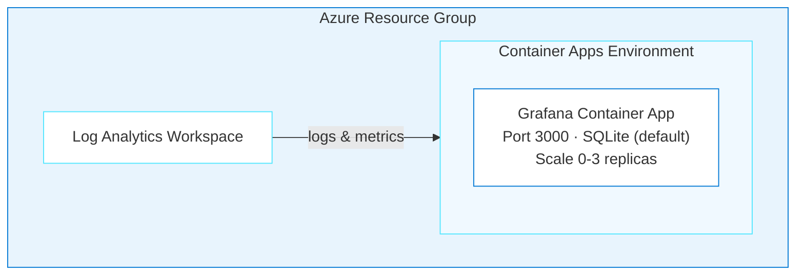

# 📊 Grafana on Azure Container Apps

Deploy [Grafana OSS](https://grafana.com/oss/grafana/) (metrics, logs, and traces visualization) to Azure using Bicep and Azure Developer CLI (azd).

> **Deploy time:** ~2 minutes | **Cost:** ~$10-20/month (dev) | **Complexity:** Simple

## Architecture



**Azure resources created:**

- **Azure Container Apps** — Serverless hosting with scale-to-zero
- **Azure Log Analytics** — Monitoring and diagnostics
- **SQLite** (default) — Embedded database, no external dependency
- Optional: **Azure Database for PostgreSQL** for production persistence

**Infrastructure directory:** [`../infra-grafana/`](../infra-grafana/)

## Prerequisites

- **Azure Subscription** with permissions to create resources
- **Azure CLI** (`az`) — [Install](https://docs.microsoft.com/en-us/cli/azure/install-azure-cli)
- **Azure Developer CLI** (`azd`) — [Install](https://learn.microsoft.com/en-us/azure/developer/azure-developer-cli/install-azd)

## Quick Start

### 1. Register Azure Resource Providers

```bash
az provider register --namespace Microsoft.App
az provider register --namespace Microsoft.OperationalInsights
```

### 2. Set Required Variables

```bash
azd env new my-grafana-env
azd env set AZURE_SUBSCRIPTION_ID "$(az account show --query id -o tsv)"
azd env set AZURE_LOCATION "westus"
azd env set GRAFANA_ADMIN_PASSWORD "$(openssl rand -base64 16)"
```

### 3. Update azure.yaml

Make sure the root `azure.yaml` points to the Grafana infra directory:

```yaml
name: grafana-azure

infra:
  provider: bicep
  path: infra-grafana

hooks:
  postprovision:
    posix:
      shell: sh
      run: ./infra-grafana/hooks/postprovision.sh
    windows:
      shell: pwsh
      run: ./infra-grafana/hooks/postprovision.ps1
```

### 4. Deploy

```bash
azd up
```

**Deployment time breakdown:**
| Stage | Time |
|-------|------|
| Resource Group | ~4s |
| Log Analytics | ~25s |
| Container Apps Environment | ~38s |
| Grafana Container App | ~10s |
| **Total** | **~2 minutes** |

### 5. Access Grafana

```bash
azd env get-value GRAFANA_URL
# Login: admin / <your GRAFANA_ADMIN_PASSWORD>
```

## Configuration

### Environment Variables

| Variable | Value | Description |
|----------|-------|-------------|
| `GF_SECURITY_ADMIN_USER` | `admin` | Admin username |
| `GF_SECURITY_ADMIN_PASSWORD` | (secret) | Admin password |
| `GF_SERVER_HTTP_PORT` | `3000` | HTTP port |
| `GF_SERVER_ROOT_URL` | Auto-configured | Public URL |
| `GF_AUTH_ANONYMOUS_ENABLED` | `false` | Disable anonymous access |
| `GF_DATABASE_TYPE` | `sqlite3` | Default database |
| `GF_LOG_MODE` | `console` | Log output mode |
| `GF_LOG_LEVEL` | `info` | Log verbosity |

### Container Resources

| Setting | Value |
|---------|-------|
| Image | `docker.io/grafana/grafana:latest` |
| CPU | 0.5 cores |
| Memory | 1 GiB |
| Min Replicas | 0 (scale-to-zero) |
| Max Replicas | 3 |
| Scale Rule | HTTP requests (10 concurrent per replica) |

### Health Probes

Grafana starts fast (~15-30 seconds) and provides a dedicated health endpoint at `/api/health`.

| Probe | Initial Delay | Period | Failure Threshold |
|-------|---------------|--------|-------------------|
| Startup | — | 10s | 30 (5 min max) |
| Liveness | 15s | 30s | 3 |
| Readiness | — | 10s | 3 |

Health endpoint response:
```json
{"commit": "abc123", "database": "ok", "version": "10.x.x"}
```

### Storage: SQLite vs PostgreSQL

**SQLite (default):**
- Zero setup — embedded in the container
- ⚠️ Dashboards lost on container restart (ephemeral storage)
- Good for dev/testing

**PostgreSQL (production):**
Add these environment variables for persistent storage:

```yaml
GF_DATABASE_TYPE: postgres
GF_DATABASE_HOST: your-server.postgres.database.azure.com
GF_DATABASE_NAME: grafana
GF_DATABASE_USER: grafana
GF_DATABASE_PASSWORD: <secret>
GF_DATABASE_SSL_MODE: require
```

**Alternative:** Mount Azure Files to `/var/lib/grafana` for persistent SQLite.

## Cost Breakdown

| Resource | SKU | Monthly Cost |
|----------|-----|--------------|
| Container Apps (scale-to-zero) | Consumption (0.5 vCPU, 1GB) | ~$5-10 |
| Log Analytics | PerGB2018 | ~$2-5 |
| **Total (SQLite)** | | **~$10-20/month** |
| + PostgreSQL (optional) | B_Standard_B1ms | +~$15/month |

Grafana is the cheapest deployment in this project — no external database required for dev use.

## Troubleshooting

### Container Won't Start

**Check logs:**
```bash
az containerapp logs show --name <app-name> --resource-group <rg> --follow
```

Verify health probes aren't too aggressive. The Bicep templates in `../infra-grafana/` include proper timing.

### 502 Bad Gateway

**Cause:** Container still starting from scale-to-zero (cold start takes 30-60s).

**Fix:** Wait 30-60 seconds and retry. For production, set `minReplicas: 1` to keep one instance warm.

### Login Fails

**Cause:** Password not set correctly, or special characters causing shell escaping issues.

**Fix:**
1. Verify the password env var is set: `az containerapp show --name <app> -g <rg> --query "properties.template.containers[0].env"`
2. Use alphanumeric passwords to avoid shell escaping issues
3. Redeploy with a new password if needed

### Dashboards Lost After Restart

**Cause:** SQLite stores data in ephemeral container storage.

**Fix:**
1. Add Azure Files volume mount for `/var/lib/grafana`
2. Switch to PostgreSQL backend (recommended for production)
3. Export dashboards as JSON and use Grafana provisioning

### Can't Connect to Data Sources

**Fix:**
1. Ensure data sources are in the same VNet or publicly accessible
2. For Azure services, use private endpoints
3. Check NSG rules if using VNet integration

### Out of Memory (OOMKilled)

**Fix:** Increase memory in Bicep:
```bicep
resources: {
  cpu: json('0.5')
  memory: '2Gi'  // Increase from 1Gi
}
```

## Verification

```bash
# Health check (expect HTTP 200 with JSON)
curl https://<GRAFANA_FQDN>/api/health

# Admin login test
curl -u admin:YourPassword https://<GRAFANA_FQDN>/api/org

# Container status
az containerapp show --name <app-name> --resource-group <rg> \
  --query "properties.runningStatus"
```

## Cleanup

```bash
azd down --force --purge
```

Teardown takes 3-5 minutes (Container Apps environment deletion is slow).

## 🤖 Copilot Agent & Skills

This deployment is powered by the **`@oss-to-azure-deployer`** Copilot agent ([`.github/agents/oss-to-azure-deployer.agent.md`](../.github/agents/oss-to-azure-deployer.agent.md)) with these skills:

| Skill | Purpose |
|-------|---------|
| [`grafana-azure`](../.github/skills/grafana-azure/SKILL.md) | Grafana-specific configuration, environment variables, health probes, troubleshooting |
| [`azure-bicep-generation`](../.github/skills/azure-bicep-generation/SKILL.md) | Bicep patterns for Container Apps, Log Analytics, naming conventions |
| [`azd-deployment`](../.github/skills/azd-deployment/SKILL.md) | azure.yaml configuration, post-provision hooks, deployment workflows |

Ask `@oss-to-azure-deployer` in GitHub Copilot to deploy Grafana, add data sources, or switch to PostgreSQL.

## Key Learnings

- **Grafana starts fast** — 15-30 seconds typical, much simpler than n8n or Superset
- **Use `/api/health` for probes** — returns JSON with database status, more reliable than `/`
- **SQLite is ephemeral** — dashboards lost on restart without persistent storage or PostgreSQL
- **Scale-to-zero cold start** takes 30-60s — this is normal, not an error
- **Avoid shell special characters in passwords** — use alphanumeric for CLI deployments
- **No database dependency** — simplest deployment in the project

## Resources

- [Grafana Documentation](https://grafana.com/docs/grafana/latest/)
- [Azure Container Apps](https://learn.microsoft.com/azure/container-apps/)
- [Azure Developer CLI](https://learn.microsoft.com/azure/developer/azure-developer-cli/)
