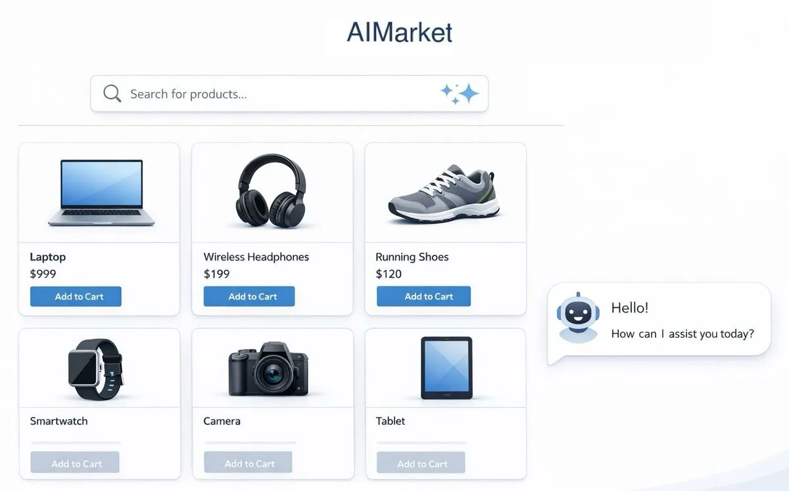
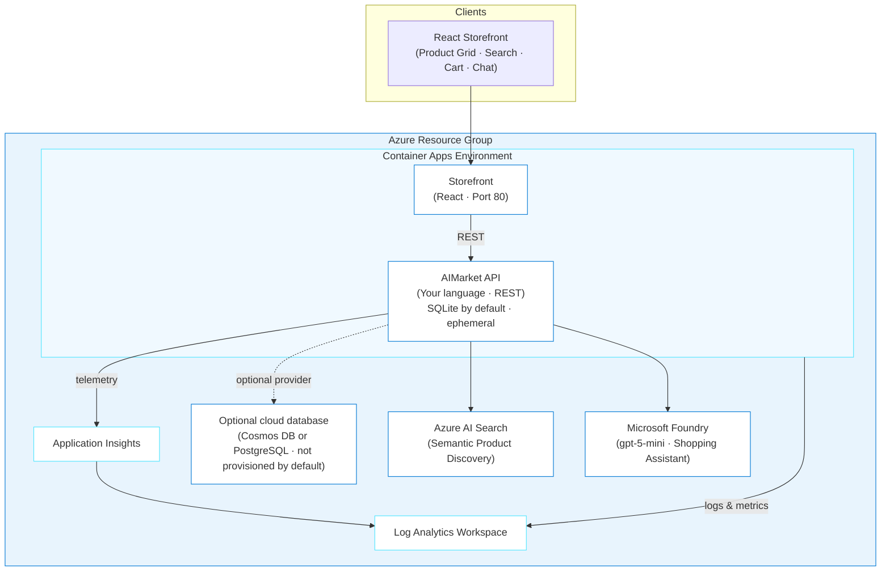
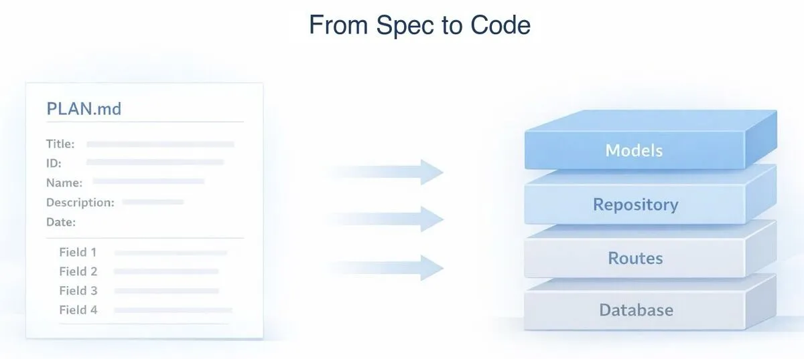
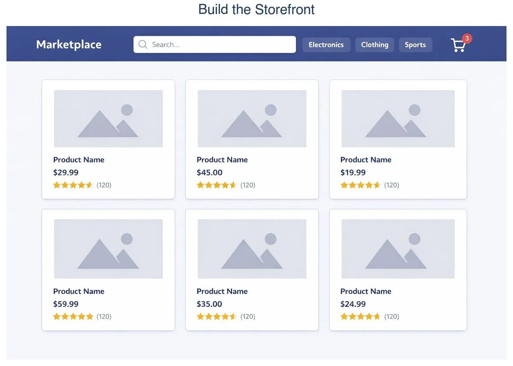
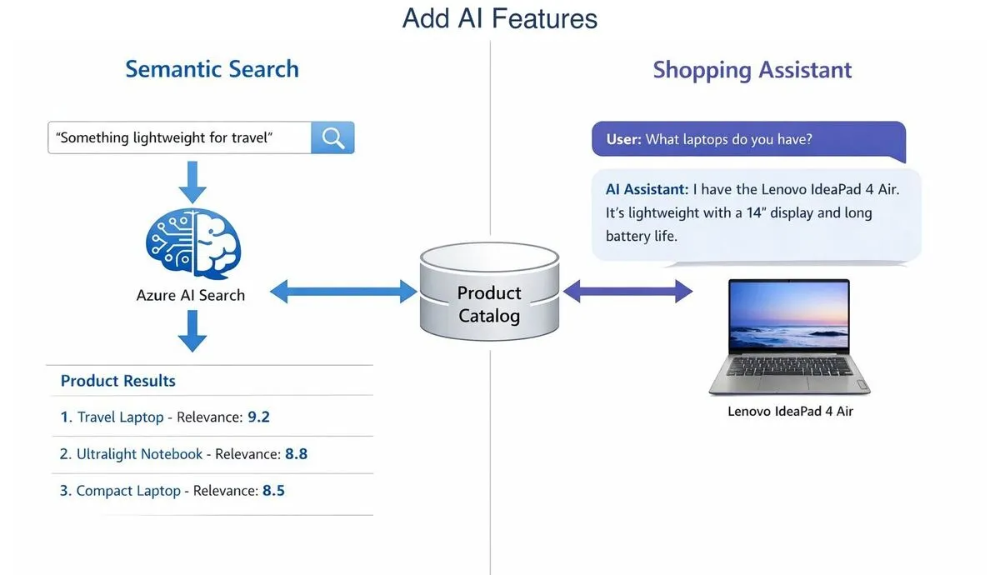
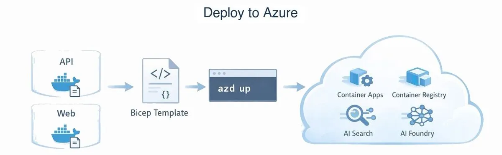
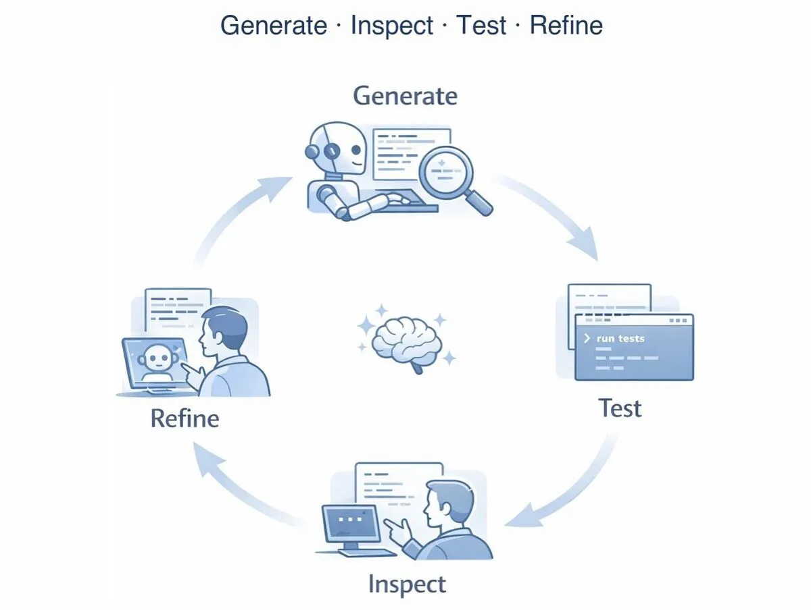

# AIMarket

> ✨ **Build a full-stack marketplace from a spec document, with AI features from search to checkout.**

<p align="center">
  
</p>

In this journey, you'll build AIMarket, a lightweight marketplace with semantic product search and a shopping assistant. You'll use a shared spec to guide GitHub Copilot as it scaffolds the API and React storefront, then inspect, test, refine, and deploy the result to Azure.

## Learning Objectives

- Use a spec/plan document as shared context for GitHub Copilot to scaffold an entire application
- Build a REST API with products, orders, and users in your choice of language (Node.js, Python, .NET, or Java)
- Build a React storefront that consumes the API
- Add semantic product search with Azure AI Search
- Build an AI shopping assistant with Microsoft Foundry
- Deploy the full stack to Azure Container Apps using `azd`

> ⏱️ **Estimated Time**: **3–5 hours for a first run** (about 2–3 hours if you've completed an OSS journey and already know Container Apps). The phase estimates below cover hands-on work; the total also includes time to test, debug, and revise.
>
> 💰 **Estimated Cost**: ~$100–115/month while the resources exist (AI Search Basic is approximately $75 of that cost; see [Cost Breakdown](#cost-breakdown)). Complete the [Cleanup](#cleanup) procedure when you finish the journey.

## Prerequisites

This journey supports Windows PowerShell, macOS, and Linux.

| Host tool | Requirement | Purpose | Validation |
| --- | --- | --- | --- |
| Azure CLI | Required | Authenticate and manage Azure resources | `az version` |
| Azure Developer CLI (`azd`) 1.28.0 or later | Required | Provision and remove the deployment | `azd version` |
| Node.js 24 LTS or later | Required | Build the frontend, run hooks, and provide the default API runtime | `node --version` |
| GitHub Copilot CLI | Required for the documented CLI path | Run the coding agent | `copilot --version` |
| GitHub CLI (`gh`) | Required only for the cloud-agent issue and pull-request path | Create issues and manage pull requests | `gh auth status` |
| Python 3.10+, .NET 8+, or Java 17+ | Required only when selected instead of the default Node.js API | Run the selected API stack | `python --version`, `dotnet --version`, or `java --version` |

Run these read-only checks on the host machine before Phase 1:

```text
az version
az account show --output table
azd version
node --version
copilot --version
```

Run `gh auth status` before the cloud-agent path. Run the validation command for the selected alternative API runtime before generating that API. Confirm that `az account show` identifies the intended subscription, `azd` is version 1.28.0 or later, and Node.js is version 24 or later. Stop and fix the prerequisite if a required check fails. See the [cross-platform installation guide](../../docs/tool-installation.md) for installation instructions.

> [!NOTE]
> GitHub Copilot CLI is the documented and validated command-line path. You may adapt the prompts for another agentic coding tool by copying or adapting this repository's `.github/skills` into that tool's supported skills or instructions location and reporting anything unsupported.

### Acceptance criteria

The local application is complete when:

- [ ] `GET /api/health` returns HTTP 200.
- [ ] The product grid shows all 10 seed products and every product image loads.
- [ ] Placing an order decrements inventory.
- [ ] Semantic search returns relevant catalog products.
- [ ] The chat assistant mentions a real catalog product and does not invent products.

The Azure deployment is complete when the checked-in verifier passes against the deployed API and storefront.

The journey is complete after the [Cleanup](#cleanup) procedure removes the Azure resources.

---

## Architecture



**Deployment components and Azure resources:**

- **Azure Container Apps**: Serverless hosting for the API and frontend
- **Database**: SQLite embedded in the API container (default). A cloud-backed deployment requires a Cosmos DB or PostgreSQL repository implementation, database infrastructure, credentials, and `DATA_PROVIDER` configuration.
- **Azure AI Search** (Basic tier): Semantic product discovery
- **Microsoft Foundry** (AIServices): gpt-5-mini shopping assistant
- **Azure Container Registry**: Docker image storage
- **Application Insights + Azure Log Analytics**: Application telemetry, monitoring, and diagnostics

> ⚠️ **Data persistence note:** The default deployment does **not** provision a database. SQLite lives inside the API container, so orders and inventory changes are lost whenever the container restarts or scales to zero. That's fine for this lab; the [Grafana journey](../grafana/README.md) explores the same ephemeral-storage tradeoff. For persistent data, ask GitHub Copilot to implement a Cosmos DB or PostgreSQL repository, provision that database in Bicep, configure its credentials, and set `DATA_PROVIDER` accordingly.

---

## The Spec

AIMarket is driven by [`PLAN.md`](./PLAN.md), the spec in this journey folder. It defines the data models, API contracts, validation rules, and seed data. Skim it before you start so you know what the finished app should do; GitHub Copilot will use the details as implementation context.

**Core data model (the parts you'll build):**

| Entity | Key Fields | Purpose |
|--------|-----------|---------|
| **Product** | id, name, description, price, category, tags, inventory, rating | Marketplace catalog |
| **Order** | id, userId, items[], total, status (pending → confirmed → shipped → delivered) | Purchase tracking |
| **User** | id, email, name, role (buyer/seller) | Account management |

**Key API endpoints you'll generate:**

| Method | Path | Description |
|--------|------|-------------|
| `GET` | `/api/products` | List products with pagination and filtering |
| `GET` | `/api/products/:id` | Get a single product |
| `POST` | `/api/products` | Create a product (sellers) |
| `POST` | `/api/products/search` | AI-powered semantic search |
| `POST` | `/api/orders` | Place an order |
| `GET` | `/api/orders/:id` | Get order details |
| `POST` | `/api/users/register` | Register a new user |
| `POST` | `/api/chat` | AI shopping assistant |

---

## The Journey

AIMarket is built in four phases that combine interactive prompting, code review, asynchronous delegation, and deployment. The [`PLAN.md`](./PLAN.md) spec is your shared context throughout.

**How this journey works:** You won't paste one giant prompt and hope for a finished app. You'll work incrementally: ask GitHub Copilot for one piece, inspect what it generated, test it, fix what needs attention, and then continue. The loop is simple: generate → inspect → test → refine.

> **💡 Tip: Track issues as you go.** Add *"If you encounter any issues, log them to issues.md so they can be tracked and fixed"* to your prompt. This keeps generation and deployment problems in one place while you iterate.

> [!IMPORTANT]
> **When something fails**
>
> 1. Stay in the same AI coding session so it retains the journey context.
> 2. Paste the exact command and relevant error output. Don't paraphrase the error.
> 3. Include your operating system, shell, current phase, and last successful step.
> 4. Remove passwords, tokens, connection strings, keys, cookies, and `.env` values before pasting.
> 5. Ask the agent to inspect the relevant application and Azure logs, explain the root cause, make the smallest safe fix, rerun the failed step, and run the journey verifier.
> 6. Record the problem and resolution in `issues.md`.
>
> Use this prompt:
>
> ```text
> The following command failed during <journey phase> on <OS and shell>:
>
> <exact command>
>
> Relevant error output:
>
> <redacted error output>
>
> Inspect the relevant application and Azure logs, explain the root cause,
> make the smallest safe fix, rerun the failed step, and run the journey
> verifier. Record the issue and resolution in issues.md. Do not print secrets.
> ```

### Phase 1: Build the API from the Spec (~25 min)

<p align="center">
  
</p>

You'll build the API in stages, not all at once. Each step teaches a different aspect of working with GitHub Copilot.

#### Step 1: Set up the project

Change to the existing journey directory so GitHub Copilot can access the skills and agent definitions in `.github/`:

```text
cd github-azure-agentic-journeys/journeys/aimarket
```

Configure `azd` to reuse the signed-in Azure CLI session:

```text
azd config set auth.useAzCliAuth true
```

The command must exit successfully.

Start the [GitHub Copilot CLI](https://docs.github.com/en/copilot/how-tos/copilot-cli/cli-getting-started):

```text
copilot
```

If you haven't installed the Azure Skills plugin yet, do it now. This one-time setup adds deployment tools, Bicep schema lookups, and infrastructure generation; see the root [Quick Start](../../README.md#quick-start) for details.

```
> /plugin marketplace add microsoft/azure-skills
> /plugin install azure@azure-skills
```

#### Step 2: Generate the data models

Start with the data models rather than the whole API. This lets you inspect the generated code before building on top of it.

> **Default stack:** Node.js + TypeScript + Express. Prefer another language? Swap it in the prompt and use PLAN.md’s Choose Your Stack table.

```
> Read the PLAN.md file in this directory. Create a Node.js/Express with TypeScript
  project in an api/ subdirectory (or my chosen stack if I say otherwise).
  Initialize the project with the standard build files.
  Then create just the data models from the Phase 1 spec: Product, Order 
  (with OrderItem and ShippingAddress), and User. Include validation functions 
  for each model. Use the recommended framework from the Choose Your Stack 
  table in the spec. If you encounter any issues, log them to issues.md.
```

**🔍 Inspect what was generated:**

Open the Product model file. Look for:
- Does the `Product` type match the PLAN.md fields? (id, name, description, price, category, tags, etc.)
- Does validation check that `price > 0` and `category` is from the allowed list?
- Are the constraints right? (name 1-200 chars, inventory >= 0)

If anything's off, tell GitHub Copilot:

```
> The Product validation doesn't check that category is one of the allowed 
  values from the spec. Fix it to reject invalid categories.
```

**💡 What you're learning:** A spec gives GitHub Copilot structure, but it doesn't remove the need for review. Compare the generated types and validation rules with the source, especially around constraints and edge cases.

#### Step 3: Generate the data layer with repository pattern

Now add the database layer. The spec calls for a repository pattern so you can swap SQLite for Cosmos DB later without changing route code.

```
> Read the Data Access Layer section in PLAN.md. Create the repository pattern 
  for [YOUR LANGUAGE]:
  1. Repository interfaces/protocols for Product, Order, and User
  2. SQLite implementation using the recommended library from the Choose Your Stack table
  3. A factory that reads DATA_PROVIDER env var (default: sqlite)
  4. Seed data from the PLAN.md tables with exact IDs
  Store tags as JSON strings in SQLite and parse them on read.
```

**🔍 Inspect what was generated:**

Open the SQLite implementation file and look for:
- **Tags storage:** SQLite has no array type. The spec says to store tags as JSON strings (`'["laptop","ultrabook"]'`) and parse them on read. Is that how tags are stored and read?
- **Order items:** Are they in a junction table (`order_items`) or embedded? The spec says junction table.
- **Seed orders:** Do they decrement inventory? They shouldn't; they're historical data.

```
> Show me how tags are stored and retrieved in the SQLite implementation. 
  Are they JSON strings in SQLite, parsed to arrays on read?
```

**💡 What you're learning:** The repository pattern lets you change storage without rewriting route handlers. In Phase 4, a Cosmos DB or PostgreSQL implementation can follow the same interfaces. This step also exposes SQLite's tradeoffs, including the need to serialize arrays and nested objects.

#### Step 4: Generate the API routes

Now add the route handlers that use the repository interfaces.

```
> Create route handlers for products, orders, users, and chat. Each should 
  receive a DataStore (repository) parameter — never import the database 
  directly. Follow the endpoint specs in PLAN.md Phase 1. Also create a 
  global error handler matching the error format from the spec, and the 
  main entry point with CORS, JSON body parsing, a GET /api/health endpoint, 
  and all routes mounted at /api.
```

**🔍 Inspect what was generated:**

Check the order creation route. This is the most complex endpoint. Look for:
1. Does `POST /orders` validate that all product IDs exist and are active?
2. Does it check inventory before creating the order?
3. Does it decrement inventory after creating the order?
4. Does it capture `priceAtPurchase` from the product's current price (not from the request)?
5. Does it calculate `total` server-side?

If any of these are missing, ask GitHub Copilot to fix them one at a time:

```
> The POST /api/orders endpoint doesn't capture priceAtPurchase from the 
  product's current price. It's using the price from the request body, 
  which means a buyer could send any price. Fix it to look up each 
  product's price from the database.
```

**💡 What you're learning:** Multi-step business rules deserve closer review than basic CRUD. Order creation must check inventory, decrement it, capture the current price, and calculate the total in the right sequence. Missing any one of those steps changes the result.

#### Step 5: Test the API yourself

Don't ask GitHub Copilot to claim it tested the API. Generate a reusable cross-platform verifier, run it yourself, and inspect the output.

1. Check that the preferred API port is free. If it is already in use, select another port instead of stopping the unrelated process.
2. Start the API with its documented `PORT` or equivalent setting.
3. Generate `scripts/verify-api.mjs` using Node.js `fetch`. The script must read `API_URL` and default to the selected local URL. This generated local verifier is separate from the checked-in deployment verifier used in Phase 4.
4. Run:

```text
node scripts/verify-api.mjs
```

The verifier must fail with a nonzero exit code unless all of these pass:

- `GET /api/health` returns JSON and HTTP 200.
- `GET /api/products` returns all 10 seed products.
- `GET /api/products?category=Electronics` returns only the three electronics products.
- `GET /api/products/prod-1` includes the full description.
- `GET /api/products/nonexistent` returns the documented 404 error envelope.
- Creating an order decrements inventory by the requested quantity.
- Updating a product to `64.99` succeeds, while a three-decimal price such as `64.991` fails validation.

If any check fails, describe the exact request, expected result, and actual result to GitHub Copilot. Keep the verifier in the generated project so the same checks work from PowerShell, Command Prompt, Bash, and CI.

```
> The category filter isn't working — GET /api/products?category=Electronics 
  returns all 10 products instead of just 3. Check the SQL query in the 
  SQLite implementation.
```

**💡 What you're learning:** Running the verifier yourself shows you what the API returns, how inventory changes after an order, and which failures matter when you later test the deployed app.

---

### Phase 2: Build the Storefront (~20 min)

<p align="center">
  
</p>

#### Step 1: Generate the React frontend

```
> Create a React frontend for AIMarket in a client/ directory using Vite, 
  TypeScript, and Tailwind CSS. The frontend is always React regardless of 
  your API language. Read the Phase 2 spec in PLAN.md. Build:
  - Product grid page with search bar and category filter buttons
  - Product detail page with Add to Cart
  - Shopping cart page with Place Order
  - A ChatWidget component that shows "Coming in Phase 3" as a stub
  Set up a Vite proxy so /api requests go to http://localhost:[YOUR API PORT].
```

#### Step 2: Run both services together

You need the API and frontend running at the same time. Ask GitHub Copilot to set this up:

```
> Create a way to start both the API and the React frontend with a single 
  command from the project root. The API runs in api/ and the frontend 
  runs in client/. I want to run one command and see both start.
```

Start both services, then open `http://localhost:5173` in your browser.

**🔍 Open the app in your browser at `http://localhost:5173`:**

- Do all 10 products display with images, prices, and ratings?
- In the browser network panel, do all 10 image requests return HTTP 2xx? Treat a broken seed image as a journey failure and replace it with a verified URL before continuing.
- Does typing in the search bar filter products?
- Click "Electronics". Do only 3 products show?
- Click a product → does the detail page load with the full description?
- Add 2 items to the cart → does the cart icon show "2"?
- Go to the cart → are quantities and totals correct?
- Place an order → do you see a confirmation with an order ID?

#### Step 3: Fix something yourself

Test the generated frontend against the browser checklist above and fix an issue you actually observe. If every check passes, add a small assertion or regression test for one of these common failure cases:

- **Cart doesn't update the icon badge** → Check that `CartContext` is properly wired
- **Product images are broken** → Check the `imageUrl` format in seed data
- **Search doesn't filter by tags** → The search function may only check `name`

Pick one issue (or find a real one) and fix it with GitHub Copilot:

```
> The search bar only matches product names but not tags. When I search 
  for "wireless" I should see the headphones. Update the filter logic 
  in ProductGrid to also search tags.
```

**💡 What you're learning:** Frontend review involves more judgment than checking an API contract. Layout, state management, and error handling can all be technically valid while still producing a poor experience, so test the app in the browser rather than trusting the generated structure.

#### Step 4: Push to GitHub

You'll need a GitHub repo for Phase 3's cloud agent workflow. Stay in this journey folder:

From the journeys repository root, change to `journeys/aimarket`, then run:

```text
git init
git add -A
git commit -m "AIMarket: API + React storefront"
gh repo create aimarket --private --source=. --push
```

> **Nested repo note:** `git init` creates a repository rooted at `journeys/aimarket`. That's intentional because the cloud agent needs a standalone repository. Git commands run inside this directory target the nested repository, while the outer journeys clone may still report changes to files it already tracks. Do not commit the generated app to the outer repository or add it as a submodule. Run these commands from `journeys/aimarket`, never from the repo root.
>
> Work only under `journeys/aimarket` for the rest of this journey. Do not copy the app to `~/aimarket`.

---

### Phase 3: Add AI Features (~30–45 min)

<p align="center">
  
</p>

This phase has two goals: integrate Azure AI services and delegate a well-scoped feature to the Copilot cloud agent.

#### Step 1: Local AI credentials (optional before Phase 4)

**Recommended:** Skip creating standalone AI resources here. Implement search and chat with **graceful fallbacks** (SQLite LIKE for search; chat returns 503 without a Foundry endpoint). Phase 4 Bicep provisions **Azure AI Search + Microsoft Foundry** and configures managed-identity authentication for Foundry.

**Optional local AI now:** If you want live semantic search and chat before deploy, have GitHub Copilot create an uncommitted `.env.local` containing `AZURE_SEARCH_ENDPOINT`, `AZURE_SEARCH_KEY`, `AZURE_SEARCH_INDEX`, `AZURE_OPENAI_ENDPOINT`, and `AZURE_OPENAI_DEPLOYMENT`, plus `AZURE_OPENAI_KEY` for local Foundry authentication. Add the file to `.gitignore` and load it through the selected framework instead of placing credentials in shell history. Use existing Search and Foundry resources, or create temporary resources and delete them immediately after testing.

Do **not** create a second long-lived Search/Foundry pair if you are about to run Phase 4 — you will pay twice.

#### Step 2: Add semantic product search (interactive CLI)

This one you'll do interactively so you can see how search integration works.

```
> Add Azure AI Search integration to AIMarket. Read the "AI Feature 1" 
  section in PLAN.md for the full spec. Create the search index, add a 
  POST /api/products/search endpoint with semantic ranking, and add a 
  script to push products to the index. Use the Azure AI Search SDK 
  recommended in PLAN.md for my language.
```

**🔍 Inspect the search service code:**

Open the search service file. Key things to understand:
- The search index has a **semantic configuration**. This is what makes "lightweight for travel" match "UltraBook Pro" even though those words don't appear together
- The endpoint does a **two-step process**: search returns IDs and scores, then full product details come from your database
- There's a **fallback**: when Azure AI Search credentials aren't set, it uses a SQLite LIKE query instead

Extend `scripts/verify-api.mjs` with fallback-search assertions, then rerun it. When Azure AI Search credentials are configured, also prove that “something lightweight for travel” returns the UltraBook product and “gift for a kid” returns the castle set or another valid toy without relying on exact string matching alone. Run those semantic assertions again after Phase 4 deployment.

> **No results?** If search returns no results, make sure products have been pushed to the search index. Restart the API (which indexes on startup) or call `POST /api/products/reindex`.

**💡 What you're learning:** Azure AI Search handles indexing and semantic reranking. You query the index with natural language, then merge the ranked results with full product records from the database.

#### Step 3: Delegate the shopping assistant to the cloud agent

For the shopping assistant, switch to an asynchronous workflow: write a GitHub issue and let the GitHub Copilot cloud agent implement it.

**Why delegate this one?** The shopping assistant is well-scoped (one endpoint + one component) with clear acceptance criteria in the spec. That makes it a good candidate for async delegation since you don't need to be in the loop for every decision.

**Option A: Delegate from your GitHub Copilot session**

If your surface supports it (e.g. Copilot CLI `/delegate`), delegate asynchronously:

```
> /delegate Create the AI shopping assistant for AIMarket. Read PLAN.md
  in the root of the pushed AIMarket repository for the full spec — see
  "AI Feature 2: Shopping Assistant"
  under Phase 3. Implement the POST /api/chat endpoint using the Microsoft Foundry
  SDK for my language. The endpoint should fetch all products and include them 
  in the system prompt. Also add a ChatWidget component to the React frontend. 
  Use the acceptance criteria in PLAN.md Phase 3 to verify your work.
```

**Option B: Create an issue and assign GitHub Copilot cloud agent**

Create `issue-body.md` with this content:

```markdown
## What
Add the AI shopping assistant to AIMarket.

## Spec
Read PLAN.md in the root of the pushed AIMarket repository. Implement:
1. **POST /api/chat** endpoint (see 'AI Feature 2: Shopping Assistant' in Phase 3)
   - Uses the Microsoft Foundry SDK for this project's language
   - Fetches all products and injects them into the system prompt
   - Accepts a messages array for conversation history
   - Returns the assistant's response
2. **ChatWidget** React component (see Phase 2 ChatWidget spec)
   - Floating button bottom-right, expands to chat panel
   - Message list + text input
   - Sends full history with each request

## Acceptance Criteria
- POST /api/chat with 'What laptops do you have?' mentions UltraBook Pro 15
- Assistant does not invent products outside the catalog
- Multi-turn conversation works (follow-up questions)
- ChatWidget opens, sends messages, displays responses
- If Azure credentials are missing, endpoint returns 503
```

Create the issue with one shell-neutral command:

```text
gh issue create --title "Add AI shopping assistant (chat endpoint + ChatWidget)" --body-file issue-body.md
```

Then assign it to the GitHub Copilot cloud agent. Navigate to the issue on GitHub and click **"Assign to Copilot"**.

While the cloud agent works, take a break or read ahead to Phase 4. Don't deploy yet; the chat endpoint is part of the live acceptance criteria. When the agent opens a PR:

```text
gh pr checkout <PR_NUMBER>
# start both API and frontend, then test the chat endpoint and widget locally
```

**🔍 Review the PR like you would any code review:**

- Does the system prompt include the product catalog? (It should fetch products on each request, not hardcode them)
- Does the code avoid setting a custom temperature? (gpt-5 family models reject non-default temperature values — only set `0.7` if you're on the gpt-4.1 fallback)
- Does the ChatWidget send the full message history, or just the latest message?
- What happens when `AZURE_OPENAI_ENDPOINT` isn't set? (Should return 503, not crash)

If something's off, comment on the PR and let the agent fix it. Then merge:

```text
gh pr merge <PR_NUMBER>
```

> **If the agent's PR doesn't work:** After 2 rounds of feedback, close the PR and implement it yourself interactively using the "AI Feature 2: Shopping Assistant" section in PLAN.md. Not every task is a good fit for delegation, and that's a lesson too.

**💡 What you're learning:** Cloud-agent work starts with a well-scoped issue and ends with your review. Self-contained tasks work best because the agent can read the spec and prove its work against testable acceptance criteria. Use interactive prompting when you need to steer each decision; delegate when the boundaries are already clear.

---

### Phase 4: Deploy to Azure (~30–45 min first time)

<p align="center">
  
</p>

Before generating Bicep, confirm that a supported model exists in `westus`:

```text
az cognitiveservices model list --location westus --query "[?model.name=='gpt-5-mini' || model.name=='gpt-4.1'].{name:model.name, version:model.version}" --output table
```

The command must list at least one supported model. Stop before provisioning if the result is empty.

#### Step 1: Generate infrastructure

The Phase 4 section in PLAN.md and the `container-apps-deployment` skill contain the infrastructure requirements used in this journey, including resources, Dockerfiles, and the postdeploy hook. That context keeps the deployment prompt short:

```
> Read the Phase 4 section in PLAN.md and the container-apps-deployment skill
  at ../../.github/skills/container-apps-deployment/SKILL.md. Following the
  Containerization, Azure Resources, Bicep Requirements, and Deployment
  sections exactly, create everything needed to deploy AIMarket to Azure
  Container Apps: Bicep in infra/, Dockerfiles with .dockerignore files for
  api/ and client/, azure.yaml (language: ts), and the required postdeploy
  hook wired into azure.yaml. Default stack: Node.js API + React client.
  Set the location to westus. Log issues to issues.md.
```

**🔍 Before deploying, review these critical details:**

1. Open `infra/main.bicep`. Do both container apps have `tags: { 'azd-service-name': '...' }`? Without these, `azd deploy` can't find the apps.
2. Is there an Azure Container Registry resource? Without it, there's nowhere to push images.
3. Open `api/Dockerfile`. Does it use the correct base image for your language? If using Node.js with `better-sqlite3`, it needs native build tools (`python3 make g++`).
4. Open `client/nginx.conf`. Does it ONLY have `try_files` for SPA routing? No `/api/` proxy block. (With public ingress on Container Apps, each service has its own URL, so nginx proxying to `aimarket-api` will crash because that hostname doesn't resolve.)
5. Open `client/.dockerignore`. Does it exclude dependency directories (`node_modules/`, `.git/`)? Without this, the Docker build context is huge and may fail.
6. Open `api/.dockerignore`. Make sure it does NOT exclude build config files like `tsconfig.json`. The Docker build needs them to compile.
7. Open `client/Dockerfile`. Is it compatible with an ACR `linux/amd64` cloud build, and are `ARG VITE_API_URL` and `ENV VITE_API_URL=$VITE_API_URL` **before** `npm run build`?
8. Do both Container Apps use system-assigned identity, an `AcrPull` assignment, and an explicit ACR registry entry using `identity: system` before a private image is deployed?
9. Does `azure.yaml` define `hooks.postdeploy` → `infra/hooks/postdeploy.js` without `shell: sh`? Without this, the storefront will load HTML but products will fail.

**💡 What you're learning:** Small deployment details can fail in very different ways. Missing service tags prevent `azd` from updating an app, an incomplete `.dockerignore` can overwhelm the build context, and the wrong nginx configuration can stop the container. The postdeploy hook solves a separate timing problem: Vite needs `VITE_API_URL` at build time, but the API FQDN isn't known until after provisioning.

#### Step 2: Deploy

Read the subscription ID on the host machine:

```text
az account show --query id --output tsv
```

Set the returned value in the selected `azd` environment:

```text
azd env set AZURE_SUBSCRIPTION_ID <subscription-id>
```

Start the deployment from the AIMarket journey directory:

```text
azd up
```

Do not continue until `azd up` and the required `postdeploy` hook exit successfully.

> ⏳ **While you wait:** While `azd` builds and publishes the application images and Azure provisions Container Apps, AI Search, and Foundry:
>
> 1. Watch resources in the [Azure Portal](https://portal.azure.com) or `az resource list --resource-group rg-<env-name> --output table`.
> 2. Open `infra/hooks/postdeploy.js` and trace how `VITE_API_URL` is set after deploy.
> 3. Think about why the API and frontend are *separate* Container Apps. What are the scaling implications?

Deployment may take several minutes. If it fails, ask GitHub Copilot to help diagnose:

```
> azd up failed with this error: [paste the error]. What's wrong?
```

#### Step 3: Confirm the frontend API URL (should be automatic)

The **postdeploy hook** should have rebuilt the web image with `VITE_API_URL=<API_URL>/api`. Confirm products load at `WEB_URL`. If they do not:

```
> The frontend can't reach the API. Run or fix infra/hooks/postdeploy.js.
  It must read API_URL with azd, rebuild the client with API_URL + "/api",
  target linux/amd64, push to ACR, and update the web Container App without
  relying on Bash or PowerShell-specific syntax.
```

<details>
<summary>Manual fallback: run the portable frontend hook</summary>

A filtered `azd deploy web` can skip project-level postdeploy hooks. Run the JavaScript hook directly instead:

```text
node infra/hooks/postdeploy.js
```

The hook must read all dynamic values through `azd env get-value`, call `az acr build` and `az containerapp update` with argument arrays, and verify that the updated Container App reaches `Running` before exiting. The host must not need Docker or Buildx.

</details>

**💡 What you're learning:** Build-time env vars for SPAs are a classic multi-service deploy problem. Production teams use postdeploy hooks, runtime config injection, or two-stage CI/CD so the first deploy still ends green.

#### Step 4: Verify the live deployment

Run the checked-in verifier from the AIMarket journey directory on the host machine:

```text
node ../../.github/scripts/verify-aimarket.mjs
```

The verifier must print `PASS: health, 10 products, images, search, chat, storefront, and API integration`. It checks the deployed health endpoint, product count, image responses, semantic-search results, an assistant-shaped chat response that mentions **UltraBook Pro 15**, the storefront response, and the production API host embedded in the frontend assets.

Open the value returned by `azd env get-value WEB_URL` in your browser and confirm that the product grid displays 10 products. If the page reports `Failed to load products`, return to Step 3.

In the browser Network panel, confirm that product requests target `https://<api-host>/api/products`, not the storefront-relative `/api/products` path.

#### 🧪 Try it yourself: Add an endpoint

With the build, deployment, and verification loop working, add one endpoint on your own:

```
> Add a PUT /api/orders/:id/status endpoint that updates an order's status. 
  Only allow valid transitions: pending → confirmed → shipped → delivered, 
  or pending → cancelled. Return 400 if the transition is invalid.
```

Test it, deploy it with `azd up`, and verify it works in production.

---

<details>
<summary>How Agentic AI is Used</summary>

## How Agentic AI is Used

<p align="center">
  
</p>

This journey uses agentic AI in several distinct roles:

| Layer | Use Case | What It Demonstrates |
|-------|----------|---------------------|
| **Code generation** | GitHub Copilot scaffolds models, routes, and data layer from a spec | Break work into pieces, inspect each one, iterate on gaps |
| **Code review** | You review generated code for business logic correctness | AI gets structure right but misses edge cases; you catch them |
| **Delegation** | Cloud agent implements a feature from a GitHub issue | Write well-scoped issues with acceptance criteria, review the PR |
| **Product search** | Azure AI Search with semantic ranking | AI-powered features are API calls, not ML projects |
| **Shopping assistant** | Microsoft Foundry grounded in product catalog | Ground LLMs in real data to prevent hallucination |
| **Infrastructure** | GitHub Copilot generates Bicep templates and Dockerfiles | Review deployment config carefully; silent failures are common |
| **Debugging** | Ask GitHub Copilot to diagnose deployment failures | Describe errors, let AI suggest fixes, verify yourself |

</details>

---

## Cost Breakdown

| Resource | SKU | Monthly Cost |
|----------|-----|--------------|
| Container Apps (2 apps, scale-to-zero) | Consumption | ~$10-20 |
| Azure AI Search | Basic (semantic ranking) | ~$75 |
| Microsoft Foundry (AIServices) | Pay-per-token (gpt-5-mini) | ~$5-10 |
| Container Registry | Basic | ~$5 |
| Application Insights + Log Analytics | Pay-per-GB | ~$2-5 |
| **Total** | | **~$100-115/month** |

Scale-to-zero on Container Apps keeps compute low when idle. **Azure AI Search Basic does not scale to zero**, so it is the main ongoing cost (~$75/mo). Tear down the same day with `azd down --force --purge` unless you intentionally keep the lab running.

---

<details>
<summary>Troubleshooting</summary>

## Troubleshooting

### API won't start

**Check:** Your runtime version and dependencies.

```text
node --version    # Node.js (need LTS)
python --version  # Python (need 3.10+)
dotnet --version  # .NET (need 8+)
java --version    # Java (need 17+)
```

### Semantic search returns no results

**Cause:** The search index is empty. Products haven't been pushed to Azure AI Search.

**Fix:** Run the indexing script to push products:

```
> Push all products from the data store to the Azure AI Search index.
```

### Chat assistant gives generic answers

**Cause:** The system prompt doesn't include product catalog context, or the product fetch is failing.

**Fix:** Check that the `/api/chat` endpoint fetches current products and includes them in the system message. The assistant needs real product data to give specific recommendations.

```
> The shopping assistant isn't mentioning specific products. 
  Check that the chat endpoint includes the product catalog in the system prompt.
```

### Frontend loads but products don't appear

**Cause:** `VITE_API_URL` was set without the `/api` path segment when the Docker image was built.

**Check:** Open browser dev tools → Network tab. Are requests going to `https://ca-api-.../products` (missing `/api`)? They should go to `https://ca-api-.../api/products`.

**Fix:** Rebuild the frontend image in Azure Container Registry with `VITE_API_URL` including `/api`:

```text
node infra/hooks/postdeploy.js
```

### Deployment fails with provider errors

**Fix:** Register Azure providers before deploying:

```text
az provider register --namespace Microsoft.App
az provider register --namespace Microsoft.Search
az provider register --namespace Microsoft.CognitiveServices
az provider register --namespace Microsoft.OperationalInsights
```

### Orders or inventory changes disappear after a while

**Cause:** The default deployment uses SQLite inside the API container. When the container restarts or scales to zero, that data is gone (see the Data persistence note in the Architecture section).

**Fix:** This is expected behavior for the lab. For persistence, ask GitHub Copilot to implement a Cosmos DB or PostgreSQL repository, provision the database, configure its credentials, and switch `DATA_PROVIDER`. If you already switched providers and see connection timeouts, check that the connection string environment variable is set on the API container, then ask GitHub Copilot to inspect the container logs.

### ACR build fails

**Build context too large:**
Check that `client/.dockerignore` and `api/.dockerignore` exclude `node_modules/`, `.git/`, and build output directories.

**Wrong image platform:**
Require the postdeploy hook to pass `--platform linux/amd64` to `az acr build`. Do not fall back to a local cross-build.

**Frontend can't find the API (`VITE_API_URL` not set):**
The `ARG VITE_API_URL` line must come BEFORE the `npm run build` step in `client/Dockerfile`. If it's after, the build arg is silently ignored.

</details>

---

<details>
<summary>Verification Checklist</summary>

## Verification Checklist

Use the acceptance contract in [Phase 4, Step 4](#step-4-verify-the-live-deployment), then run `node ../../.github/scripts/verify-aimarket.mjs` from the AIMarket journey directory.

</details>

---

## Key Learnings

- **The spec is the prompt.** A well-written plan gives GitHub Copilot enough context to generate code that matches.
- **Delegation needs context.** The GitHub Copilot cloud agent produces better PRs when your repo includes a spec it can read.
- **Ground AI in real data.** The shopping assistant works because it receives the product catalog as context, not because the LLM memorized products.
- **AI features still need API contracts.** Semantic search and chat are REST endpoints backed by Azure services; no ML expertise is required.
- **SQLite is a starting point, not durable cloud storage.** The repository pattern keeps route code independent of the database, but a move to Cosmos DB or PostgreSQL still requires a provider implementation, infrastructure, credentials, and configuration.

---

## Assignment

1. Add a new AI feature: ask GitHub Copilot to *"Add a product recommendations endpoint that suggests similar products based on category and price range using Microsoft Foundry."*
2. Add order confirmation: ask GitHub Copilot to *"When an order is placed, use Microsoft Foundry to generate a personalized thank-you message that mentions the products purchased."*
3. When you're done, continue to Cleanup below.

---

## Cleanup

> [!CAUTION]
> This procedure permanently deletes the AIMarket Azure resources and any data stored inside the API container. Record any data or deployment details that you want to keep before you continue.

Read and save the generated resource group name:

```text
azd env get-value RESOURCE_GROUP_NAME
```

Run the cleanup from the AIMarket journey directory:

```text
azd down --force --purge
```

The command must exit successfully. Verify that the generated resource group is gone:

```text
az group exists --name <resource-group-name>
```

The command must return `false`.

If you created a separate temporary AI resource group, delete only its recorded exact name and verify its deletion:

```text
az group delete --name <temporary-ai-resource-group> --yes
az group exists --name <temporary-ai-resource-group>
```

The final command must return `false`.

---

## What's Next

Explore the other journeys:

- [SmartTodo](../smart-todo/README.md) — Azure Functions Flex Consumption, Azure SQL, SwiftUI, and Foundry task breakdown (macOS for the iOS phase)
- [Grafana](../grafana/README.md) and [n8n](../n8n/README.md) — quick OSS deploys to Container Apps

> 📚 **All journeys:** [Back to root README](../../README.md#agentic-journeys)

---

## Resources

- [AIMarket Spec](./PLAN.md): The plan document used by GitHub Copilot to scaffold the app
- [Azure AI Search Documentation](https://learn.microsoft.com/azure/search/)
- [Microsoft Foundry](https://learn.microsoft.com/azure/ai-services/)
- [Azure Cosmos DB](https://learn.microsoft.com/azure/cosmos-db/)
- [Azure Container Apps](https://learn.microsoft.com/azure/container-apps/)
- [Azure Developer CLI](https://learn.microsoft.com/azure/developer/azure-developer-cli/)
