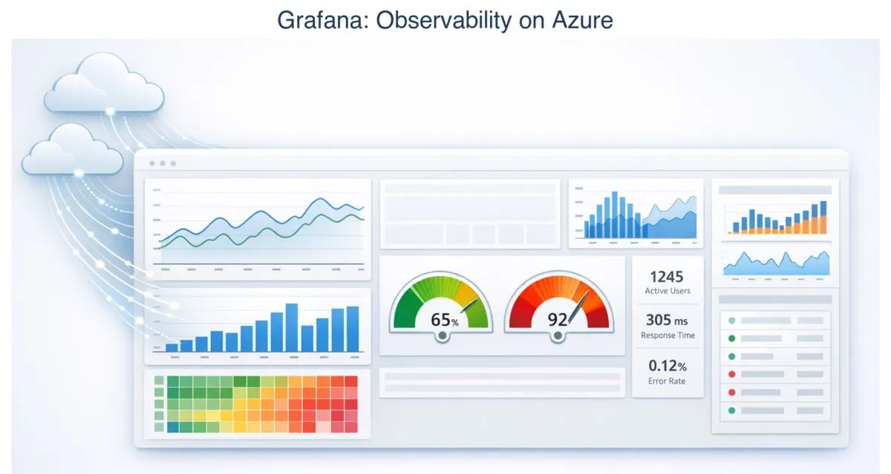
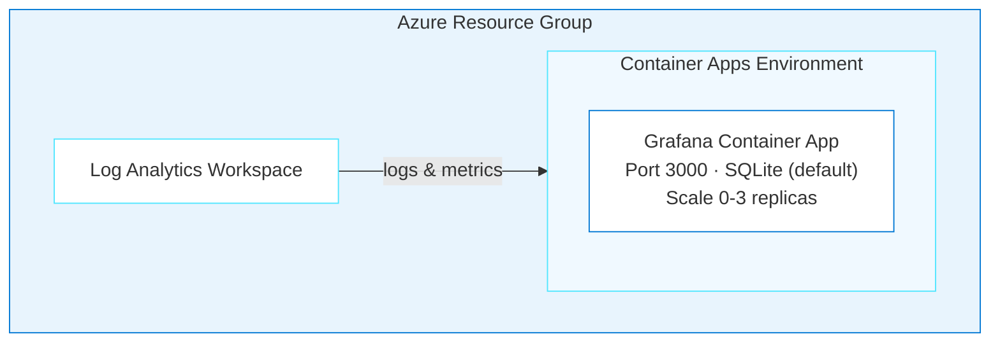
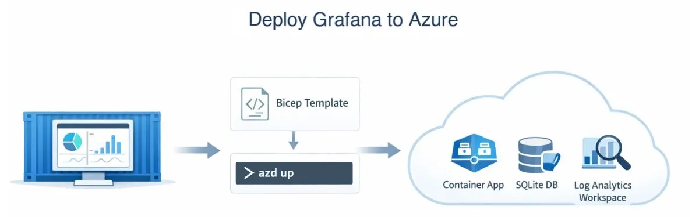

# Grafana on Azure Container Apps

> ✨ **Deploy Grafana on Container Apps with an embedded database and simple health probes.**

<p align="center">
  
</p>

You'll deploy [Grafana OSS](https://grafana.com/oss/grafana/), an open-source observability platform, to Azure Container Apps. Grafana uses an embedded SQLite database by default, so there is no external database to provision. This keeps the deployment small, while the final sections explain when PostgreSQL is a better fit.

## Learning Objectives

- Deploy Grafana to Azure Container Apps using agentic AI
- Understand why Grafana deploys with minimal configuration (no external database, fast startup)
- Evaluate SQLite vs PostgreSQL for different environments
- Use `/api/health` for reliable health probes
- Handle scale-to-zero cold starts gracefully

> ⏱️ **Estimated Time**: ~15–20 minutes first run
>
> 💰 **Estimated Cost**: ~$10–20/month while the resources exist (see [Cost Breakdown](#cost-breakdown)). Complete the [Cleanup](#cleanup) procedure when you finish the journey.

## Prerequisites

This journey supports Windows PowerShell, macOS, and Linux.

| Host tool | Requirement | Purpose | Validation |
| --- | --- | --- | --- |
| Azure CLI | Required | Authenticate and manage Azure resources | `az version` |
| Azure Developer CLI (`azd`) 1.28.0 or later | Required | Provision and remove the deployment | `azd version` |
| Node.js 24 LTS or later | Required | Run the portable verifier | `node --version` |
| GitHub Copilot CLI | Required for the documented CLI path | Run the deployment agent | `copilot --version` |

The signed-in Azure account must have permission to create resource groups, Container Apps, managed identities, and Log Analytics resources.

Run these read-only checks on the host machine before you create Azure resources:

```text
az version
az account show --output table
azd version
node --version
copilot --version
```

Confirm that `az account show` identifies the intended subscription, `azd` is version 1.28.0 or later, and Node.js is version 24 or later. Stop and fix the prerequisite if a command fails or a required version is too old. See the [cross-platform installation guide](../../docs/tool-installation.md) for installation instructions.

> [!NOTE]
> GitHub Copilot CLI is the documented and validated command-line path. You may adapt the deployment prompt for another agentic coding tool by copying or adapting this repository's `.github/skills` into that tool's supported skills or instructions location and reporting anything unsupported.

### Acceptance criteria

The deployment is complete when:

- [ ] `<grafana-url>/api/health` returns HTTP 200 with `"database":"ok"`.
- [ ] The browser login succeeds with the deployed admin credentials.

The journey is complete after the [Cleanup](#cleanup) procedure removes the Azure resources.

---

## Architecture



**Azure resources created:**

- **Azure Container Apps**: Serverless hosting with scale-to-zero
- **Azure Log Analytics**: Monitoring and diagnostics
- **SQLite** (default): Embedded database, no external dependency
- Optional: **Azure Database for PostgreSQL Flexible Server** for production persistence

> ⚠️ **Storage note:** Grafana uses SQLite by default, which lives inside the container. Dashboards and data sources are lost when the container restarts. See [Storage Considerations](#storage-sqlite-vs-postgresql) for production options.

**Infrastructure directory:** `infra-grafana/` (generated at the repo root when you run the deployment; it won't exist until then)

---

## Deploy with the Agent

In GitHub Copilot, use the repository's `oss-to-azure-deployer` agent to generate and deploy the infrastructure from your prompts.

> **💡 Tip: Track issues as you go.** Add *"If you encounter any issues, log them to issues.md so they can be tracked and fixed"* to your prompt. This keeps generation and deployment problems in one place while you iterate.

> [!IMPORTANT]
> **When something fails**
>
> 1. Stay in the same AI coding session so it retains the journey context.
> 2. Paste the exact command and relevant error output. Don't paraphrase the error.
> 3. Include your operating system, shell, current phase, and last successful step.
> 4. Remove passwords, tokens, connection strings, keys, cookies, and `.env` values before pasting.
> 5. Ask the agent to inspect the relevant application and Azure logs, explain the root cause, make the smallest safe fix, rerun the failed step, and run the journey verifier.
> 6. Record the problem and resolution in `issues.md`.
>
> Use this prompt:
>
> ```text
> The following command failed during <journey phase> on <OS and shell>:
>
> <exact command>
>
> Relevant error output:
>
> <redacted error output>
>
> Inspect the relevant application and Azure logs, explain the root cause,
> make the smallest safe fix, rerun the failed step, and run the journey
> verifier. Record the issue and resolution in issues.md. Do not print secrets.
> ```

### Step 1: Setup

Run the following steps from the repository root. If you're in the parent directory that contains the clone, enter it first:

```text
cd github-azure-agentic-journeys
```

Configure `azd` to reuse the signed-in Azure CLI session:

```text
azd config set auth.useAzCliAuth true
```

The command must exit successfully.

Start the [GitHub Copilot CLI](https://docs.github.com/en/copilot/how-tos/copilot-cli/cli-getting-started):

```text
copilot
```

If you haven't installed the Azure Skills plugin yet, do it now. This one-time setup adds deployment tools, Bicep schema lookups, and infrastructure generation; see the root [Quick Start](../../README.md#quick-start) for details.

```
> /plugin marketplace add microsoft/azure-skills
> /plugin install azure@azure-skills
```

Now select the deployment agent. Agents are specialized personas that know how to handle specific tasks:

```
> /agent
```

Select **`oss-to-azure-deployer`** from the list. You're now in an interactive session with the deployment agent.

### Step 2: Deploy

<p align="center">
  
</p>

Give the agent one prompt that covers the location, secrets, and issue handling:

```
> Deploy Grafana to Azure using Bicep and azd. Set the location to westus,
  generate a secure admin password, and use /api/health for probes.
  If a deployment step fails, inspect the relevant logs, make the smallest
  safe correction, rerun the failed step, and record the problem and
  resolution in issues.md. Do not print secrets.
```

The agent handles the entire deployment:

1. Loads the `grafana-azure` skill (Grafana-specific health probes, ports, and environment variables) and the `container-apps-deployment` skill, then follows the Azure plugin pipeline: `azure-prepare` → `azure-validate` → `azure-deploy`
2. Generates a lean Bicep (Azure's infrastructure-as-code language) structure in `infra-grafana/` with no PostgreSQL module needed (SQLite is the default)
3. Updates `azure.yaml`, registers Azure providers, sets environment variables
4. Runs `azd up`

> ⏳ **While you wait:** This is the fastest deployment in the project because there is no database server to provision. Compare the [architecture diagram](#architecture) with the [n8n architecture](../n8n/README.md#architecture), then consider the persistence tradeoff created by embedded SQLite. You'll test that tradeoff in the [Assignment](#assignment). You can also inspect the resources as they appear by running `az resource list --resource-group rg-<env-name> --output table` in a separate terminal.

To explore the storage tradeoff, ask:

```
> Should I use PostgreSQL instead of SQLite for Grafana?
```

A useful answer should explain that SQLite is suitable for development and testing, but dashboards are lost when the container restarts. For production, mount Azure Files at `/var/lib/grafana` or switch to PostgreSQL.

### Step 3: Verify

Ask the agent to check the health endpoint and Container App logs:

```text
> Verify the Grafana deployment. Report each acceptance criterion as pass or fail.
```

Run the checked-in verifier from the repository root on the host machine:

```text
node .github/scripts/verify-grafana.mjs
```

The verifier must print `PASS: <grafana-url>/api/health returned HTTP 200 and database=ok` and the deployed URL. Open that URL in a browser and log in with the deployed admin credentials. Retrieve a generated password only in a private terminal, and do not paste it into the agent session or shared logs.

If verification fails, report the failed criterion, exact command, redacted error output, and last successful step in the same agent session:

```
> Grafana is returning 502 errors
```

The agent will check if it's a cold start issue (scale-from-zero takes 30-60s) or a real problem.

---

<details>
<summary>Configuration Reference (handled by the agent automatically)</summary>

## Configuration Reference

### Environment Variables

| Variable | Value | Description |
|----------|-------|-------------|
| `GF_SECURITY_ADMIN_USER` | `admin` | Admin username |
| `GF_SECURITY_ADMIN_PASSWORD` | (secret) | Admin password |
| `GF_SERVER_HTTP_PORT` | `3000` | HTTP port |
| `GF_SERVER_ROOT_URL` | Auto-configured | Public URL |
| `GF_AUTH_ANONYMOUS_ENABLED` | `false` | Disable anonymous access |
| `GF_DATABASE_TYPE` | `sqlite3` | Default database |
| `GF_LOG_MODE` | `console` | Log output mode |
| `GF_LOG_LEVEL` | `info` | Log verbosity |

### Container Resources

| Setting | Value |
|---------|-------|
| Image | `docker.io/grafana/grafana:latest` |
| CPU | 0.5 cores |
| Memory | 1 GiB |
| Min Replicas | 0 (scale-to-zero) |
| Max Replicas | 3 |
| Scale Rule | HTTP requests (10 concurrent per replica) |

### Health Probes

Grafana starts fast (~15-30 seconds) and provides a dedicated health endpoint at `/api/health`.

| Probe | Initial Delay | Period | Failure Threshold |
|-------|---------------|--------|-------------------|
| Startup | n/a | 10s | 30 (5 min max) |
| Liveness | 15s | 30s | 3 |
| Readiness | n/a | 10s | 3 |

Health endpoint response:

```json
{"commit": "abc123", "database": "ok", "version": "10.x.x"}
```

### Storage: SQLite vs PostgreSQL

**SQLite (default):**
- Zero setup, embedded in the container
- ⚠️ Dashboards lost on container restart (ephemeral storage)
- Good for dev/testing

**PostgreSQL (production):**
Add these environment variables for persistent storage:

```yaml
GF_DATABASE_TYPE: postgres
GF_DATABASE_HOST: your-server.postgres.database.azure.com
GF_DATABASE_NAME: grafana
GF_DATABASE_USER: grafana
GF_DATABASE_PASSWORD: <secret>
GF_DATABASE_SSL_MODE: require
```

**Alternative:** Mount Azure Files to `/var/lib/grafana` for persistent SQLite.

</details>

---

## Cost Breakdown

| Resource | SKU | Monthly Cost |
|----------|-----|--------------|
| Container Apps (scale-to-zero) | Consumption (0.5 vCPU, 1GB) | ~$5-10 |
| Log Analytics | Pay-per-GB | ~$2-5 |
| **Total (SQLite)** | | **~$10-20/month** |
| + PostgreSQL (optional) | B_Standard_B1ms | +~$15/month |

---

<details>
<summary>Troubleshooting</summary>

## Troubleshooting

### Container Won't Start

Ask the agent to diagnose:

```
> My Grafana container won't start. Check the logs and tell me what's wrong.
```

The agent uses `azure_deploy_app_logs` to pull logs and identify the issue, typically health probes that are too aggressive. The Bicep templates in `infra-grafana/` include proper timing.

### 502 Bad Gateway

**Cause:** This typically happens on the first request after the container scales from zero. Cold start takes 30-60s. This is a one-time delay, not a persistent issue.

**Fix:** Wait 30-60 seconds and retry. For production, set `minReplicas: 1` to keep one instance warm.

### Login Fails

**Cause:** Password not set correctly, or special characters causing shell escaping issues.

**Fix:**

Ask the agent:

```
> My Grafana login isn't working. Check if the admin password environment variable is set correctly.
```

If the agent finds shell escaping issues, use alphanumeric passwords and redeploy.

### Dashboards Lost After Restart

**Cause:** SQLite stores data in ephemeral container storage.

**Fix:**
1. Add Azure Files volume mount for `/var/lib/grafana`
2. Switch to PostgreSQL backend (recommended for production)
3. Export dashboards as JSON and use Grafana provisioning

---

> **Post-Deployment Issues:** The following issues relate to *using* Grafana after deployment, not the deployment itself.

### Can't Connect to Data Sources

**Fix:**
1. Ensure data sources are in the same VNet or publicly accessible
2. For Azure services, use private endpoints
3. Check NSG rules if using VNet integration

### Out of Memory (OOMKilled)

**Fix:** Increase memory in Bicep:

```bicep
resources: {
  cpu: json('0.5')
  memory: '2Gi'  // Increase from 1Gi
}
```

</details>

---

## Key Learnings

- **Embedded storage is still a persistence decision.** SQLite data is ephemeral in this container deployment, so plan for that before production.
- **Scale-to-zero cold starts are normal.** 30-60s on first request isn't an error.
- **Same agent, different skills.** The agent loaded `grafana-azure` instead of `n8n-azure` and adapted automatically.
- **Simpler apps mean simpler infrastructure.** No database dependency means fewer moving parts to break.

---

## Assignment

1. Create a dashboard in Grafana, then restart the container app:

   Ask GitHub Copilot to generate `scripts/restart-grafana.mjs`. It must read the resource group through `azd`, locate the tagged Grafana Container App and its active revision through Azure CLI argument arrays, then restart only that revision. Run `node scripts/restart-grafana.mjs`.

   (If an `azd env get-value` lookup fails, just ask the agent: *"Restart my Grafana container app."*)

   After the restart, check whether the dashboard still exists. With the default ephemeral SQLite storage, it should be gone. Ask the agent: *"Why did my Grafana dashboard disappear after a restart?"*
2. Try the fix: ask the agent *"How do I make Grafana dashboards persist across restarts?"* and implement what it suggests.
3. When you're done, continue to Cleanup below.

---

## Cleanup

> [!CAUTION]
> This command permanently deletes the Azure deployment. Export any dashboard definitions that you want to keep before you continue.

Read and save the generated resource group name:

```text
azd env get-value RESOURCE_GROUP_NAME
```

Run the cleanup from the repository root on the host machine:

```text
azd down --force --purge
```

Deleting the Container Apps environment can take 3–5 minutes. The command must exit successfully. Verify that the generated resource group is gone:

```text
az group exists --name <resource-group-name>
```

The command must return `false`. If cleanup fails or the resource group still exists, use the **When something fails** procedure in [Deploy with the Agent](#deploy-with-the-agent) and do not assume that Azure stopped billing the resources.

---

## What's Next

Explore the other journeys:

- [n8n](../n8n/README.md) — Container Apps + PostgreSQL, health probes, post-provision hooks
- [Superset](../superset/README.md) — AKS, init containers (higher cost)
- [AIMarket](../aimarket/README.md) — full-stack build from a PLAN.md spec with Foundry

> 📚 **All journeys:** [Back to root README](../../README.md#agentic-journeys)

---

## Resources

- [Grafana Documentation](https://grafana.com/docs/grafana/latest/)
- [Azure Container Apps](https://learn.microsoft.com/azure/container-apps/)
- [Azure Developer CLI](https://learn.microsoft.com/azure/developer/azure-developer-cli/)
