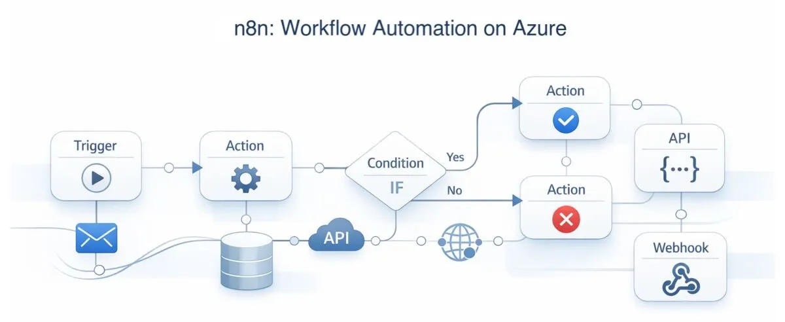
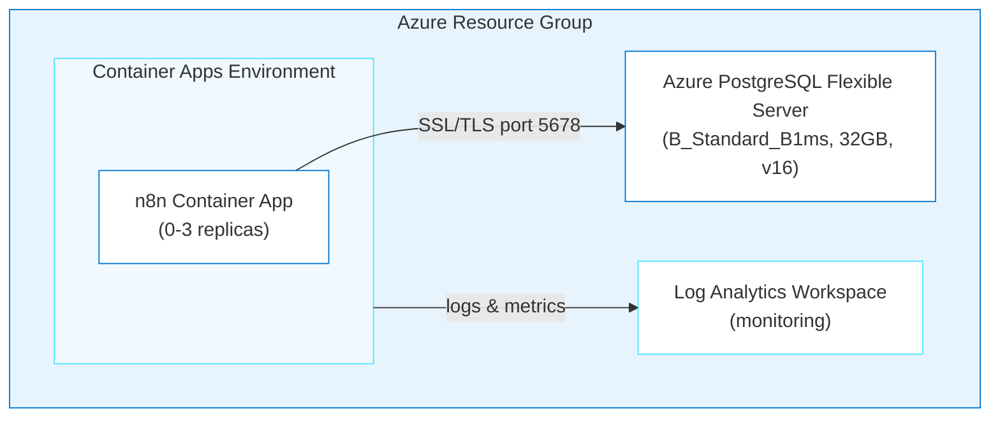
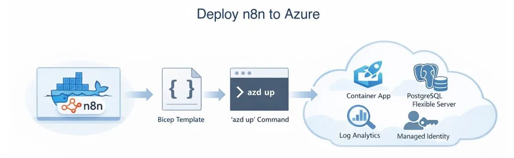

# n8n on Azure Container Apps

> ✨ **Deploy a self-hosted workflow automation platform to Azure by having a conversation with an AI agent.**

<p align="center">
  
</p>

In this journey, you'll deploy [n8n](https://n8n.io), an open-source, self-hosted workflow automation tool, to Azure Container Apps with PostgreSQL. An AI agent generates the Bicep infrastructure, configures the health probes, and runs the deployment. Plan on 20–30 minutes for the first run.

## Learning Objectives

- Use the `oss-to-azure-deployer` agent with GitHub Copilot to generate Azure infrastructure through conversation
- Understand how the agent loads app-specific and generic skills to build Bicep templates
- Deploy n8n to Azure Container Apps with PostgreSQL using `azd up`
- Configure health probes for slow-starting containers
- Troubleshoot common deployment issues using Azure MCP (Model Context Protocol) tools and container logs

> ⏱️ **Estimated Time**: ~20–30 minutes first run (PostgreSQL provisioning takes most of that time)
>
> 💰 **Estimated Cost**: ~$25–35/month while the resources exist (see [Cost Breakdown](#cost-breakdown)). Complete the [Cleanup](#cleanup) procedure when you finish the journey.

## Prerequisites

This journey supports Windows PowerShell, macOS, and Linux.

| Host tool | Requirement | Purpose | Validation |
| --- | --- | --- | --- |
| Azure CLI | Required | Authenticate and manage Azure resources | `az version` |
| Azure Developer CLI (`azd`) 1.28.0 or later | Required | Provision and remove the deployment | `azd version` |
| Node.js 24 LTS or later | Required | Run the cross-platform hook and verifier | `node --version` |
| GitHub Copilot CLI | Required for the documented CLI path | Run the deployment agent | `copilot --version` |

The signed-in Azure account must have permission to create Container Apps, PostgreSQL Flexible Server, Log Analytics, and managed identity resources.

Run these read-only checks on the host machine before you create Azure resources:

```text
az version
az account show --output table
azd version
node --version
copilot --version
```

Confirm that `az account show` identifies the intended subscription, `azd` is version 1.28.0 or later, and Node.js is version 24 or later. Stop and fix the prerequisite if a command fails or a required version is too old. See the [cross-platform installation guide](../../docs/tool-installation.md) for Windows, macOS, and Linux installation instructions.

> [!NOTE]
> GitHub Copilot CLI is the documented and validated command-line path. You may adapt the deployment prompt for the GitHub Copilot app, VS Code agent chat, or another agentic coding tool. For another tool, run: **"Copy or adapt this repository's `.github/skills` into your supported skills or instructions location, preserving their behavior and reporting anything unsupported."**

### Acceptance criteria

The deployment is complete when:

- [ ] `<n8n-url>/healthz` returns HTTP 200.
- [ ] The n8n UI returns HTTP 200 and renders either **Set up owner account** or the normal login page.
- [ ] The Container App has a `WEBHOOK_URL` value that uses the deployed HTTPS URL.

The journey is complete after the [Cleanup](#cleanup) procedure removes the Azure resource group.

---

## Architecture



**Azure resources created:**

- **Azure Container Apps**: Serverless hosting with scale-to-zero
- **Azure Database for PostgreSQL Flexible Server**: Managed database for persistent storage
- **Azure Log Analytics**: Centralized monitoring and logging
- **User-Assigned Managed Identity**: Secure access to Azure resources

**Infrastructure directory:** `infra-n8n/` (generated at the repo root when you run the deployment; it won't exist until then)

---

## Deploy with the Agent

You'll use `oss-to-azure-deployer` (a custom agent defined in this repo) with GitHub Copilot to generate and deploy the entire infrastructure through conversation.

> **💡 Tip: Track issues as you go.** Add *"If you encounter any issues, log them to issues.md so they can be tracked and fixed"* to your prompt. This keeps generation and deployment problems in one place while you iterate.

> [!IMPORTANT]
> **When something fails**
>
> 1. Stay in the same AI coding session so it retains the journey context.
> 2. Paste the exact command and relevant error output. Don't paraphrase the error.
> 3. Include your operating system, shell, current phase, and last successful step.
> 4. Remove passwords, tokens, connection strings, keys, cookies, and `.env` values before pasting.
> 5. Ask the agent to inspect the relevant application and Azure logs, explain the root cause, make the smallest safe fix, rerun the failed step, and run the journey verifier.
> 6. Record the problem and resolution in `issues.md`.
>
> Use this prompt:
>
> ```text
> The following command failed during <journey phase> on <OS and shell>:
>
> <exact command>
>
> Relevant error output:
>
> <redacted error output>
>
> Inspect the relevant application and Azure logs, explain the root cause,
> make the smallest safe fix, rerun the failed step, and run the journey
> verifier. Record the issue and resolution in issues.md. Do not print secrets.
> ```

### Step 1: Setup

If the current directory is not the repository root, run this command from the parent directory:

```text
cd github-azure-agentic-journeys
```

Configure `azd` to reuse the signed-in Azure CLI session:

```text
azd config set auth.useAzCliAuth true
```

The command must exit successfully.

Start the [GitHub Copilot CLI](https://docs.github.com/en/copilot/how-tos/copilot-cli/cli-getting-started):

```text
copilot
```

If you haven't installed the Azure Skills plugin yet, do it now. This one-time setup adds deployment tools, Bicep schema lookups, and infrastructure generation; see the root [Quick Start](../../README.md#quick-start) for details.

```
> /plugin marketplace add microsoft/azure-skills
> /plugin install azure@azure-skills
```

Now select the deployment agent. Agents are specialized personas that know how to handle specific tasks:

```
> /agent
```

Select **`oss-to-azure-deployer`** from the list. You're now in an interactive session with the deployment agent.

### Step 2: Deploy

<p align="center">
  
</p>

Give the agent one prompt that covers the location, secrets, health probes, and issue handling:

```
> Deploy n8n to Azure using Bicep and azd. Set the location to westus,
  generate secure passwords for all credentials, set the Container App
  minReplicas to 1 so I can verify it right away without a cold start,
  and use n8n's /healthz endpoint for startup/readiness/liveness probes.
  If a deployment step fails, inspect the relevant logs, make the smallest
  safe correction, rerun the failed step, and record the problem and
  resolution in issues.md. Do not print secrets.
```

The agent handles the entire deployment:

1. Loads the `n8n-azure` and `container-apps-deployment` skills, then follows the Azure plugin pipeline: `azure-prepare` → `azure-validate` → `azure-deploy`
2. Uses Azure MCP tools to look up Bicep schemas and best practices
3. Generates modular Bicep infrastructure in `infra-n8n/`
4. Updates `azure.yaml`, registers Azure providers, sets environment variables
5. Runs `azd up`
6. Configures `WEBHOOK_URL` with `infra-n8n/hooks/postprovision.js`, referenced directly from `azure.yaml`. This cross-platform Node.js hook avoids Bash- or PowerShell-specific syntax. Because the update creates a replacement Container App revision, the hook must not exit until both `/healthz` and `/` return HTTP 200 for six consecutive probes over 30 seconds.

Do not start verification until `azd up` and the `postprovision` hook exit successfully.

The deployment takes several minutes. You'll see the agent generating Bicep files, registering Azure providers, and running `azd up`. It may prompt you to confirm your Azure subscription.

> ⏳ **While you wait:** Use the deployment time to connect the generated resources to the architecture:
>
> 1. Watch your resources appear in real-time. Open the [Azure Portal](https://portal.azure.com) → search for your resource group (`rg-<env-name>`), or run `az resource list --resource-group rg-<env-name> --output table` in a separate terminal.
> 2. Look at the [architecture diagram](#architecture) above. Match each box to a resource appearing in the portal.
> 3. Ask the agent: *"What's happening right now? Walk me through the deployment step by step."*
> 4. **Quiz yourself:** Why does n8n need an approximately five-minute startup window (`failureThreshold: 10` with `periodSeconds: 30`)? (Hint: expand the collapsed **Configuration Reference** section below and check the Health Probes table.)
> 5. Browse the [n8n workflow templates](https://n8n.io/workflows/) and pick one you want to try after deployment.

You can ask follow-up questions anytime during or after generation:

```
> Why does the liveness probe have a 60-second initial delay?
> What does the post-provision hook do?
```

### Step 3: Verify

Ask the agent to check the health endpoint, `WEBHOOK_URL`, and Container App logs:

```text
> Verify the n8n deployment. Report each acceptance criterion as pass or fail.
```

Run the checked-in verifier from the repository root on the host machine:

```text
node .github/scripts/verify-n8n.mjs
```

The verifier must print `PASS: /healthz and UI returned HTTP 200` and the deployed n8n URL. Open that URL in a browser and confirm that the rendered page shows either **Set up owner account** or the normal login page. HTTP 401 is not a successful UI check.

If verification fails, report the failed criterion, exact command, redacted error output, and last successful step in the same agent session:

```
> The container is in CrashLoopBackOff, what's happening?
```

For a more detailed checklist, see the troubleshooting section.

---

<details>
<summary>Configuration Reference (handled by the agent automatically)</summary>

## Configuration Reference

### Environment Variables

The deployment automatically configures these n8n environment variables:

| Variable | Value | Description |
|----------|-------|-------------|
| `DB_TYPE` | `postgresdb` | Database type |
| `DB_POSTGRESDB_HOST` | Azure PostgreSQL FQDN | Database server address |
| `DB_POSTGRESDB_PORT` | `5432` | PostgreSQL port |
| `DB_POSTGRESDB_DATABASE` | `n8n` | Database name |
| `DB_POSTGRESDB_SSL_ENABLED` | `true` | Required for Azure PostgreSQL |
| `DB_POSTGRESDB_SSL_REJECT_UNAUTHORIZED` | `false` | Azure cert compatibility |
| `DB_POSTGRESDB_CONNECTION_TIMEOUT` | `60000` | 60s timeout for cold starts |
| `N8N_ENCRYPTION_KEY` | Auto-generated | Encryption key for credentials |
| `N8N_PORT` | `5678` | n8n default port |
| `N8N_PROTOCOL` | `https` | Protocol for generated URLs |
| `N8N_ENDPOINT_HEALTH` | `healthz` | Dedicated health endpoint for probes |
| `WEBHOOK_URL` | Auto-configured | Set by post-provision hook |

### Container Resources

| Setting | Value |
|---------|-------|
| Image | `docker.io/n8nio/n8n:2.30.6` |
| CPU | 1.0 core |
| Memory | 2 GiB |
| Min Replicas | 1 while verifying the deployment; 0 afterward if you want scale-to-zero |
| Max Replicas | 3 |
| Scale Rule | HTTP requests (10 concurrent per replica) |

### Health Probes

n8n requires **60+ seconds** to start. Without proper health probes, Azure kills the container before initialization completes.

| Probe | Initial Delay | Period | Failure Threshold | Max Wait |
|-------|---------------|--------|-------------------|----------|
| Startup | n/a | 30s | 10 | 5 minutes |
| Liveness | 60s | 30s | 3 | n/a |
| Readiness | n/a | 10s | 3 | n/a |

Probe path: `/healthz`. Don't probe `/`; that's the UI root and can redirect or hang while n8n is still initializing.

### Secrets Management

Sensitive values are stored as Container App secrets and referenced via `secretRef`:

- `postgres-password` → `DB_POSTGRESDB_PASSWORD`
- `n8n-encryption-key` → `N8N_ENCRYPTION_KEY`

Current n8n releases use built-in user management. On first launch, complete the **Set up owner account** flow. Do not generate or configure the removed `N8N_BASIC_AUTH_*` variables.

</details>

---

## Cost Breakdown

| Resource | SKU | Monthly Cost |
|----------|-----|--------------|
| Container Apps (scale-to-zero) | Consumption (1 vCPU, 2GB) | ~$5-15 |
| PostgreSQL Flexible Server | B_Standard_B1ms (32GB) | ~$15 |
| Log Analytics | Pay-per-GB (30-day retention) | ~$2-5 |
| **Total** | | **~$25-35/month** |

After verification, you can set `minReplicas: 0` to reduce idle costs through scale-to-zero. If you keep `minReplicas: 1` for production, expect ~$60-80/month for Container Apps alone.

---

<details>
<summary>Troubleshooting</summary>

## Troubleshooting

### Container CrashLoopBackOff

**Symptom:** Container restarts repeatedly, logs show health check failures.

**Cause:** n8n needs 60+ seconds to start, and default health probes kill it too early.

**Fix:** Ensure health probes target `/healthz`, use `initialDelaySeconds: 60` on liveness, and use a five-minute startup window. With the AVM Container App module, that means `failureThreshold: 10` with `periodSeconds: 30`. Keep `minReplicas: 1` until the health check passes.

Ask the agent to diagnose:

```
> My n8n container keeps restarting. Check the logs and tell me what's wrong.
```

The agent uses `azure_deploy_app_logs` to pull logs and identify the issue.

### Database Connection Refused

**Symptom:** n8n logs show `ECONNREFUSED` or SSL handshake errors.

**Fix:**

1. Set `DB_POSTGRESDB_HOST` to the PostgreSQL fully qualified domain name (FQDN).
2. Set `DB_POSTGRESDB_SSL_ENABLED=true`.
3. Set `DB_POSTGRESDB_SSL_REJECT_UNAUTHORIZED=false` for Azure certificate compatibility.
4. Set `DB_POSTGRESDB_CONNECTION_TIMEOUT=60000` for cold starts.
5. Restart the Container App revision.
6. Confirm that the logs no longer contain `ECONNREFUSED` or SSL handshake errors.

### WEBHOOK_URL Not Set

**Symptom:** Webhooks don't work or n8n displays an incorrect webhook URL.

**Cause:** The Container App FQDN isn't available until after deployment.

**Fix:** Run the idempotent post-provision hook from the repository root on the host machine:

```text
node infra-n8n/hooks/postprovision.js
```

The hook must exit successfully after `/healthz` and `/` return HTTP 200 for six consecutive probes over 30 seconds. If it exits nonzero, use the **When something fails** procedure in [Deploy with the Agent](#deploy-with-the-agent).

### Resource Provider 409 Conflicts

**Fix:** Register providers before deployment:

```text
az provider register --namespace Microsoft.App
az provider register --namespace Microsoft.DBforPostgreSQL
az provider register --namespace Microsoft.OperationalInsights
```

### newGuid() Bicep Error

`newGuid()` can only be used as a **parameter default value**:

```bicep
// ❌ Wrong
var encryptionKey = newGuid()

// ✅ Correct
@secure()
param n8nEncryptionKey string = newGuid()
```

</details>

---

## Key Learnings

- **Post-provision hooks** solve circular dependencies (like WEBHOOK_URL needing the deployed URL).
- **Azure MCP tools provide current Bicep schemas.** This lets the agent use actual API versions instead of guessing.
- **Register providers first.** This prevents 409 conflicts during deployment.
- **Same agent, different skills.** The agent loaded `n8n-azure` and adapted to n8n's specific requirements automatically.

---

## Assignment

1. Ask the agent: *"How would I add a custom domain to my n8n deployment?"*
2. Create a simple workflow in n8n: add an HTTP Request node that calls `https://api.github.com/zen`, connect it to a Set node, and run it. This confirms your deployed n8n instance can make outbound API calls.
3. When you're done, continue to Cleanup below.

---

## Cleanup

> [!CAUTION]
> This command permanently deletes the deployment and its PostgreSQL data. Export each workflow that you want to keep before you continue.

Read and save the resource group name before deletion:

```text
azd env get-value RESOURCE_GROUP_NAME
```

Run the cleanup from the repository root on the host machine:

```text
azd down --force --purge
```

PostgreSQL deletion can take 3–5 minutes. After the command exits successfully, verify the deletion:

```text
az group exists --name <resource-group-name>
```

The command must return `false`.

---

## What's Next

Explore the other journeys:

- [AIMarket](../aimarket/README.md) — full-stack build from a PLAN.md spec with Foundry
- [Superset](../superset/README.md) — AKS, init containers (higher cost)
- [Grafana](../grafana/README.md) — the simplest Container Apps deploy

> 📚 **All journeys:** [Back to root README](../../README.md#agentic-journeys)

---

## Resources

- [n8n Documentation](https://docs.n8n.io/)
- [Azure Container Apps](https://learn.microsoft.com/azure/container-apps/)
- [Azure Database for PostgreSQL](https://learn.microsoft.com/azure/postgresql/)
- [Azure Developer CLI](https://learn.microsoft.com/azure/developer/azure-developer-cli/)
