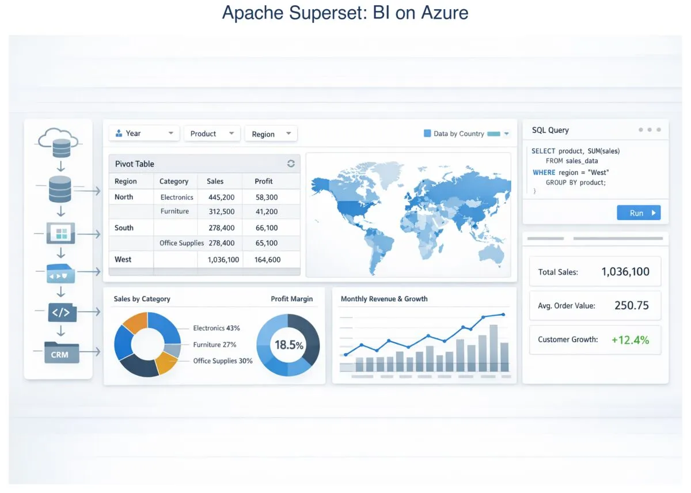
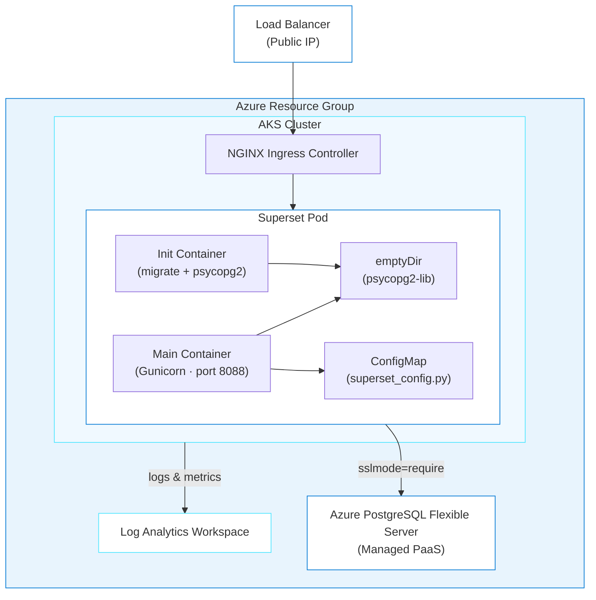
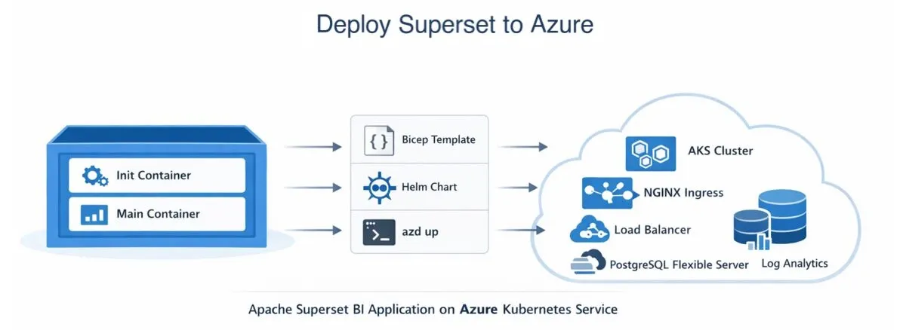

# Apache Superset on Azure Kubernetes Service

> ✨ **Some workloads need Kubernetes. This journey shows you how to recognize them and deploy one.**

<p align="center">
  
</p>

> ⚠️ **Skip this journey unless you specifically want AKS concepts.** It costs **~$200+/month if left running** (node VMs + load balancer), needs **vCPU quota**, and takes longer than Grafana/n8n. If you want a full-stack build instead, see [AIMarket](../aimarket/README.md).

[Apache Superset](https://superset.apache.org/) needs init containers (containers that run before the main app starts for tasks such as database migrations), shared volumes, and custom configuration mounts. These patterns fit Kubernetes well. You'll use the agent to generate AKS infrastructure, deploy a full BI platform, and see when Kubernetes is worth the added cost and complexity.

## Learning Objectives

- Understand when AKS is required instead of Container Apps
- Deploy Superset with init containers, shared volumes, and a mounted ConfigMap (a Kubernetes object that stores configuration files)
- Install psycopg2-binary into a shared emptyDir (a temporary shared volume that both containers can access) for PostgreSQL connectivity
- Use `azure_deploy_plan` with `target=AKS` for Kubernetes deployment planning
- Debug AKS-specific issues: init container failures, CrashLoopBackOff (a Kubernetes state where a container keeps crashing and restarting), SQLite fallback

> ⏱️ **Estimated Time**: ~30–45 minutes first run (AKS creation takes most of that time)
>
> 💰 **Estimated Cost**: ~$200–215/month while the resources exist (AKS nodes are the main cost; see [Cost Breakdown](#cost-breakdown)). Complete the [Cleanup](#cleanup) procedure immediately after the journey.

## Prerequisites

This journey supports Windows PowerShell, macOS, and Linux.

| Host tool | Requirement | Purpose | Validation |
| --- | --- | --- | --- |
| Azure CLI | Required | Authenticate and manage Azure resources | `az version` |
| Azure Developer CLI (`azd`) 1.28.0 or later | Required | Provision and remove the deployment | `azd version` |
| Node.js 24 LTS or later | Required | Run the post-provision hook and verifier | `node --version` |
| `kubectl` | Required | Inspect and manage the AKS workload | `kubectl version --client` |
| Helm 3 | Required | Install the NGINX Ingress Controller | `helm version` |
| GitHub Copilot CLI | Required for the documented CLI path | Run the deployment agent | `copilot --version` |

The signed-in Azure account must have permission to create AKS, PostgreSQL Flexible Server, Load Balancer, managed identity, and Log Analytics resources. The target region must have quota for at least four vCPUs.

Run these read-only checks on the host machine before you create Azure resources:

```text
az version
az account show --output table
az vm list-usage --location westus --output table
azd version
node --version
kubectl version --client
helm version
copilot --version
```

Confirm that `az account show` identifies the intended subscription, the target region has at least four available vCPUs, `azd` is version 1.28.0 or later, Node.js is version 24 or later, and Helm reports major version 3. Stop and fix the prerequisite if any check fails. See the [cross-platform installation guide](../../docs/tool-installation.md) for installation instructions.

> [!NOTE]
> GitHub Copilot CLI is the documented and validated command-line path. You may adapt the deployment prompt for another agentic coding tool by copying or adapting this repository's `.github/skills` into that tool's supported skills or instructions location and reporting anything unsupported.

### Acceptance criteria

The deployment is complete when:

- [ ] `kubectl get pods -n superset` reports each Superset pod as Ready and Running.
- [ ] Superset logs contain `PostgresqlImpl` and do not contain `SQLiteImpl`.
- [ ] `<superset-url>/health` returns HTTP 200.
- [ ] Browser login reaches `/superset/welcome/`.

The journey is complete after the [Cleanup](#cleanup) procedure removes the Azure resources.

---

## Architecture



**Azure resources created:**

- **Azure Kubernetes Service (AKS)**: Managed Kubernetes cluster (2x Standard_D2s_v3 nodes)
- **Azure Database for PostgreSQL Flexible Server**: Managed database (required)
- **Azure Load Balancer**: Public IP for external access
- **NGINX Ingress Controller**: HTTP routing within the cluster
- **Azure Log Analytics**: Monitoring and diagnostics

**Infrastructure directory:** `infra-superset/` (generated at the repo root when you run the deployment; it won't exist until then)

### Why AKS Instead of Container Apps?

Superset requires:
- **Init containers** for database migrations and psycopg2 installation
- **Shared volumes** (emptyDir) between init and main containers
- **ConfigMap mounting** for `superset_config.py`
- **More control** over the deployment lifecycle

> **Where does NGINX come from?** The post-provision hook installs the NGINX Ingress Controller into the cluster using Helm (a package manager for Kubernetes). It provides HTTP routing and a public Load Balancer IP for external access.

---

## Deploy with the Agent

In GitHub Copilot, use the repository's `oss-to-azure-deployer` agent to generate and deploy the AKS infrastructure from your prompts.

> **💡 Tip: Track issues as you go.** Add *"If you encounter any issues, log them to issues.md so they can be tracked and fixed"* to your prompt. This keeps generation and deployment problems in one place while you iterate.

> [!IMPORTANT]
> **When something fails**
>
> 1. Stay in the same AI coding session so it retains the journey context.
> 2. Paste the exact command and relevant error output. Don't paraphrase the error.
> 3. Include your operating system, shell, current phase, and last successful step.
> 4. Remove passwords, tokens, connection strings, keys, cookies, and `.env` values before pasting.
> 5. Ask the agent to inspect the relevant application and Azure logs, explain the root cause, make the smallest safe fix, rerun the failed step, and run the journey verifier.
> 6. Record the problem and resolution in `issues.md`.
>
> Use this prompt:
>
> ```text
> The following command failed during <journey phase> on <OS and shell>:
>
> <exact command>
>
> Relevant error output:
>
> <redacted error output>
>
> Inspect the relevant application and Azure logs, explain the root cause,
> make the smallest safe fix, rerun the failed step, and run the journey
> verifier. Record the issue and resolution in issues.md. Do not print secrets.
> ```

### Step 1: Setup

If the current directory is not the repository root, run this command from the parent directory:

```text
cd github-azure-agentic-journeys
```

Configure `azd` to reuse the signed-in Azure CLI session:

```text
azd config set auth.useAzCliAuth true
```

The command must exit successfully.

Start the [GitHub Copilot CLI](https://docs.github.com/en/copilot/how-tos/copilot-cli/cli-getting-started):

```text
copilot
```

If you haven't installed the Azure Skills plugin yet, do it now. This one-time setup adds deployment tools, Bicep schema lookups, and infrastructure generation; see the root [Quick Start](../../README.md#quick-start) for details.

```
> /plugin marketplace add microsoft/azure-skills
> /plugin install azure@azure-skills
```

Now select the deployment agent. Agents are specialized personas that know how to handle specific tasks:

```
> /agent
```

Select **`oss-to-azure-deployer`** from the list. You're now in an interactive session with the deployment agent.

### Step 2: Deploy

<p align="center">
  
</p>

Give the agent one prompt that covers the location, secrets, target platform, and issue handling:

```
> Deploy Apache Superset to Azure using Bicep and azd. Set the location to westus,
> generate secure passwords for all credentials, use AKS (not Container Apps),
> and generate infra-superset/hooks/postprovision.js for az aks get-credentials,
> Helm, kubectl apply, and load-balancer polling without shell-specific syntax.
> If a deployment step fails, inspect the relevant logs, make the smallest safe
> correction, rerun the failed step, and record the problem and resolution in
> issues.md. Do not print secrets.
```

The agent handles the entire deployment:

1. Loads the `superset-azure` skill, then follows the Azure plugin pipeline: `azure-prepare` → `azure-validate` → `azure-deploy`
2. Recommends AKS over Container Apps based on Superset's need for init containers, shared volumes, and ConfigMap mounting
3. Generates Bicep (Azure's infrastructure-as-code language) and Kubernetes manifests in `infra-superset/`
4. Updates `azure.yaml`, registers Azure providers, sets environment variables
5. Runs `azd up`
6. Runs `infra-superset/hooks/postprovision.js`, a cross-platform Node.js hook that securely generates and persists missing `SUPERSET_SECRET_KEY` and `SUPERSET_ADMIN_PASSWORD` values, calls Helm and `kubectl` with argument arrays, applies the Kubernetes manifests, and waits for the external IP. Existing secret values are reused and never printed.

> ⏳ **While you wait:** This deployment can take a while because AKS cluster creation alone takes several minutes. Use that time to connect the architecture to the resources being created:
>
> 1. Watch your resources appear in real-time. Open the [Azure Portal](https://portal.azure.com) → search for your resource group, or run `az resource list --resource-group rg-<env-name> --output table` in a separate terminal.
> 2. Read the [init container pattern](#psycopg2-installation-critical) below. Why can't you just `pip install psycopg2-binary` in the main container? (Hint: read-only filesystem.)
> 3. **Compare costs:** This AKS deployment costs ~$200/month, compared with ~$25 for n8n and ~$10 for Grafana. Review the [Cost Breakdown](#cost-breakdown) and decide when AKS-specific capabilities justify the premium.
> 4. Explore Superset's [creating your first dashboard guide](https://superset.apache.org/user-docs/using-superset/creating-your-first-dashboard) to see what you can build after deployment.

You can ask follow-up questions anytime:

```
> Why do you need an init container for psycopg2?
> Why AKS instead of Container Apps?
```

### Step 3: Verify

Ask the agent to check the pod state, PostgreSQL evidence, health endpoint, and logs:

```text
> Verify the Superset deployment. Report each acceptance criterion as pass or fail.
```

Run the checked-in verifier from the repository root on the host machine:

```text
node .github/scripts/verify-superset.mjs
```

The verifier must print `PASS: <count> pod(s) Ready/Running, PostgreSQL confirmed, /health HTTP 200` and the deployed URL. Browser login is a separate check in Step 4.

If verification fails, report the failed criterion, exact command, redacted error output, and last successful step in the same agent session:

```
> My Superset pod is stuck in Init:0/1
```

### Step 4: Open Superset

Read the deployment URL and admin password in a private terminal:

```text
azd env get-value SUPERSET_URL
azd env get-value SUPERSET_ADMIN_PASSWORD
```

Do not paste the password into the agent session or shared logs. Open the URL and sign in with username `admin`.

Automated browser verification must target `#username`, `#password`, and `input[type="submit"], button[type="submit"]`. After signing in, confirm that the browser reaches `/superset/welcome/` and displays the Superset home page.

---

<details>
<summary>Configuration Reference (handled by the agent automatically)</summary>

## Configuration Reference

### Environment Variables

| Variable | Value | Description |
|----------|-------|-------------|
| `SQLALCHEMY_DATABASE_URI` | `postgresql://...?sslmode=require` | Full PostgreSQL connection string |
| `SUPERSET_SECRET_KEY` | (32+ char string) | Flask secret key for session signing |
| `SUPERSET_CONFIG_PATH` | `/app/pythonpath/superset_config.py` | Path to config file |
| `PYTHONPATH` | `/psycopg2-lib` | Include psycopg2 installation location |
| `ADMIN_USERNAME` | `admin` | Admin username |
| `ADMIN_PASSWORD` | (secret) | Admin password |
| `SUPERSET_WEBSERVER_PORT` | `8088` | Default Superset port |
| `GUNICORN_WORKERS` | `2` | Number of Gunicorn workers |
| `GUNICORN_TIMEOUT` | `120` | Request timeout in seconds |

**Critical:** Azure PostgreSQL requires `?sslmode=require` in the connection string.

### superset_config.py (Required)

⚠️ **Superset does not read environment variables directly for database configuration.** Create a `superset_config.py` file that maps the environment variables to Superset's configuration:

```python
import os

SQLALCHEMY_DATABASE_URI = os.environ.get(
    'SQLALCHEMY_DATABASE_URI',
    'sqlite:////app/superset_home/superset.db'
)
SECRET_KEY = os.environ.get('SUPERSET_SECRET_KEY', 'change-me')

WTF_CSRF_ENABLED = True
WTF_CSRF_EXEMPT_LIST = []
WTF_CSRF_TIME_LIMIT = 60 * 60 * 24 * 365  # 1 year, extended for long dashboard sessions

FEATURE_FLAGS = {
    "DASHBOARD_NATIVE_FILTERS": True,
    "DASHBOARD_CROSS_FILTERS": True,
    "ENABLE_TEMPLATE_PROCESSING": True,
}
```

This is deployed as a Kubernetes ConfigMap mounted at `/app/pythonpath/`.

### psycopg2 Installation (Critical)

The official `apache/superset:latest` image does not include `psycopg2` for PostgreSQL. Without it, Superset silently falls back to SQLite.

**Solution:** Install to an emptyDir volume shared between init and main containers:

```yaml
volumes:
- name: psycopg2-install
  emptyDir: {}

initContainers:
- name: superset-init
  command: ["/bin/sh", "-c"]
  args:
    - |
      pip install psycopg2-binary --target=/psycopg2-lib
      PYTHONPATH=/psycopg2-lib superset db upgrade
      PYTHONPATH=/psycopg2-lib superset fab create-admin ... || true
      PYTHONPATH=/psycopg2-lib superset init
  volumeMounts:
  - name: psycopg2-install
    mountPath: /psycopg2-lib

containers:
- name: superset
  env:
  - name: PYTHONPATH
    value: "/psycopg2-lib"
  volumeMounts:
  - name: psycopg2-install
    mountPath: /psycopg2-lib
```

### Container Resources

| Component | CPU Request | CPU Limit | Memory Request | Memory Limit |
|-----------|-------------|-----------|----------------|--------------|
| Superset Web | 250m | 1000m | 512Mi | 2Gi |
| Init Container | 100m | 500m | 256Mi | 1Gi |

### Health Probes

Superset takes **60-90+ seconds** to start due to database migrations and Flask initialization.

| Probe | Initial Delay | Period | Failure Threshold | Max Wait |
|-------|---------------|--------|-------------------|----------|
| Startup | n/a | 10s | 60 | 10 minutes |
| Liveness | 90s | 15s | 5 | n/a |
| Readiness | 45s | 10s | 5 | n/a |

Health endpoint: `GET /health` → `{"status": "OK"}` (HTTP 200)

</details>

---

## Cost Breakdown

| Resource | SKU | Monthly Cost |
|----------|-----|--------------|
| AKS Cluster | 2x Standard_D2s_v3 | ~$170 |
| PostgreSQL Flexible Server | B_Standard_B1ms | ~$15 |
| Load Balancer | Standard | ~$20 |
| **Total** | | **~$200-215/month** |

⚠️ **Superset on AKS is significantly more expensive** than the Container Apps deployments (n8n ~$25-35, Grafana ~$10-20). Consider Container Apps if AKS features aren't required. Each Standard_D2s_v3 node costs ~$70/month ($0.096/hr × 730 hrs). For a lab run, a single-node pool is enough for Superset. Add *"use a single-node system pool"* to your deployment prompt to cut the node cost in half.

> 💡 **Pausing instead of deleting:** Want to come back tomorrow without paying for idle nodes? Stop the cluster. Compute billing stops while the cluster is stopped, though you still pay for disks and the load balancer IP:
>
> Ask GitHub Copilot to generate `scripts/set-aks-state.mjs`, which reads the owned resource group through `azd`, locates that run's AKS cluster, and accepts `stop` or `start`. Invoke it with `node scripts/set-aks-state.mjs stop` or `node scripts/set-aks-state.mjs start`.
>
> This is a useful AKS operations skill in its own right. For multi-day breaks, still prefer a full `azd down --force --purge`.

---

<details>
<summary>Troubleshooting</summary>

## Troubleshooting

### Deployment Failed (`azd up` errors)

**Common causes:**
1. **Provider not registered**: Run `az provider register --namespace Microsoft.ContainerService` and retry
2. **Subscription quota exceeded**: Check your VM quota with `az vm list-usage --location <region>`. AKS needs at least 4 vCPUs.
3. **Region capacity**: Try a different region if you see capacity errors

### ModuleNotFoundError: No module named 'psycopg2'

**Also appears as:** `Context impl SQLiteImpl` in logs (should be `PostgresqlImpl`).

**Cause:** psycopg2-binary not installed or not in PYTHONPATH.

**Fix:** Install with `pip install psycopg2-binary --target=/psycopg2-lib` and set `PYTHONPATH=/psycopg2-lib` in **both** init and main containers.

Ask the agent to diagnose:

```
> Superset logs show SQLiteImpl instead of PostgresqlImpl. Is psycopg2 installed correctly?
```

That log pattern points to a missing psycopg2 installation or `PYTHONPATH` setting. Ask the agent to check both containers.

### SQLALCHEMY_DATABASE_URI Not Recognized

**Symptom:** Superset uses SQLite even though the env var is set.

**Cause:** Superset doesn't read env vars directly. It needs `superset_config.py`.

**Fix:** Create a ConfigMap with `superset_config.py` that reads `os.environ.get('SQLALCHEMY_DATABASE_URI')`, mount it, and set `SUPERSET_CONFIG_PATH`.

### Pod Stuck in Init:0/1

**Possible causes:**
1. PostgreSQL not reachable: check firewall rules
2. Wrong credentials: verify connection string
3. psycopg2 not installed: see above

Ask the agent to diagnose:

```
> My Superset pod is stuck in Init:0/1. Check the init container logs and test PostgreSQL connectivity.
```

### "'tcp' is not a valid port number"

**Misleading error.** Despite the wording, this is caused by a missing psycopg2 installation. See the fix above.

### Permission Denied During pip install

**Cause:** The Superset container runs as non-root with read-only virtualenv.

**Writable locations:** `/psycopg2-lib` (emptyDir), `/tmp`, `/app/superset_home/.local/`

**Fix:** Always use `pip install --target=/psycopg2-lib` with an emptyDir volume.

### 500 Internal Server Error

**Check:**

Ask the agent:

```
> Superset is returning 500 errors. Check the main container logs and look for database connection or migration issues.
```

### Secret Key Error

**Symptom:** `SUPERSET_SECRET_KEY must be a non-empty string`

**Fix:** Ensure `SUPERSET_SECRET_KEY` is set in Kubernetes secrets (32+ characters).

</details>

---

## Key Learnings

- **Workload requirements drive the hosting choice.** Superset's init containers, shared volumes, and ConfigMap mounts make AKS a better fit than Container Apps.
- **emptyDir volumes share data between init and main containers.** This is the pattern for installing runtime dependencies.
- **"SQLiteImpl" in logs means misconfiguration.** If you see this, the PostgreSQL connection string isn't reaching Superset.

---

## Assignment

1. Verify that Superset is using PostgreSQL, not SQLite. Ask the agent: *"Is my Superset deployment using PostgreSQL?"*
2. Compare the three deployments: Grafana (~$10-20/month, ~2 minutes to provision), n8n (~$25-35/month, ~7 minutes to provision), and Superset (~$200-215/month, ~15-20 minutes to provision). These provisioning times are only part of the longer guided journey estimates shown at the top of each README. When would you choose each?
3. When you're done, continue to Cleanup below.

---

## Cleanup

> [!CAUTION]
> This command permanently deletes the AKS cluster, PostgreSQL database, and other journey resources. Export any Superset content that you want to keep before you continue.

Run the cleanup from the repository root on the host machine:

```text
azd down --force --purge
```

AKS and PostgreSQL deletion can take 5–10 minutes. The command must exit successfully. If it fails, use the **When something fails** procedure in [Deploy with the Agent](#deploy-with-the-agent) and do not assume that Azure stopped billing the resources.

---

## What's Next

Explore the other journeys:

- [AIMarket](../aimarket/README.md) — full-stack build from a spec: API + React + Foundry + Azure
- [SmartTodo](../smart-todo/README.md) — Azure Functions, Azure SQL, SwiftUI client

Or keep going with OSS: ask `@oss-to-azure-deployer` *"How would I deploy Gitea to Azure?"*

> 📚 **All journeys:** [Back to root README](../../README.md#agentic-journeys)

---

## Resources

- [Apache Superset Documentation](https://superset.apache.org/docs/intro)
- [Azure Kubernetes Service](https://learn.microsoft.com/azure/aks/)
- [Azure Database for PostgreSQL](https://learn.microsoft.com/azure/postgresql/)
- [Azure Developer CLI](https://learn.microsoft.com/azure/developer/azure-developer-cli/)
