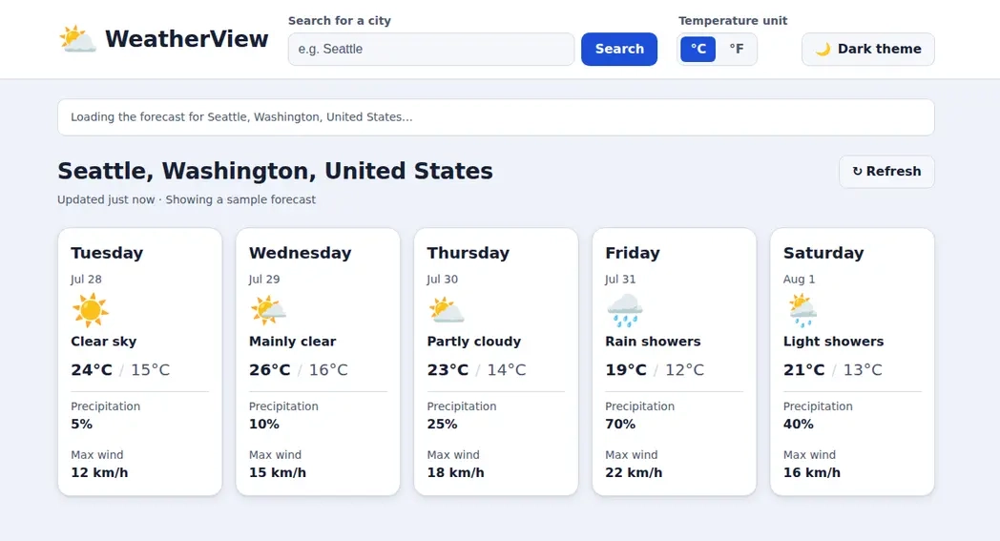
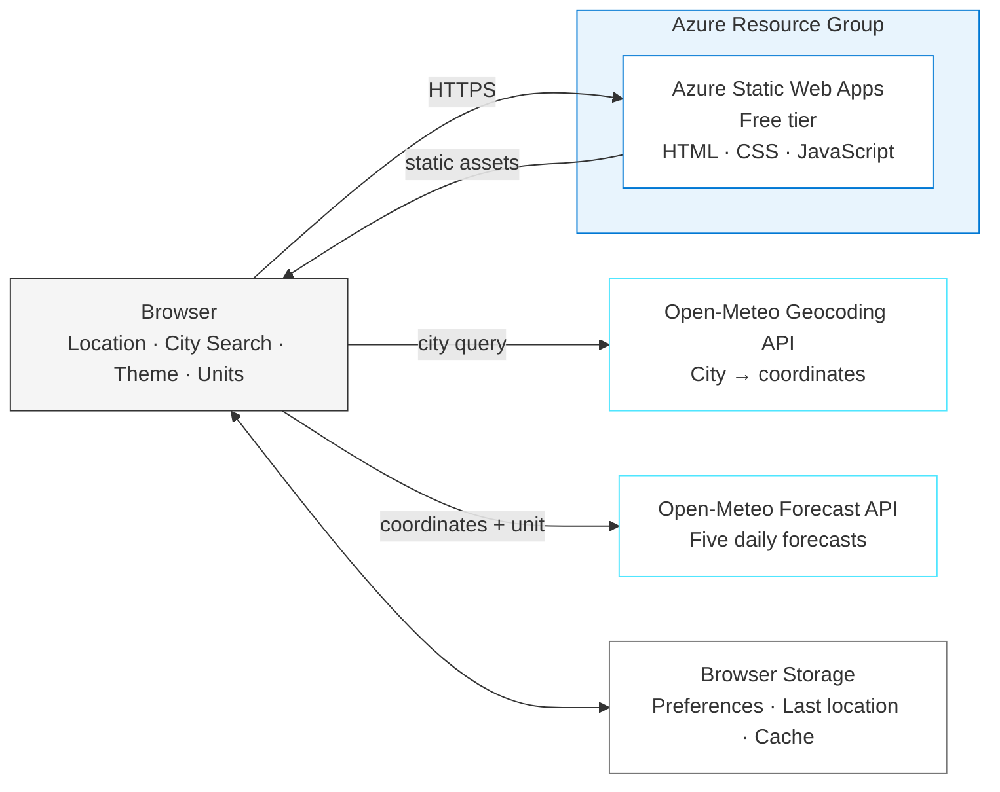
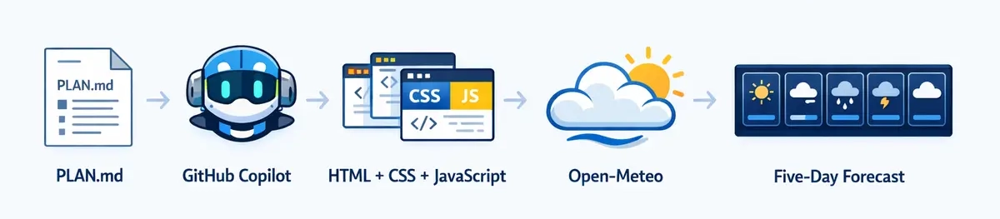
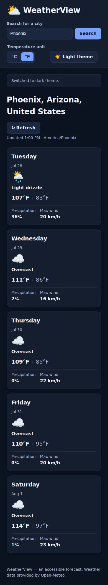
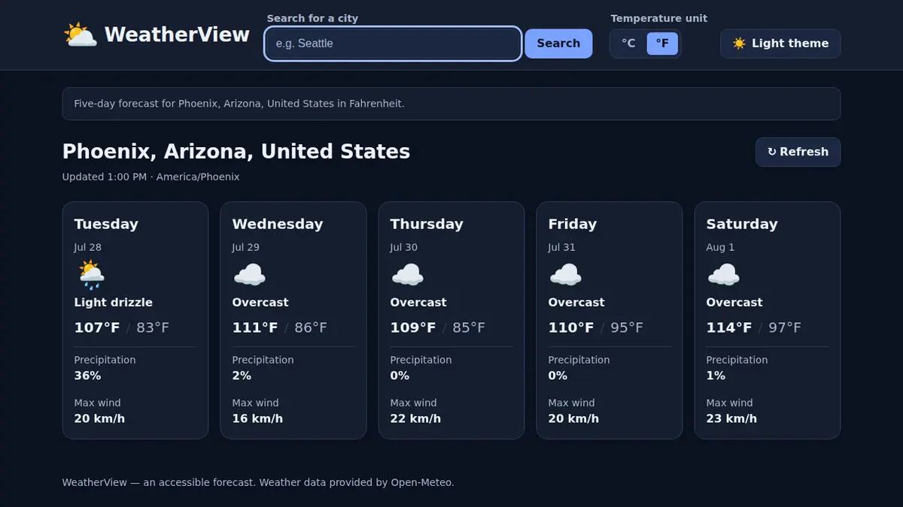
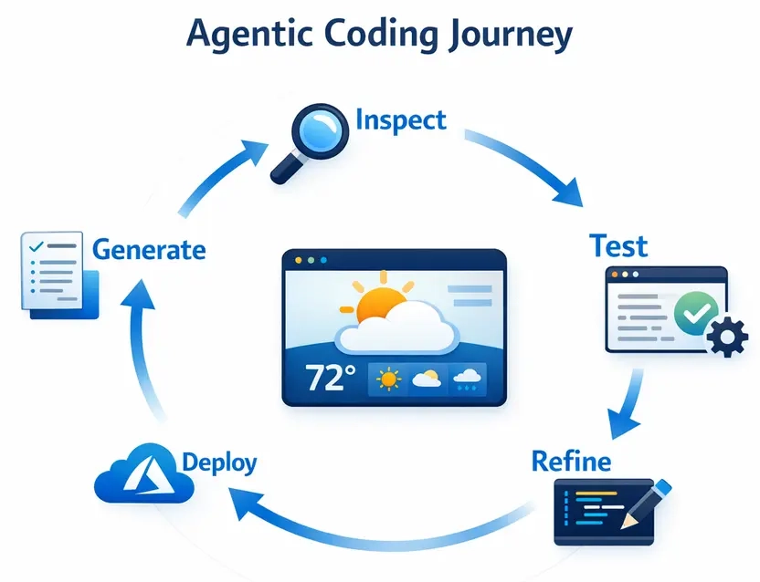

# WeatherView - Five-Day Forecast on Azure

> ✨ **Turn a small product plan into a polished, accessible weather app and ship it globally using Azure Static Web Apps.**

<p align="center">
  
</p>

You'll build WeatherView from a shared spec using vanilla HTML, CSS, and JavaScript. GitHub Copilot will help you turn the plan into a responsive five-day forecast, test the behaviors that matter, generate Bicep, and deploy the finished site to Azure Static Web Apps with `azd`.

## Learning Objectives

- Turn a product plan into small, reviewable implementation prompts
- Build modular browser code around live Open-Meteo forecast and geocoding APIs
- Review generated UI code for accessibility, resilience, and performance
- Write tests that give the same result every run, so you verify the app works instead of trusting that it built
- Use the Azure Skills plugin to generate and validate Bicep for Azure Static Web Apps
- Deploy a static app with `azd up`, verify it in a browser, and remove only the resources created by the journey

> 💰 **Estimated Cost**: **$0/month for the Azure Static Web Apps Free tier within its quotas**. Complete [Cleanup](#cleanup) the same day anyway so the journey leaves no resources behind.

## Prerequisites

This journey supports Windows PowerShell, Command Prompt, Mac, and Linux.

| Host tool | Requirement | Purpose | Validation |
|---|---|---|---|
| [Azure CLI](https://learn.microsoft.com/cli/azure/install-azure-cli) | Required | Authenticate, inspect the selected subscription, and register the Static Web Apps provider | `az version` |
| [Azure Developer CLI (`azd`)](https://learn.microsoft.com/azure/developer/azure-developer-cli/install-azd) 1.28.0 or later | Required | Provision, deploy, and remove the application | `azd version` |
| [Node.js](https://nodejs.org/en/download) LTS or later | Required | Run the local server, tests, verifier, and browser tooling | `node --version` |
| [GitHub Copilot CLI](https://docs.github.com/en/copilot/how-tos/copilot-cli/cli-getting-started) | Required for the documented CLI path | Run the coding agent and Azure Skills plugin | `copilot --version` |
| Git | Required | Create the isolated application workspace and inspect changes | `git --version` |

Run these read-only checks before Phase 1:

```text
node --version
az version
az account show --output table
azd version
copilot --version
git --version
```

Confirm that `az account show` identifies the subscription you intend to use, `azd` is version 1.28.0 or later, and Node.js is a currently supported LTS release. Stop and fix a failed prerequisite before asking GitHub Copilot to generate code. See the [cross-platform installation guide](../../docs/tool-installation.md) for Windows, Mac, and Linux installation options.

> [!NOTE]
> GitHub Copilot CLI is the documented and validated path. You can adapt the prompts for the GitHub Copilot app, an IDE agent, or another agentic coding tool. For another tool, run: **"Copy or adapt this repository's `.github/skills` into your supported skills or instructions location, preserving their behavior and reporting anything unsupported."**

### Acceptance criteria

The local app is complete when:

- [ ] The initial flow uses browser geolocation when available and falls back to Seattle when it is unavailable.
- [ ] Exactly five forecast cards render from Open-Meteo data.
- [ ] City search loads another valid location without a page reload.
- [ ] Celsius/Fahrenheit changes the source unit and persists after reload.
- [ ] Light/dark theme changes and persists after reload.
- [ ] Loading, no-result, malformed-response, offline, and retry states are represented safely.
- [ ] Keyboard navigation, accessible names, status announcements, and visible focus have been checked.
- [ ] Unit tests, browser tests, and the generated local verifier pass.

The Azure deployment is complete when the checked-in verifier passes against `WEB_URL`, browser acceptance passes with no required resource failures, and you capture a full-page screenshot.

The journey is complete after [Cleanup](#cleanup) removes the exact resource group created by this run.

---

## Architecture



**Deployment components and external services:**

- **Azure Static Web Apps Free tier**: Hosts and globally distributes the static site
- **Open-Meteo Forecast API**: Returns five-day forecast data without an API key
- **Open-Meteo Geocoding API**: Resolves city searches to coordinates
- **Browser geolocation and storage**: Supplies the initial location and persists user preferences locally

No backend, database, container, deployment token, paid weather API, or local Docker installation is required.

---

## The Spec

WeatherView is driven by [`PLAN.md`](./PLAN.md). The spec starts from the original [WeatherView implementation plan](https://github.com/DanWahlin/github-copilot-get-started/blob/main/.plans/main-plan.md), then makes the browser flow, city search, error states, tests, and Azure deployment contract explicit.

Open the spec before you begin. GitHub Copilot will use its exact section names throughout the journey.

**Core browser modules:**

| Module | Responsibility |
|---|---|
| `index.html` | Semantic app shell, controls, status region, and forecast grid |
| `styles.css` | Responsive cards, design tokens, themes, focus, and reduced-motion behavior |
| `weather-api.js` | Geocoding, forecast requests, response validation, and normalization |
| `weather-maps.js` | WMO weather-code labels and icons |
| `app.js` | State, event wiring, caching, preferences, geolocation, and rendering |
| `scripts/verify-app.mjs` | Repeatable local acceptance checks generated before it is run |

---

## The Journey

WeatherView is built in three phases. You'll first create the product experience, then harden and test it, and finally generate Bicep and deploy it to Azure Static Web Apps.

**How this journey works:** Work incrementally. Ask GitHub Copilot for one bounded change, inspect the result against `PLAN.md`, run it yourself, and repair only observed gaps. The loop is: generate → inspect → test → refine.

**What AI model should I choose?** Use a capable frontier model for the initial architecture, accessibility review, infrastructure generation, and difficult debugging. Smaller models are often sufficient for focused tests and narrow fixes. Switch when the model repeatedly misses requirements rather than endlessly expanding a prompt.

> **💡 Track issues as you go.** Every generation prompt asks GitHub Copilot to record real problems and fixes in `issues.md` inside the isolated WeatherView workspace. Do not pre-populate the source journey with hypothetical failures.

> [!IMPORTANT]
> **When something fails**
>
> 1. Stay in the same GitHub Copilot session so it retains the journey context.
> 2. Paste the exact command and relevant output. Do not paraphrase it.
> 3. Include the operating system, shell, current phase, and last successful step.
> 4. Remove tokens, cookies, subscription identifiers, and `.azure` values before pasting.
> 5. Ask GitHub Copilot to explain the root cause, make the smallest safe fix, rerun the failed check, and record the resolution in `issues.md`.
>
> ```text
> The following command failed during <journey phase> on <OS and shell>:
>
> <exact command>
>
> Relevant error output:
>
> <redacted error output>
>
> Inspect the relevant application or Azure state, explain the root cause,
> make the smallest safe fix, rerun the failed step, and run the applicable
> verifier. Record the issue and resolution in issues.md. Do not print secrets.
> ```

### Phase 1: Build the Weather Experience

<p align="center">
  
</p>

#### Step 1: Create an isolated workspace

Keep this README open, but generate the application in a separate workspace so the source journeys repository stays clean.

From the journeys repository root, start GitHub Copilot CLI:

```text
copilot
```

Run this prompt. If you want a different parent folder, change only the target path:

```
> Create a standalone WeatherView workspace in a sibling directory named
  weather-view-workspace next to this repository. Stop and ask before changing
  anything if that directory already exists and is not empty.
  Preserve the existing folder structure by copying these directories into
  the workspace:
  - journeys/weather-view
  - .github/agents
  - .github/skills
  - .github/scripts
  - docs
  Initialize a Git repository at the workspace root and add a root .gitignore
  that excludes .env and .env.* while allowing .env.example, plus .azure/,
  node_modules/, coverage/, test-results/, and playwright-report/.
  Do not modify the source journeys repository. When finished, show the
  workspace path and every copied top-level path.
```

End that session, then change to the journey directory in the new workspace:

```text
cd ../weather-view-workspace/journeys/weather-view
```

Configure `azd` to reuse the Azure CLI session:

```text
azd config set auth.useAzCliAuth true
```

Start a new GitHub Copilot CLI session from `journeys/weather-view`:

```text
copilot
```

#### Step 2: Install and confirm Azure Skills

The Azure Skills plugin is not a footnote in this journey. It gives GitHub Copilot current Bicep schemas, deployment planning, infrastructure validation, and Azure troubleshooting context that the base coding model may not have.

If you completed the root [Quick Start](../../README.md#quick-start), the plugin persists and you can skip installation. Otherwise, run these canonical commands inside GitHub Copilot CLI:

```
> /plugin marketplace add microsoft/azure-skills
```

```
> /plugin install azure@azure-skills
```

> [!IMPORTANT]
> Use only `microsoft/azure-skills` and `azure@azure-skills`. Do not substitute an older or similarly named marketplace.

Ask GitHub Copilot to confirm the plugin context before generating Azure files:

```
> Confirm whether the Azure Skills plugin is available in this session. List
  the Azure skills or MCP tools you can use for Bicep schema lookup,
  infrastructure guidance, deployment planning, validation, and deployment.
  Do not create files or Azure resources yet. If the plugin is unavailable,
  stop and tell me to install azure@azure-skills.
```

#### Step 3: Scaffold the accessible app shell

> **Default stack:** vanilla HTML5 + CSS + modern JavaScript ES modules. Do not substitute a framework or UI library.

```
> Read PLAN.md, especially "Choose Your Stack," "Project Structure," "Product
  Experience," and "Accessibility and Performance." Create the initial
  WeatherView project with index.html, styles.css, package.json, app.js,
  weather-api.js, and weather-maps.js. For this step, build the semantic app
  shell and responsive visual system only:
  - header/navigation with branded title
  - labeled city search
  - Celsius/Fahrenheit control
  - light/dark theme control
  - aria-live status region
  - resolved-location heading area
  - forecast-grid container with five realistic placeholder cards
  - responsive design tokens, visible focus, reduced-motion support, and both
    themes
  Do not call external APIs yet. Add a local start script that accepts a
  configurable port and does not require a global package. Log issues to
  issues.md.
```

**🔍 Inspect what was generated:**

- Does the page use semantic landmarks and one clear heading hierarchy?
- Does every control have a visible label or unambiguous accessible name?
- Can you reach every control with Tab and see where focus is?
- At narrow width, do cards and header controls reflow without horizontal scrolling?
- Does the design still work with `prefers-reduced-motion`?

Start the local app using the generated command. The exact command belongs in the generated `package.json` and project README; do not invent a second server path.

Open the local URL in a browser, resize it to phone width, and use only the keyboard for one pass through the controls.

**💡 What you're learning:** Generating the shell separately keeps visual and accessibility decisions reviewable. If API code and UI arrive in one large change, it is harder to tell whether failures come from the data contract, rendering, or layout.

#### Step 4: Add weather data, geolocation, and city search

```
> Read "Primary User Flow," "City Search," "Weather Data," "Weather Code
  Mapping," "Caching," and "Application States and Resilience" in PLAN.md.
  Implement the real WeatherView behavior in weather-api.js, weather-maps.js,
  and app.js:
  - browser geolocation with a bounded wait and Seattle fallback
  - Open-Meteo city geocoding and five-day forecast requests
  - strict payload validation and normalized day objects
  - WMO code labels/icons with an unknown-code fallback
  - exactly five forecast cards in one DOM update
  - source-unit refetch for Celsius/Fahrenheit
  - persisted theme, unit, and last successful location
  - a ten-minute location+unit cache
  - explicit loading, no-result, malformed-data, network-error, and retry states
  Keep the previous successful forecast visible when a city search or refresh
  fails. Do not introduce a framework, API key, backend, or image dependency.
  Log issues to issues.md.
```

**🔍 Inspect the API and state code:**

1. Are URLs built with `URL` and `URLSearchParams`?
2. Does forecast validation require five aligned values for every daily field?
3. Does empty search avoid a network request?
4. If geolocation is denied, does the status explain the Seattle fallback without showing a scary error?
5. Does changing units call Open-Meteo with a different `temperature_unit` rather than converting old values?
6. Does a failed request keep the last good forecast visible?
7. Can an unknown weather code render safely?
8. Does a forecast date remain the same calendar day in `America/Phoenix`, or does midnight parsing shift it backward?

Run the app and check the local acceptance criteria manually. Search for your city, change units, change themes, reload, then deny or block geolocation in browser permissions and reload again.

**💡 What you're learning:** External API code needs a normalization boundary. The rest of the UI should consume one stable model rather than know that Open-Meteo returns parallel arrays.

---

### Phase 2: Test, Verify, and Refine

<p align="center">
  
</p>

#### Step 1: Generate targeted tests

```
> Read "Local Tooling and Tests" in PLAN.md. Add tests for every listed
  behavior. Use Node's built-in test runner for pure module tests when
  practical. Add Playwright as a pinned development dependency for browser
  behavior and use its bundled Chromium, not a branded Chrome channel.
  Browser tests must mock geolocation and Open-Meteo responses deterministically
  for success, no-result, malformed-payload, and network-failure cases. They
  must assert exactly five cards, city search, unit refetch, preference
  persistence, retry behavior, accessible names, and visible keyboard focus.
  Add test and test:e2e package scripts and document the exact one-time Chromium
  install command. Do not weaken application behavior to make tests pass.
```

Run the generated tests yourself. If Playwright's Chromium browser isn't installed yet, run the install command the agent documented in the project. Skip the `--with-deps` flag: it installs system-level packages and needs administrator rights, which this journey doesn't require.

**🔍 Inspect the tests:**

- Do API unit tests fail on arrays with four or six values, not only missing objects?
- Does a browser regression prove a date-only value such as `2026-07-28` stays `Tuesday, Jul 28` in an America timezone?
- Do browser tests mock geolocation rather than depend on the developer's location?
- Does the unit test prove a new Open-Meteo request contains `fahrenheit`?
- Do persistence tests reload the page and check restored state?
- Do error tests prove the previous successful cards remain visible?
- Are fixed sleeps avoided in favor of observable UI state?

#### Step 2: Generate the local verification script before running it

The journey will ask you to run `scripts/verify-app.mjs`, so create it first. This is deliberately explicit: a tutorial should never tell you to execute a file it did not help you create.

```
> Create scripts/verify-app.mjs in this journey directory as specified in
  "Local Tooling and Tests" in PLAN.md. It must work on Windows, Mac, and Linux
  with Node.js LTS or later. It must:
  1. accept --base-url and default to the documented local URL
  2. request index.html, styles.css, app.js, weather-api.js, and weather-maps.js
  3. fail on any non-2xx response or missing required app-shell marker
  4. call Open-Meteo for Seattle with all required daily fields,
     forecast_days=5, timezone=auto, and temperature_unit=celsius
  5. validate exactly five aligned forecast days
  6. print a short PASS summary and exit 0, or print the exact failed assertion
     and exit nonzero
  Use fetch and Node standard-library APIs only. Do not start, stop, or kill an
  unrelated process. Add an npm verify script and document how to start the app
  in one terminal and run the verifier in another. Then show me the created
  file before running it.
```

Start the local server using the generated project command. In a second terminal, run:

```text
node scripts/verify-app.mjs --base-url http://localhost:<your-port>
```

The script must print a PASS summary. Stop only the local server you started for this test.

**💡 What you're learning:** Verification scripts are executable acceptance criteria. Creating one before deployment gives you a repeatable contract that can later target the live URL.

#### Step 3: Run a focused quality review

```
> /review Review the completed WeatherView implementation against PLAN.md.
  Focus on correctness, accessibility, resilience, performance, browser
  security, and test gaps. Identify missing or incorrectly implemented
  requirements with file and line evidence. Do not suggest a framework rewrite.
```

Address high-confidence correctness, accessibility, security, and reliability findings. Rerun unit tests, browser tests, and `scripts/verify-app.mjs` after every repair.

> **💡 Get another perspective:** Use `/rubber-duck` with the same bounded review question against another model. Act only on specific, reproducible findings tied to `PLAN.md`.

#### 🧪 Try it yourself: Inject a malformed response

Use the Playwright network mock to return five dates but only four maximum temperatures. Confirm that WeatherView shows the user-safe error, keeps previous forecast cards when available, and offers a keyboard-accessible Retry action. Ask GitHub Copilot to explain why rendering partial parallel arrays is unsafe.

---

### Phase 3: Deploy to Azure Static Web Apps

<p align="center">
  
</p>

#### Step 1: Generate Bicep and azd configuration with Azure Skills

Before submitting the generation prompt, confirm `azure@azure-skills` is active. The agent should use Azure schema and deployment guidance rather than relying solely on remembered Static Web Apps properties.

```
> Read "Azure Deployment" in PLAN.md. Use the installed Azure Skills plugin,
  including current Bicep schema and azd infrastructure guidance, to create the
  WeatherView deployment:
  - subscription-scope infra/main.bicep that creates an environment resource group
  - resource-group-scoped Static Web App module
  - prefer br/public:avm/res/web/static-site, but use raw
    Microsoft.Web/staticSites@2023-12-01 if current AVM inputs block deployment
  - Free SKU, provider Custom, allowConfigFileUpdates true
  - normalize unsupported Static Web Apps locations to eastus2
  - azd-env-name and azd-service-name: web tags
  - WEB_URL, STATIC_WEB_APP_NAME, and RESOURCE_GROUP_NAME outputs
  - main.parameters.json using azd environment values
  - azure.yaml with one web service using host: staticwebapp and language: js
  - scripts/build-static.mjs plus an npm build script that recreates dist/ and
    copies only the six deployable site files; azure.yaml must set dist: dist
  - staticwebapp.config.json with navigation fallback and the security headers
    required by PLAN.md, including Open-Meteo connect-src origins
  Do not create a backend, API key, deployment token, storage account, container,
  GitHub Actions workflow, or local-Docker requirement. Log real generation or
  validation issues to issues.md.
```

If GitHub Copilot asks questions, accept answers consistent with `PLAN.md`: Static Web Apps Free, default/fallback Static Web Apps location `eastus2`, and no backend.

#### Step 2: Perform a read-only pre-deployment review

```
> Use Azure Skills to perform a read-only pre-deployment review of WeatherView.
  Do not modify files and do not create Azure resources. Check PLAN.md's
  "Azure Deployment" contract and return:
  1. PRE-DEPLOYMENT STATUS: READY or NOT READY
  2. a table with PASS or FAIL plus file/line evidence for every check
  3. each blocking issue and its smallest exact fix

  Verify that:
  - main.bicep is subscription scoped and resource-group resources are in a
    resource-group-scoped module
  - the Static Web App uses Free SKU, provider Custom, config updates enabled,
    supported-location normalization, azd-env-name, and azd-service-name: web
  - outputs are WEB_URL, STATIC_WEB_APP_NAME, and RESOURCE_GROUP_NAME
  - azure.yaml has exactly one web service with project ., language js, and
    host staticwebapp, plus dist: dist
  - scripts/build-static.mjs recreates dist/ with only index.html, styles.css,
    app.js, weather-api.js, weather-maps.js, and staticwebapp.config.json
  - no secret, deployment token, backend, storage account, container, workflow,
    or local Docker dependency was added
  - staticwebapp.config.json has a safe navigation fallback and permits only
    self plus Open-Meteo forecast/geocoding origins in connect-src
  - tests and local verification still pass
  Run Azure Skills validation plus any existing read-only azd/Bicep validation
  that does not create resources. Do not report READY while a required check
  is unresolved.
```

If the status is `NOT READY`, ask GitHub Copilot to fix only the failed checks, then rerun the same read-only review.

**💡 What you're learning:** A deployment can be structurally valid but still target the wrong resource. The `azd-service-name: web` tag is the bridge between Bicep and the `web` service in `azure.yaml`.

#### Step 3: Let GitHub Copilot prepare the azd environment

Use the agent for prerequisite preparation rather than copying values through a chain of manual `az` commands:

```
> Prepare this WeatherView azd environment for deployment. Do not run azd up
  and do not create application resources.
  1. Confirm Azure CLI and azd authentication are healthy and identify the
     selected subscription by name.
  2. Confirm the Microsoft.Web provider is Registered; register only that
     provider if necessary and wait for registration to complete.
  3. Read the current subscription ID and set AZURE_SUBSCRIPTION_ID in the
     selected azd environment as a literal value. Do not use shell command
     substitution.
  4. Set AZURE_LOCATION to eastus2 unless this environment already has a
     supported intentional choice.
  5. Use Azure Skills deployment planning to check the final plan.
  Stop and report any missing authentication or permission instead of guessing.
  Do not print tokens or secrets. At the end, show the subscription name and
  the names of environment keys set, but redact the subscription ID.
```

`Microsoft.Web` is the only provider this journey needs. Do not register unrelated Container Apps, SQL, Kubernetes, AI, or monitoring providers.

#### Step 4: Run the deployment yourself

Run the one command that matters from `journeys/weather-view`:

```text
azd up
```

You may be prompted for an environment name and location. Use a unique environment name and `eastus2` unless you intentionally selected another supported Static Web Apps location.

Do not continue until infrastructure provisioning and the `web` service deployment both exit successfully.

> ⏳ **While you wait:** Open `infra/main.bicep` and trace the environment name from azd parameter to resource-group name, Static Web App name, service tag, and `WEB_URL` output. Ask GitHub Copilot: *"Explain how azd finds the Static Web App resource and deploys this project without a deployment token or GitHub Actions workflow."*

If `azd up` fails, paste the exact error into the existing GitHub Copilot session and ask it to use Azure Skills to diagnose the current files and deployment state. Do not convert the journey into a long list of ad hoc Azure CLI repairs.

#### Step 5: Verify the live deployment

Run the checked-in verifier from `journeys/weather-view`:

```text
node ../../.github/scripts/verify-weather-view.mjs
```

It must print:

```text
PASS: WeatherView assets and five-day Open-Meteo contract verified
```

The script reads `WEB_URL` through `azd`, verifies the main document and required modules from Azure Static Web Apps, checks important app-shell and security markers, calls Open-Meteo for Seattle, and fails if the forecast contract does not contain exactly five aligned days.

Now ask GitHub Copilot to create and run deployed browser acceptance before you rely on a screenshot:

```
> Create scripts/verify-deployed-browser.mjs for WeatherView using the pinned
  project-local Playwright dependency and bundled Chromium. Read WEB_URL with
  azd using an argument array. In a fresh browser context:
  - deny geolocation so the Seattle fallback is deterministic
  - open WEB_URL and require exactly five forecast cards
  - search for Phoenix and require the visible location to change while five
    cards remain
  - switch to Fahrenheit and require °F, reload, and require it to persist
  - switch theme, reload, and require the selected theme to persist
  - verify the controls have accessible names and a keyboard focus indicator
  - record console errors and failed document, script, stylesheet, fetch, XHR,
    and image requests; fail on any required-resource failure
  - save a full-page screenshot to artifacts/weather-view-azure.png
  Exit nonzero on any failed assertion. Do not use fixed delays when an
  observable UI state is available. Then run the script and show its PASS
  summary plus screenshot path.
```

Open the value returned by this command in your own browser:

```text
azd env get-value WEB_URL
```

Complete one human pass:

1. Confirm five readable cards at desktop and narrow mobile widths.
2. Search for a city near you.
3. Switch units and reload.
4. Switch themes and reload.
5. Navigate every control with the keyboard.
6. In browser developer tools, confirm there are no console errors and forecast/geocoding requests go directly to Open-Meteo over HTTPS.

The browser script was created before you ran it, and its screenshot is evidence of the same deployment the verifier tested.

#### 🧪 Try it yourself: Add a compact forecast mode

```
> Add an accessible compact/comfortable density control to WeatherView. Persist
  the choice, preserve the existing responsive layout and focus behavior, and
  add a Playwright test that reloads the page and proves the preference remains.
```

Run all tests and both deployed verifiers again before accepting the change.

---

<details>
<summary><strong>How Agentic AI is Used</strong></summary>

## How Agentic AI is Used

<p align="center">
  
</p>

This journey uses agentic AI in several distinct roles:

| Layer | Use Case | What It Demonstrates |
|---|---|---|
| **Planning** | `PLAN.md` turns product intent into stable implementation contracts | A spec can be shared context across many focused prompts |
| **Code generation** | GitHub Copilot creates the shell, API boundary, state, and tests incrementally | Smaller generation steps are easier to inspect and repair |
| **Code review** | You compare generated UI and browser behavior to accessibility and resilience requirements | Working code can still fail product requirements |
| **Test generation** | GitHub Copilot converts acceptance criteria into unit, Playwright, and verifier scripts | Verification should be executable and created before use |
| **Azure Skills** | Plugin tools provide current Bicep schema, deployment planning, validation, and troubleshooting | Specialized skills reduce stale cloud assumptions |
| **Infrastructure** | GitHub Copilot generates subscription-scoped Bicep and Static Web Apps configuration | Service tags and outputs connect IaC to azd deployment behavior |
| **Debugging** | GitHub Copilot uses exact failures and Azure context to make bounded repairs | Agent assistance is strongest when evidence and scope are explicit |

</details>

---

## Cost Breakdown

| Resource | SKU | Monthly cost if left running |
|---|---|---|
| Azure Static Web Apps | Free | $0 within Free-tier quotas |
| Open-Meteo APIs | Free public API | $0, subject to fair-use limits |
| **Total** | | **$0 within documented quotas** |

This journey is free under normal lab usage, but cleanup still matters: it proves that the deployment is reproducible and prevents forgotten resources from accumulating across repeated runs.

---

<details>
<summary><strong>Troubleshooting</strong></summary>

## Troubleshooting

### The page loads but no forecast cards appear

**Cause:** Open-Meteo request failed, Content Security Policy blocks `connect-src`, or payload validation correctly rejected an unexpected response.

**Fix:** Open browser developer tools and preserve the exact console/network failure. Ask GitHub Copilot to compare `staticwebapp.config.json`, `weather-api.js`, and the response with `PLAN.md`. Do not remove the whole Content Security Policy to make the request work; allow only the required Open-Meteo HTTPS origins.

### City search reports no result

**Cause:** The geocoding API returned no match or the search input was empty.

**Fix:** Keep the previous successful forecast visible, display the inline no-result message, and try a more specific city such as `Phoenix, Arizona`. Empty input must not make a request.

### Fahrenheit changes but reverts after reload

**Cause:** The selected unit is not persisted as `weather-view-unit`, or startup code overwrites the stored value before reading it.

**Fix:** Inspect storage in browser developer tools, then ask GitHub Copilot to trace initialization and add a reload regression test. Do not convert cached Celsius values locally; refetch in Fahrenheit.

### `azd up` cannot find the deployment target

**Cause:** The Static Web App is missing `azd-service-name: web`, the `azure.yaml` service key differs, or the Bicep output/resource module did not deploy successfully.

**Fix:** Rerun the Phase 3 read-only review. The `web` key in `azure.yaml` and `azd-service-name` tag must match exactly.

### `azd up` says the service source and output folder cannot both be the root

**Cause:** Azure Static Web Apps does not allow `project: .` to also be the publish output folder.

**Fix:** Generate `scripts/build-static.mjs`, add an npm `build` script, and set `dist: dist` in `azure.yaml`. The build must recreate `dist/` with only the six deployable site files. Run the build, inspect the output list, and rerun `azd up`; do not move the whole journey or publish tests and infrastructure.

### Static Web Apps is unavailable in the selected region

**Cause:** The resource group accepts more regions than Azure Static Web Apps does.

**Fix:** Keep the resource group in the selected location if desired, but map the Static Web App to a supported location such as `eastus2`. The generated module should already normalize unsupported choices.

### A route or reload returns 404

**Cause:** `staticwebapp.config.json` navigation fallback is missing or excludes are too broad.

**Fix:** Restore the fallback to `/index.html`, excluding actual static assets so missing JavaScript and CSS still return real 404 responses rather than HTML.

### Deployment fails with `Exec format error` or `cannot execute binary file`

Most people never see this. It only shows up on some ARM64 machines, such as certain Windows on ARM or Linux ARM laptops. If your deployment succeeded, skip this section.

**What happened:** `azd up` has two parts. It created the Static Web App in Azure successfully, then it downloaded a small Microsoft upload tool to copy your site files up. That tool doesn't have a build for your machine's chip, so it couldn't run.

**What to do:** Expand the workaround below to have GitHub Copilot upload your files from a temporary machine in Azure instead. If you have access to another computer with an Intel or AMD chip, you can also just rerun `azd up` there with the same environment name.

<details>
<summary><strong>Workaround: upload from a temporary machine in Azure</strong></summary>

Use this only after `azd up` creates the Static Web App and then fails with the error above. The workaround starts one short-lived container in Azure, uses it to upload your files, then deletes it. That container costs a small amount while it runs, and it isn't part of your app. You don't need Docker on your own machine.

Paste this prompt into the existing GitHub Copilot CLI session:

```text
The WeatherView azd deployment provisioned the Static Web App, but its publish
step failed because StaticSitesClient cannot execute on this ARM64 host. Use the
Azure Skills plugin and the existing selected azd environment to complete only
the static-content upload through a temporary x64 Azure Container Instance.

Requirements:
- Do not change Bicep, azure.yaml, the Static Web App, or application behavior.
- Run npm run build and verify dist contains only the six expected site assets.
- Read RESOURCE_GROUP_NAME and STATIC_WEB_APP_NAME from azd. Stop if either is
  missing or if the resource group does not belong to the selected environment.
- Explain that Microsoft.ContainerInstance will be registered and one temporary
  container group will be created. Wait for my approval before registering the
  provider or creating the container group.
- Retrieve the Static Web Apps deployment token only in process memory. Never
  print it, write it to disk, put it in a command argument, or include it in logs.
- Pass the token to the container as a secure environment value. Use a pinned
  Microsoft-hosted x64 image and a pinned Static Web Apps CLI version.
- Upload only dist. Wait for the publisher to terminate with exit code 0.
- In a finally block, delete the temporary container group and verify that the
  exact container group no longer exists, including after a failed upload.
- Run ../../.github/scripts/verify-weather-view.mjs after publishing.
- Report the deployed URL, verifier result, temporary resource name, and deletion
  result. Redact tokens, credentials, and subscription identifiers.
```

The agent explains what it plans to create and waits for your approval. Once it finishes, confirm all three:

1. The upload finished successfully.
2. `node ../../.github/scripts/verify-weather-view.mjs` prints PASS.
3. The temporary container is gone.

If you can't create temporary resources, copy the workspace to a computer with an Intel or AMD chip, sign in there, and rerun `azd up` with the same environment name.

</details>

### Browser verification fails on geolocation

**Cause:** The automated context inherited an unpredictable host location or permission state.

**Fix:** The deployed browser verifier must deny geolocation and assert the deterministic Seattle fallback. Test granted geolocation separately with a mocked browser location.

</details>

---

<details>
<summary><strong>Verification Checklist</strong></summary>

## Verification Checklist

From `journeys/weather-view` in the isolated workspace:

1. Run the generated unit and browser tests using the exact package scripts.
2. Run the generated local verifier against the running local server.
3. Run `azd up` and require both provisioning and web deployment to succeed.
4. Run:

   ```text
   node ../../.github/scripts/verify-weather-view.mjs
   ```

5. Create and run `scripts/verify-deployed-browser.mjs` with the Phase 3 prompt.
6. Inspect `artifacts/weather-view-azure.png` and the browser failure log.
7. Complete the manual desktop, mobile-width, persistence, and keyboard pass.

Do not call the deployment complete from HTTP 200 alone.

</details>

---

## Assignment

1. **Add a saved-locations list:** Save up to five unique locations. Select one, observe whether the forecast updates without geolocation, then ask GitHub Copilot how it prevents duplicate entries and stale cache collisions.
2. **Add an offline snapshot:** Store the last successful forecast with a timestamp and label it clearly when offline. Disable the network in browser developer tools, observe the result, then ask GitHub Copilot why stale data needs a visible age.
3. **Audit contrast:** Use browser accessibility tooling in both themes. Fix one real contrast issue, rerun browser tests, and ask GitHub Copilot to explain why automated contrast checks do not replace keyboard and screen-reader review.
4. When finished, continue to Cleanup.

---

## Cleanup

> [!CAUTION]
> This permanently removes the WeatherView Azure Static Web App and its resource group. Save the deployed URL, screenshot, or logs you want to retain before continuing.

Read and save the exact resource group name created by this environment:

```text
azd env get-value RESOURCE_GROUP_NAME
```

From `journeys/weather-view`, run:

```text
azd down --force --purge
```

The command must exit successfully. Verify only the recorded group:

```text
az group exists --name <resource-group-name>
```

It must return `false`. If deletion is still in progress, wait and query that same exact name again. Do not broaden cleanup to unrelated resource groups or other azd environments.

---

## What's Next

Explore related journeys:

- [AIMarket](../aimarket/README.md) — add a backend, semantic product search, Foundry chat, and Container Apps
- [SmartTodo](../smart-todo/README.md) — combine Azure Functions, Azure SQL, Foundry, and a SwiftUI client
- [Grafana](../grafana/README.md) — deploy an existing application to Container Apps with an agent

> 📚 **All journeys:** [Back to root README](../../README.md#agentic-journeys)

---

## Resources

- [WeatherView Spec](./PLAN.md)
- [Source WeatherView implementation plan](https://github.com/DanWahlin/github-copilot-get-started/blob/main/.plans/main-plan.md)
- [Azure Static Web Apps documentation](https://learn.microsoft.com/azure/static-web-apps/)
- [Azure Static Web Apps configuration](https://learn.microsoft.com/azure/static-web-apps/configuration)
- [Azure Developer CLI](https://learn.microsoft.com/azure/developer/azure-developer-cli/)
- [Azure Verified Modules](https://azure.github.io/Azure-Verified-Modules/indexes/bicep/)
- [Open-Meteo Forecast API](https://open-meteo.com/en/docs)
- [Open-Meteo Geocoding API](https://open-meteo.com/en/docs/geocoding-api)
- [WMO weather interpretation codes](https://open-meteo.com/en/docs#weather_variable_documentation)
- [Web Content Accessibility Guidelines](https://www.w3.org/WAI/standards-guidelines/wcag/)
