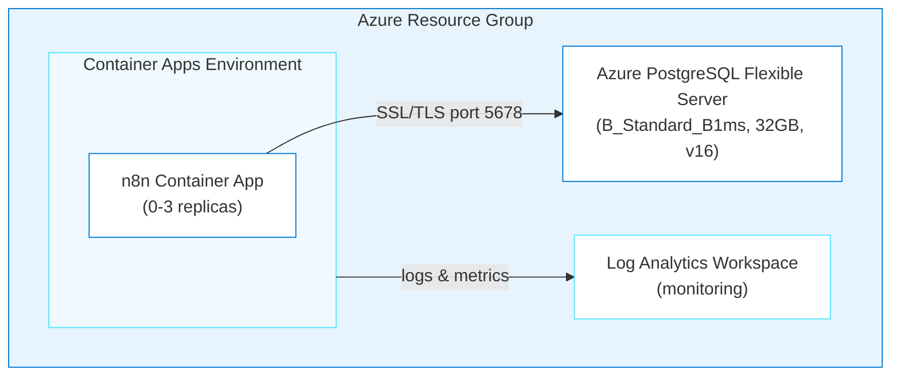

# Chapter 01: n8n — Workflow Automation on Azure Container Apps

> **What if deploying a production workflow automation platform to Azure was as simple as having a conversation?**

In this chapter, you'll deploy [n8n](https://n8n.io) — a powerful workflow automation platform — to Azure Container Apps with a managed PostgreSQL database. You'll do it two ways: first by using the `@oss-to-azure-deployer` Copilot agent to *generate* the infrastructure, then by deploying pre-built Bicep templates with a single command. Along the way, you'll learn how the agent uses Azure MCP tools to look up schemas, get best practices, and plan deployments — all from inside GitHub Copilot CLI.

## Learning Objectives

- Use `@oss-to-azure-deployer` in GitHub Copilot CLI to generate Azure infrastructure through conversation
- Understand how the agent loads app-specific and generic skills to build Bicep templates
- Deploy n8n to Azure Container Apps with PostgreSQL using `azd up`
- Configure health probes for slow-starting containers
- Troubleshoot common deployment issues using Azure MCP tools and container logs

> ⏱️ **Estimated Time**: ~20 minutes (Path 1) or ~10 minutes (Path 2)

---

## Real-World Analogy: The Sous Chef

Imagine you're a head chef who wants to add a new dish to the menu. You *could* research every ingredient, technique, and timing yourself. Or you could tell your sous chef what you want and let them handle the details — they know the recipes, the pantry, and the kitchen equipment.

| Kitchen | Azure Deployment |
|---------|-----------------|
| Head chef (you) | Developer using GitHub Copilot CLI |
| Sous chef | `@oss-to-azure-deployer` agent |
| Recipes | Skills (`n8n-azure`, `azure-bicep-generation`, etc.) |
| Pantry inventory | Azure MCP tools (`azure_bicep_schema`, `azure_deploy_iac_guidance`) |
| Plating the dish | `azd up` — one command to deploy everything |
| Taste test | Verification checklist and `azure_deploy_app_logs` |

The agent knows the recipes. You just tell it what you want to cook.

---

## Architecture



**Azure resources created:**

- **Azure Container Apps** — Serverless hosting with scale-to-zero
- **Azure Database for PostgreSQL Flexible Server** — Managed database for persistent storage
- **Azure Log Analytics** — Centralized monitoring and logging
- **User-Assigned Managed Identity** — Secure access to Azure resources

**Infrastructure directory:** [`../infra-n8n/`](../infra-n8n/)

---

## Path 1: Generate Infrastructure with the Agent

This is the primary tutorial path. You'll use `@oss-to-azure-deployer` in GitHub Copilot CLI to generate the entire infrastructure through conversation.

### Step 1: Install the Azure MCP Plugin

The agent uses Azure MCP tools to look up Bicep schemas, get deployment best practices, and plan deployments. Install the plugin first:

```bash
copilot
```

Once inside the interactive session:

```
> /plugin install microsoft/github-copilot-for-azure:plugin
```

> **What this does:** Gives the agent access to tools like `azure_bicep_schema`, `azure_deploy_iac_guidance`, `azure_deploy_plan`, and `azure_deploy_app_logs`. The agent can look up real Azure resource schemas instead of guessing.

### Step 2: Select the Agent

Use the `/agent` command to see available agents and select the deployer:

```
> /agent
```

Select **`oss-to-azure-deployer`** from the list. You're now in an interactive session with the deployment agent. It knows about n8n, Grafana, Superset, and the full Azure deployment lifecycle.

### Step 3: Ask the Agent to Deploy n8n

```
> Deploy n8n to Azure using Bicep and azd
```

The agent will:

1. **Load the right skills** — `n8n-azure` for n8n-specific configuration, `azure-container-apps` for Container Apps patterns, `azure-bicep-generation` for Bicep conventions, and `azd-deployment` for azure.yaml setup
2. **Use Azure MCP tools** — `azure_bicep_schema` for the latest API versions, `azure_deploy_iac_guidance` for Bicep best practices with azd compatibility
3. **Generate the Bicep infrastructure** in `infra-n8n/` with all required modules, parameters, and hooks

### Step 4: Review the Generated Infrastructure

Once the agent finishes, check what it created:

```bash
ls -R infra-n8n/
```

You should see a modular Bicep structure:

```
infra-n8n/
├── main.bicep                    # Orchestrates all modules
├── main.parameters.json          # azd parameter mapping (${VAR} syntax)
├── abbreviations.json            # Naming conventions
├── modules/
│   ├── log-analytics.bicep       # Log Analytics Workspace
│   ├── container-apps-environment.bicep  # Container Apps Environment
│   ├── n8n-container-app.bicep   # n8n Container App with probes
│   └── postgresql.bicep          # PostgreSQL Flexible Server
└── hooks/
    ├── postprovision.sh          # Sets WEBHOOK_URL after deployment
    └── postprovision.ps1         # Windows equivalent
```

You can ask follow-up questions in the same session:

```
> Why did you set the liveness probe to 60 seconds?
```

The agent explains that n8n needs 60+ seconds to start — without proper probes, Azure kills the container before initialization completes (CrashLoopBackOff).

### Step 5: Deploy to Azure

Stay in the same Copilot session and ask the agent to deploy:

```
> Run azd up for the n8n infrastructure you just generated. Set the location to westus and generate secure passwords for all credentials. If there are any issues, resolve them.
```

The agent will:

1. Update `azure.yaml` to point to `infra-n8n`
2. Register required Azure resource providers
3. Create an azd environment and set variables (location, passwords)
4. Run `azd up` (~7 minutes)
5. If anything fails (provider not registered, Bicep error, etc.) — diagnose and fix automatically
6. Run the post-provision hooks to configure `WEBHOOK_URL`

### Step 6: Verify

Once the agent reports success, ask it to verify:

```
> Verify the n8n deployment is working. Check the health endpoint and container logs.
```

The agent will use `azure_deploy_app_logs` to fetch logs and confirm everything is healthy.

You can also verify manually:

```bash
N8N_URL=$(azd env get-value N8N_URL)
curl -s -o /dev/null -w "%{http_code}" "$N8N_URL"  # Expect 200
```

If something goes wrong, just ask — you're still in the same session with full context:

```
> The container is in CrashLoopBackOff, what's happening?
```

---

## Path 2: Deploy Pre-Built Infrastructure

Already have the `infra-n8n/` code and just want to deploy? Follow these steps.

### 1. Register Azure Resource Providers

**Run these first** to avoid 409 conflicts:

```bash
az provider register --namespace Microsoft.App
az provider register --namespace Microsoft.DBforPostgreSQL
az provider register --namespace Microsoft.OperationalInsights
```

### 2. Set Required Variables

```bash
azd env new my-n8n-env
azd env set AZURE_SUBSCRIPTION_ID "$(az account show --query id -o tsv)"
azd env set AZURE_LOCATION "westus"
azd env set POSTGRES_PASSWORD "$(openssl rand -base64 16)"
azd env set N8N_BASIC_AUTH_PASSWORD "$(openssl rand -base64 16)"
```

### 3. Update azure.yaml

Make sure the root `azure.yaml` points to the n8n infra directory:

```yaml
name: n8n-azure

infra:
  provider: bicep
  path: infra-n8n

hooks:
  postprovision:
    posix:
      shell: sh
      run: ./infra-n8n/hooks/postprovision.sh
    windows:
      shell: pwsh
      run: ./infra-n8n/hooks/postprovision.ps1
```

### 4. Deploy

```bash
azd up
```

**Deployment time breakdown:**
| Stage | Time |
|-------|------|
| Resource Group | ~4s |
| Log Analytics | ~25s |
| Container Apps Environment | ~38s |
| PostgreSQL Flexible Server | ~4-5 min |
| n8n Container App | ~20s |
| **Total** | **~7 minutes** |

### 5. Access n8n

```bash
azd env get-value N8N_URL
# Login: admin / <your N8N_BASIC_AUTH_PASSWORD>
```

---

## Configuration Reference

### Environment Variables

The deployment automatically configures these n8n environment variables:

| Variable | Value | Description |
|----------|-------|-------------|
| `DB_TYPE` | `postgresdb` | Database type |
| `DB_POSTGRESDB_HOST` | Azure PostgreSQL FQDN | Database server address |
| `DB_POSTGRESDB_PORT` | `5432` | PostgreSQL port |
| `DB_POSTGRESDB_DATABASE` | `n8n` | Database name |
| `DB_POSTGRESDB_SSL_ENABLED` | `true` | Required for Azure PostgreSQL |
| `DB_POSTGRESDB_SSL_REJECT_UNAUTHORIZED` | `false` | Azure cert compatibility |
| `DB_POSTGRESDB_CONNECTION_TIMEOUT` | `60000` | 60s timeout for cold starts |
| `N8N_ENCRYPTION_KEY` | Auto-generated | Encryption key for credentials |
| `N8N_BASIC_AUTH_ACTIVE` | `true` | Enable basic authentication |
| `N8N_PORT` | `5678` | n8n default port |
| `N8N_PROTOCOL` | `https` | Protocol for generated URLs |
| `WEBHOOK_URL` | Auto-configured | Set by post-provision hook |

### Container Resources

| Setting | Value |
|---------|-------|
| Image | `docker.io/n8nio/n8n:latest` |
| CPU | 1.0 core |
| Memory | 2 GiB |
| Min Replicas | 0 (scale-to-zero) |
| Max Replicas | 3 |
| Scale Rule | HTTP requests (10 concurrent per replica) |

### Health Probes

n8n requires **60+ seconds** to start. Without proper health probes, Azure kills the container before initialization completes.

| Probe | Initial Delay | Period | Failure Threshold | Max Wait |
|-------|---------------|--------|-------------------|----------|
| Startup | — | 10s | 30 | 5 minutes |
| Liveness | 60s | 30s | 3 | — |
| Readiness | — | 10s | 3 | — |

### Secrets Management

Sensitive values are stored as Container App secrets and referenced via `secretRef`:

- `postgres-password` → `DB_POSTGRESDB_PASSWORD`
- `n8n-encryption-key` → `N8N_ENCRYPTION_KEY`
- `n8n-auth-password` → `N8N_BASIC_AUTH_PASSWORD`

---

## Cost Breakdown

| Resource | SKU | Monthly Cost |
|----------|-----|--------------|
| Container Apps (scale-to-zero) | Consumption (1 vCPU, 2GB) | ~$5-15 |
| PostgreSQL Flexible Server | B_Standard_B1ms (32GB) | ~$15 |
| Log Analytics | PerGB2018 (30-day retention) | ~$2-5 |
| **Total** | | **~$25-35/month** |

Scale-to-zero keeps costs low during idle periods. For production with `minReplicas: 1`, expect ~$60-80/month for Container Apps alone.

---

## Troubleshooting

### Container CrashLoopBackOff

**Symptom:** Container restarts repeatedly, logs show health check failures.

**Cause:** n8n needs 60+ seconds to start — default health probes kill it too early.

**Fix:** Ensure health probes are configured with `initialDelaySeconds: 60` on liveness and `failureThreshold: 30` on startup. The Bicep templates in `../infra-n8n/` already include this.

```bash
# Check container logs
APP_NAME=$(azd env get-value N8N_CONTAINER_APP_NAME)
RG=$(azd env get-value RESOURCE_GROUP_NAME)
az containerapp logs show --name $APP_NAME --resource-group $RG --follow
```

> **Agent tip:** Ask `@oss-to-azure-deployer` — *"My n8n container keeps restarting"* — and it will use `azure_deploy_app_logs` to pull logs and diagnose the issue.

### Database Connection Refused

**Symptom:** n8n logs show `ECONNREFUSED` or SSL handshake errors.

**Fix:**
1. Always use PostgreSQL **FQDN** (not internal hostname)
2. Enable SSL: `DB_POSTGRESDB_SSL_ENABLED=true`
3. Set `DB_POSTGRESDB_SSL_REJECT_UNAUTHORIZED=false` (Azure cert compatibility)
4. Increase connection timeout to 60s for cold starts

### WEBHOOK_URL Not Set

**Symptom:** Webhooks don't work, static assets fail to load.

**Cause:** Circular dependency — FQDN isn't known until Container App is created.

**Fix:** The post-provision hook handles this automatically. Manual fix:

```bash
N8N_FQDN=$(az containerapp show --name $APP_NAME --resource-group $RG \
  --query "properties.configuration.ingress.fqdn" -o tsv)
az containerapp update --name $APP_NAME --resource-group $RG \
  --set-env-vars "WEBHOOK_URL=https://$N8N_FQDN"
```

### Resource Provider 409 Conflicts

**Fix:** Register providers before deployment:

```bash
az provider register --namespace Microsoft.App
az provider register --namespace Microsoft.DBforPostgreSQL
az provider register --namespace Microsoft.OperationalInsights
```

### newGuid() Bicep Error

`newGuid()` can only be used as a **parameter default value**:

```bicep
# ❌ Wrong
var encryptionKey = newGuid()

# ✅ Correct
@secure()
param n8nEncryptionKey string = newGuid()
```

---

## Verification Checklist

After `azd up` completes:

```bash
# 1. Get URL
N8N_URL=$(azd env get-value N8N_URL)

# 2. Test HTTP response (expect 200)
curl -s -o /dev/null -w "%{http_code}" "$N8N_URL"

# 3. Verify n8n page loads
curl -s "$N8N_URL" | grep -o "<title>[^<]*</title>"

# 4. Check WEBHOOK_URL is set
az containerapp show --name $APP_NAME --resource-group $RG \
  --query "properties.template.containers[0].env[?name=='WEBHOOK_URL'].value" -o tsv

# 5. Check container logs
az containerapp logs show --name $APP_NAME --resource-group $RG --tail 20
```

---

## Cleanup

```bash
azd down --force --purge
```

Teardown takes 5-10 minutes (PostgreSQL deletion is slow). This permanently deletes all data — export workflows first.

---

## Key Learnings

- **Health probes are critical** — n8n needs 60s initial delay and 5-minute startup allowance
- **Always use PostgreSQL FQDN** with SSL enabled
- **`SSL_REJECT_UNAUTHORIZED=false`** is safe for Azure (connection is still encrypted)
- **Post-provision hooks** solve the WEBHOOK_URL circular dependency
- **Register providers first** — prevents 409 conflicts during deployment
- **`newGuid()`** only works as a Bicep parameter default value
- **Azure MCP tools** give the agent real-time access to schemas and best practices — it's not guessing

---

## Assignment

**Practice what you learned:**

1. Deploy n8n using **Path 2** (pre-built infrastructure) — get comfortable with the `azd` workflow
2. After it's running, start a Copilot CLI session with `@oss-to-azure-deployer` and ask: *"How would I add a custom domain to my n8n deployment?"*
3. Try breaking something on purpose — change `initialDelaySeconds` to `5` in the liveness probe and redeploy. Watch it crash. Then ask the agent to diagnose it.
4. Clean up with `azd down --force --purge`

---

## What's Next

In [Chapter 02: Grafana](../grafana/README.md), you'll deploy a metrics and visualization platform — the simplest deployment in the project (~2 minutes, no database required). You'll see how the same agent and skill system adapts to a completely different application.

---

## Resources

- [n8n Documentation](https://docs.n8n.io/)
- [Azure Container Apps](https://learn.microsoft.com/azure/container-apps/)
- [Azure Database for PostgreSQL](https://learn.microsoft.com/azure/postgresql/)
- [Azure Developer CLI](https://learn.microsoft.com/azure/developer/azure-developer-cli/)
